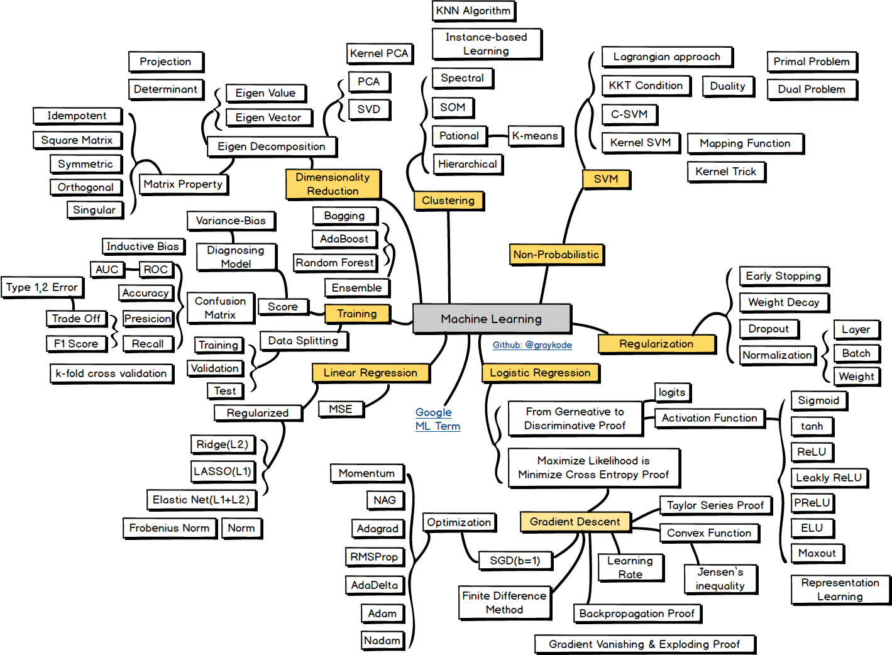

+++
title = '机器学习笔记'
date = 2023-12-27T19:02:35+08:00
draft = true
tags = ["课程笔记"]
categories = ["课业"]
description = "ucas2023秋 周晓飞机器学习课程笔记"
image = "机器学习笔记/1704273253086.png"
+++

# 导语

这门课说是会给题库，但是知识还是学给自己比较好。

# 笔记

# 题库知识点

分类/回归：x->y的映射，分类问题y为离散值，回归问题y为连续值

分类强调依据类别标签 y 对样本 x 空间的划分，回归强调 x 与回归值的拟合。

聚类：学习 x 到类簇 y 的映射

"类簇"通常指的是一组相似的数据点的集合。这种相似性通常是通过某种度量（例如欧几里得距离或余弦相似性）来确定的。

# 最后一节课
