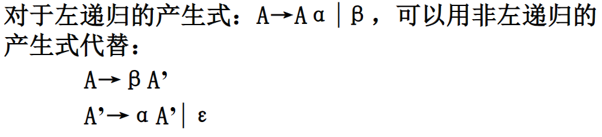

+++
title = '编译程序高级教程'
date = 2023-12-15T17:37:48+08:00
draft = true
tags = ["课程笔记"]
+++

# 导语

本笔记是ucas李炼编译程序高级教程课程的笔记。属于知识点碎碎念，不知道对作业、考试有没有作用。

## 文法

文法：终结符、非终结符、产生式、开始符号（或者识别符号）的四元组

产生式：可以理解为推导规则

终结符、非终结符：

* 非终结符：能出现在推导左边的就是非终结符
* 终结符：不能出现在推导左边的局势终结符

即能否进一步推导细分是区分终结符和非终结符的关键

句型、句子：

* 句型：符号串x是从开始符号S推导出来的，则x是文法G[S]的句型
* 句子：若推导出的符号串x仅由终结符号组成，则x为G[S]的句子

语言：从S推导出的所有句子的集合，也就是从S开始推导出的只有终结符的东西 G产生的语言记作L（G）

文法的等价： 如果L(G)==L(G2)，则G1等价于G2

3型文法==有限自动机： 如果文法的产生式P都有A→aB或A→a的形式，其中A、B∈$V_N$，a∈$V_T$。3型文法的许多性质是可判定的常用于编译器的词法分析程序的构造

左右线性文法：

* 右线性文法：形如A→aB或A→a
* 左线性文法：形如A→Ba或A→a

## 词法

字母表Σ

正规式==3型文法（感觉正规式就是正则表达式）

正规式和正规集：

* **正规集**可以用**正规式**表示
* **正规式**是表示**正规集**一种方法
* 一个字集合是**正规集**当且仅当它能用**正规式**表示
* 正规集是正规式表示的语言

正规式可以递归定义

且正规式有运算优先级

感觉正规式和正则表达式没啥区别

（这他妈不就是正则表达式吗）

有限状态自动机

五元式M = (S, ∑, δ, s0, F)，其中

* S是状态集合
* ∑是字母表
* s0为开始状态，属于S
* F是接受（或终止）状态的集合，属于S
* δ是转换函数

只有转换函数的表示稍微难理解一点，下面是一个例子

也可以转成转换表

只要有从s0到F内元素的路径，NFA就接受这个串（串也被称为语言）

根据是否有ε转换细分成两种

### 二型文法

设G=(VN,Vt,P,S)，如果它的每个产生式有如下形式，A→β，A∈VN，β∈(VN∪VT)*，则G是二型文法【即，所有的产生式都是非终结符推别的】

二型文法==下推自动机（PDA）

最右（左）推导：推导的每一步都是替代最右（左）边非终结符的推导

二义性文法：一个文法，如果存在某个句子有不止一棵分析树与之对应，则称这个文法是二义的

一个二义性的文法是**可能**将其改写，得到一个等价的无二义性的文法的。这种变换不总是可行的，具体看看第三章ppt吧

自上而下、自下而上：

* 对任何输入串，试图用一切可能的方法，从文法开始符号出发，自上而下、从左到右地为输入串建立分析树，**即为输入串寻找最左推导**。
  * 消除左递归
  * 
  * 左递归的分类
    * 直接左递归：直接见诸于产生式的左递
    * 一般的左递归：如S→Aa|b  A→Ac|Sd|
      * 直接左递归消除：
        * 
      * 一般左递归消除：
        * 
        * 

文法G满足一定条件可以唯一的选择产生式继续推导

FIRST集：令文法G是不含左递归的文法，对G的非终结符的候选α，定义它的开始符号（终结首符）集合

求FIRST集：

1. 直接收取：对形如U－a…的产生式（其中a是终结符），把a收入到First(U)中
2. 反复传送：对形入U－P…的产生式（其中P是非终结符），应把First(P)中的全部内容传送到First(U)中。

在不含左递归且每个非终结符所有选择的FIRST集都两两不相交的条件下（互相求∩为空集），存在可能构造专门的递归下降分析器

FOLLOW集合：Follow集合是针对非终结符而言的，Follow(U)所表达的是句型中非终结符U所有可能的后随终结符号的集合（U后面可能跟着的终结符的集合）

求FOLLOW集：例，求FOLLOW(U)

（1）将 $ 放到follow（S）中，其中S是文法的开始符号。

（2）如果存、A→αBβ，那么first（β）中除ε之外加入follow（B）中。 【 follow(B)是求跟在B后的终结符或$组成的集合，因此对于跟在B后的β，它的first集合就是follow(B)的子集 】

（3）如果存在A→αB，或A→αBβ， 且first（β）包含ε， follow（A）加入follow（B）中。 【 对于A→αBβ,且β多步推导出ε ，那么可以用αB替换A, B后面紧跟的字符就是A后面紧跟的字符】

预测分析表

例，上面那个的预测分析表：

非递归预测分析

LL(1)文法：

https://leiblog.wang/%E7%BC%96%E8%AF%91%E9%AB%98%E7%BA%A7%E6%95%99%E7%A8%8B%EF%BD%9C%E5%AD%A6%E4%B9%A0%E7%AC%94%E8%AE%B0/
https://blog.csdn.net/m0_67877471/article/details/124776449

[https://www.cnblogs.com/henuliulei/](http://www.cnblogs.com/acgoto/)

[编译原理FOLLOW集的求法_follow集合怎么求-CSDN博客](https://blog.csdn.net/qq_43319080/article/details/106379883#:~:text=%EF%BC%881%EF%BC%89%E5%B0%86%20%24%20%E6%94%BE%E5%88%B0follow%EF%BC%88S%EF%BC%89%E4%B8%AD%EF%BC%8C%E5%85%B6%E4%B8%ADS%E6%98%AF%E6%96%87%E6%B3%95%E7%9A%84%E5%BC%80%E5%A7%8B%E7%AC%A6%E5%8F%B7%E3%80%82%20%EF%BC%882%EF%BC%89%E5%A6%82%E6%9E%9C%E5%AD%98%E5%9C%A8%E4%B8%80%E4%B8%AA%E4%BA%A7%E7%94%9F%E5%BC%8FA%E2%86%92%CE%B1B%CE%B2%EF%BC%8C%E9%82%A3%E4%B9%88first%EF%BC%88%CE%B2%EF%BC%89%E4%B8%AD%20%E9%99%A4%CE%B5%E4%B9%8B%E5%A4%96%20%E7%9A%84%E6%89%80%E6%9C%89%E7%AC%A6%E5%8F%B7%E9%83%BD%E5%9C%A8follow%EF%BC%88B%EF%BC%89%E4%B8%AD%E3%80%82,%E3%80%90%20follow%20%28B%29%E6%98%AF%E6%B1%82%E8%B7%9F%E5%9C%A8B%E5%90%8E%E7%9A%84%E7%BB%88%E7%BB%93%E7%AC%A6%E6%88%96%24%E7%BB%84%E6%88%90%E7%9A%84%E9%9B%86%E5%90%88%EF%BC%8C%E5%9B%A0%E6%AD%A4%E5%AF%B9%E4%BA%8E%E8%B7%9F%E5%9C%A8B%E5%90%8E%E7%9A%84%CE%B2%EF%BC%8C%E5%AE%83%E7%9A%84first%E9%9B%86%E5%90%88%E5%B0%B1%E6%98%AFfollow%20%28B%29%E7%9A%84%E5%AD%90%E9%9B%86%20%E3%80%91%20%EF%BC%883%EF%BC%89%E5%A6%82%E6%9E%9C%E5%AD%98%E5%9C%A8%E4%B8%80%E4%B8%AA%E4%BA%A7%E7%94%9F%E5%BC%8FA%E2%86%92%CE%B1B%EF%BC%8C%E6%88%96%E5%AD%98%E5%9C%A8%E4%BA%A7%E7%94%9F%E5%BC%8FA%E2%86%92%CE%B1B%CE%B2%E4%B8%94first%EF%BC%88%CE%B2%EF%BC%89%E5%8C%85%E5%90%AB%CE%B5%EF%BC%8C%E9%82%A3%E4%B9%88follow%EF%BC%88A%EF%BC%89%E4%B8%AD%E7%9A%84%E6%89%80%E6%9C%89%E7%AC%A6%E5%8F%B7%E9%83%BD%E5%9C%A8follow%EF%BC%88B%EF%BC%89%E4%B8%AD%E3%80%82)
