+++
title = '网络认证技术作业三'
date = 2023-11-29T19:56:28+08:00
tags = ["课程作业"]
+++

为了避免跨平台的问题，直接用choco在windows上安装openssl 3.1.1

`choco install openssl`

首先生成私钥

```bash
openssl genrsa -aes256 -out private.pem 4096
```

其中

`genrsa`是openssl的一个命令，用于生成RSA私钥。

`-aes256`表示在输出私钥之前，使用AES 256加密

`-out private.pem` 表示将生成的私钥输出到名为private.pem的文件中

`4096`表示生成的私钥的位数，即私钥的长度为4096位

然后使用私钥生成证书

```sh
openssl req -new -x509 -days 365 -key .\private.pem -out cacert.crt -config .\smime.cnf -extensions smime
```

其中

`req`是openssl的一个命令，用于创建和处理PKCS#10格式的证书请求。

`-new`表示创建一个新的证书请求。

`-x509`表示生成一个自签名的证书，而不是生成一个证书请求。

`-days 365`表示生成的证书的有效期为365天。

`-key .\private.pem`表示使用名为private.pem的文件中的私钥来签署证书。

`-out cacert.crt`表示将生成的证书输出到名为cacert.crt的文件中。

`-config .\smime.cnf`表示使用名为smime.cnf的文件作为配置文件。

`-extensions smime`表示应该包含配置文件中名为smime的部分中指定的扩展。

smime的部分为

```bash
[smime]
basicConstraints = CA:FALSE
keyUsage = nonRepudiation, digitalSignature, keyEncipherment
extendedKeyUsage = emailProtection
subjectKeyIdentifier = hash
authorityKeyIdentifier = keyid:always, issuer
subjectAltName = email:copy
```

`basicConstraints = CA:FALSE`指定证书不能用作CA（证书颁发机构）

`keyUsage = nonRepudiation, digitalSignature, keyEncipherment`指定证书的公钥可以用于哪些用途。这个证书可以用于非否认（nonRepudiation）、数字签名（digitalSignature）和密钥封装（keyEncipherment）

`extendedKeyUsage = emailProtection`用于电子邮件保护（emailProtection）

`subjectKeyIdentifier = hash`用公钥的hash值唯一地标识证书中的公钥。

`authorityKeyIdentifier = keyid:always, issuer`用于标识签署此证书的CA的公钥。这个扩展通常包含CA公钥的keyid（一个唯一标识符），以及CA的名称（issuer）。`keyid:always`表示总是包含keyid，无论是否需要

`subjectAltName = email:copy`用于指定证书的主题可选名称（Subject Alternative Name）。主题可选名称是电子邮件地址，该地址从证书的主题名称字段中复制

生成的时候国家地区公司啥的都不重要，我直接敲回车按默认了。邮箱写自己的就行了。

直接用windwos自带的证书查看器查看这个证书。

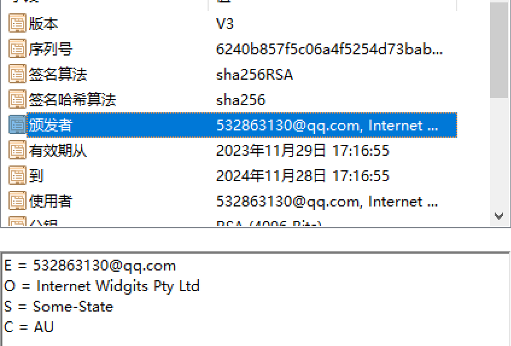

版本v3是指我们使用了x.509第3版本，然后序列号是有证书生成算法生成的，唯一的指定这个证书，像身份证号似的。签名算法和哈希算法是一个声明，颁发者是我们刚才在生成证书时写的。有效期由我们刚才的 `-days` 参数指明，使用者和颁发者一样。

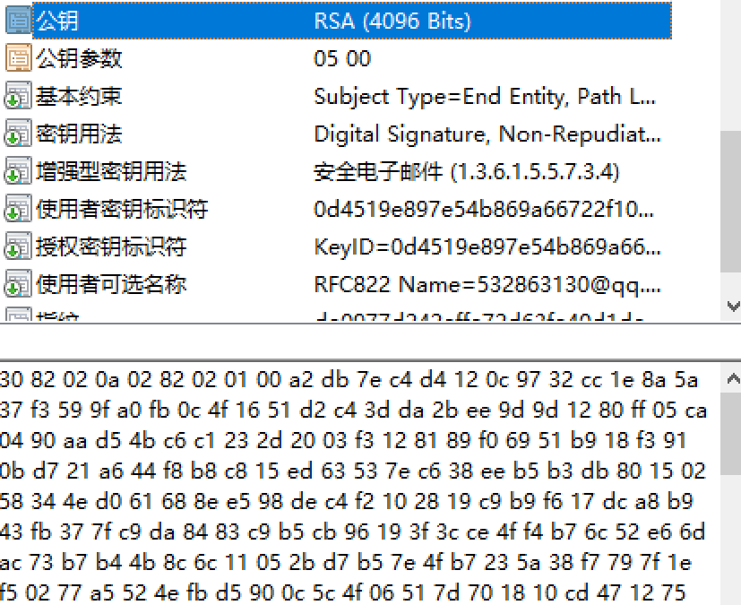

公钥直接在证书文件里保存。公钥参数0500表示NULL，这是因为RSA的公钥的参数（模数和公开指数）已经在公钥字段中给出，所以不需要在公钥参数字段中再给出，如果是其他的加密算法，可能会包含其他信息。

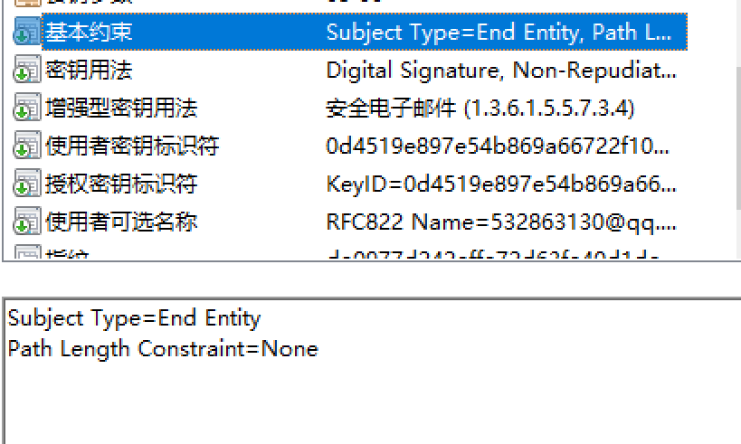

基本约束

**Subject Type=End Entity** ：这表示该证书是一个终端实体证书，而不是CA（证书颁发机构）证书。也就是说这个证书不能用于签发/创建其他证书。**Path Length Constraint=None** ：这表示路径长度没有设置，准许其签发多级的数字证书。然而，由于Subject Type=End Entity，这个证书不能用于签发其他证书，所以这个设置在这种情况下没有意义。这是由于我们使用了 `basicConstraints = CA:FALSE`的选项。

下面的其他拓展都在-extension部分说过了，这里就不多赘述了。

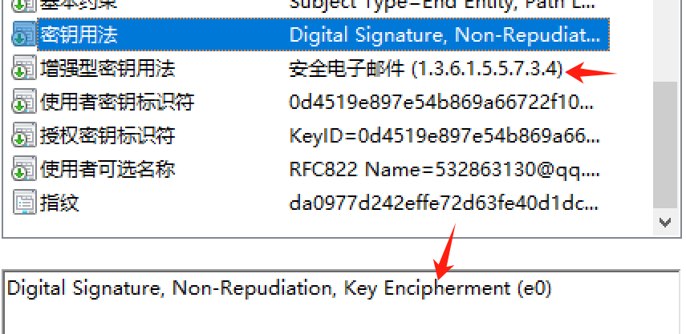

然后安装这个证书，并且选择保存路径为受信任的根证书颁发机构

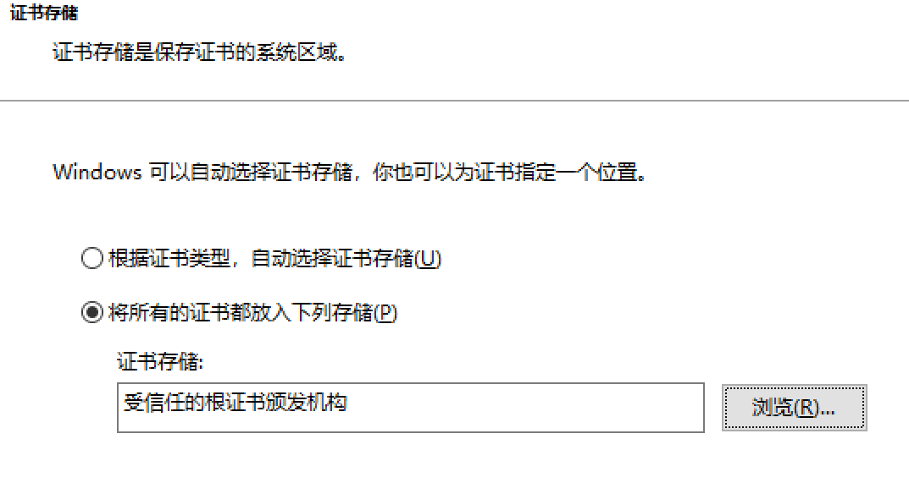

我使用的客户端是outlook。使用的邮箱服务是qq邮箱。


在outlook里添加我的证书

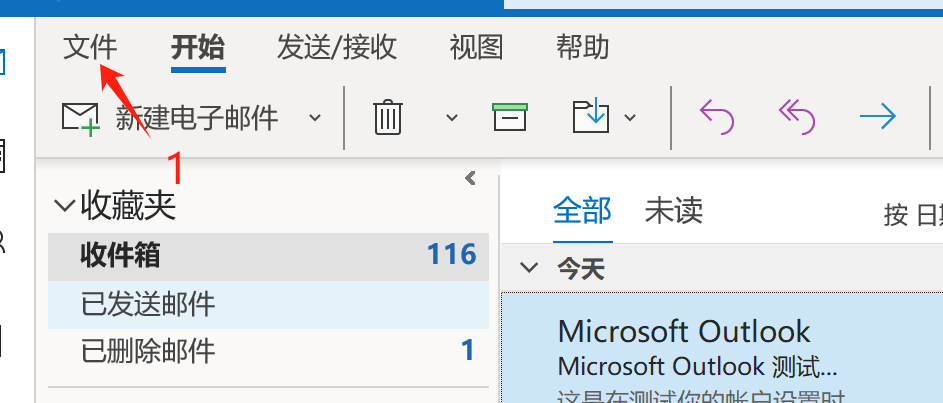

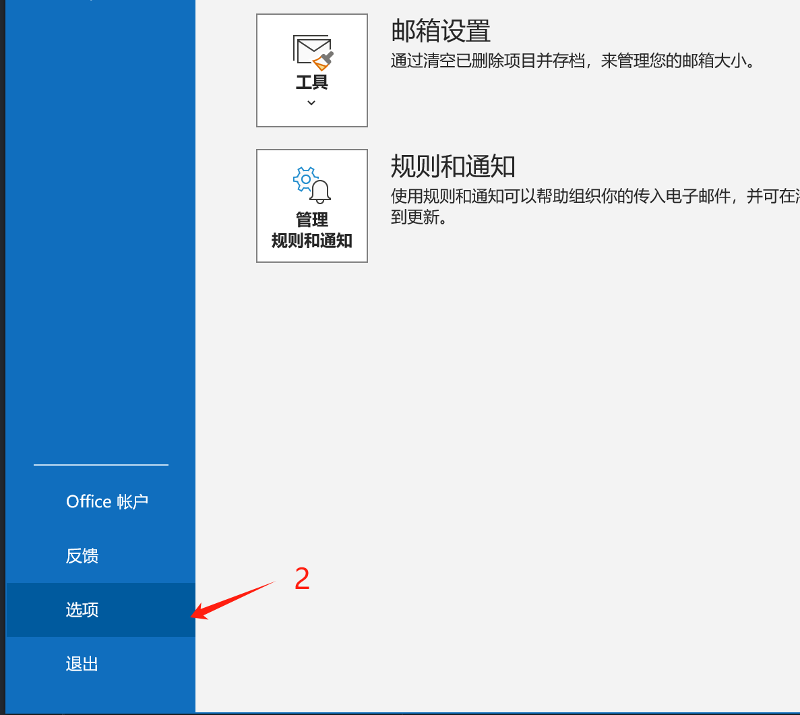

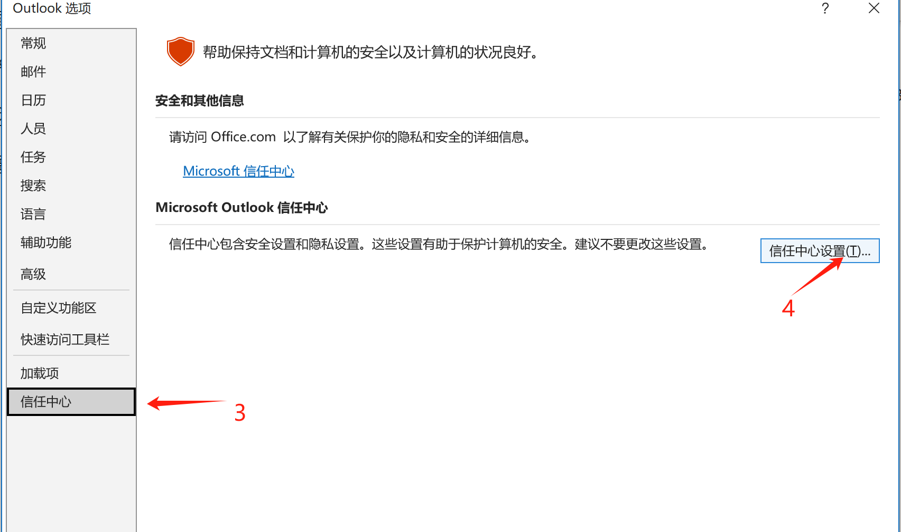

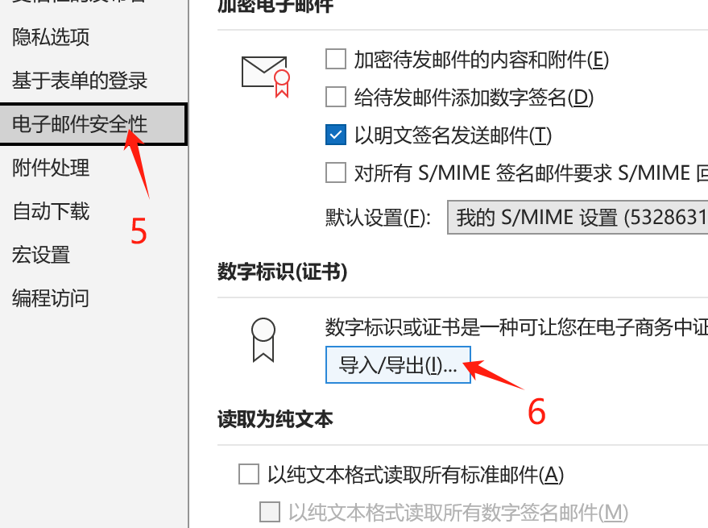

这里outlook只支持导入pfx，所以我们需要把生成的证书格式转换

```
openssl pkcs12 -export -out cacert.pfx -inkey .\private.pem -in .\cacert.crt
```

接下来是导入助教的证书，首先在outlook里新建一个联系人

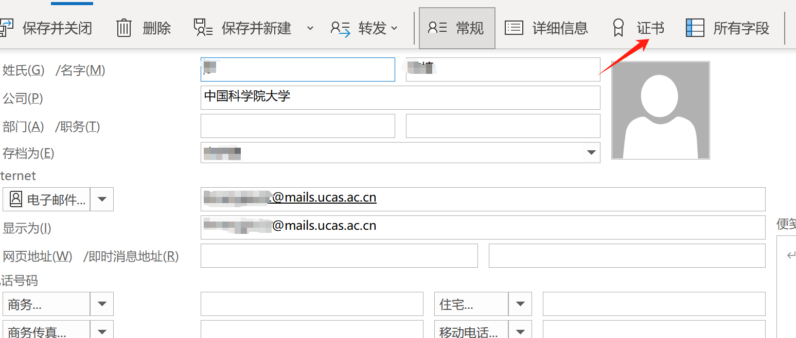

导入，这里又只支持.cer了，我的windows下的openssl好像缺了库没法转，所以用wsl里的openssl转了一下

```
openssl pkcs12 -in limengjie22\@mails.ucas.ac.cn.pfx -nokeys -out output.cer
```

`openssl pkcs12 -nokeys`命令用于从PKCS#12文件（通常具有.pfx或.p12扩展名）中提取证书，-nokeys指定不包含私钥，这样生成的output.cer不能做任何需要私钥的操作（我们也没有要用私钥的操作）

import password即使提供的私钥.txt的内容。然后就可以成功导入了

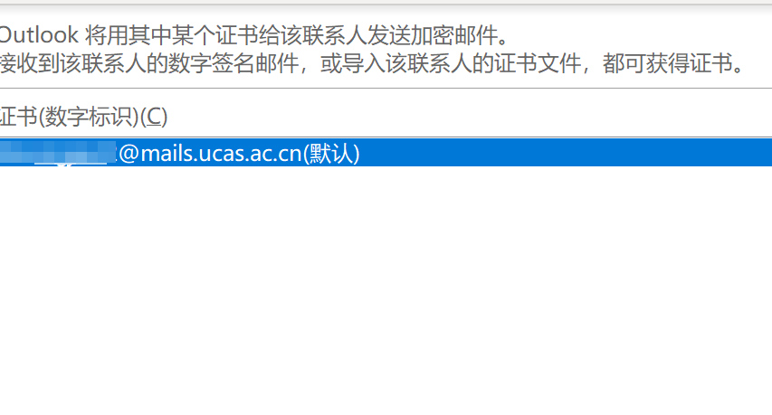

然后在发送邮件的时候，在选项里把加密和签署都点了

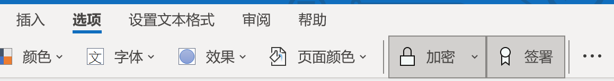
