+++
title = '网络认证技术笔记'
date = 2023-12-27T19:07:10+08:00
draft = true
+++

# 导语

ucas2023秋 林璟锵、马存庆 网络认证技术笔记

说是开课以来从未有过挂科选手，但是想得不错的分数还是要努努力，进自己脑子的知识才是最好的知识

# 笔记

网络认证技术 ≈ 密码学+计算机网络

网络认证：在信息系统/网络环境中，实现身份的确认。目标：在不可信的网络环境中确认主体是谁，有什么属性、权限、能力

身份确认的主体：人、设备、软件服务……

PKI：公钥基础设施

CA：认证中心，生成数字证书

CA是PKI的核心组成成分，但是在很多地方把CA和PKI混用了。

# 考试用

两个半小时

题型：

1. 判断 2分
2. 简答 5-8分
   1. 建议不要空这

关键是原理之类的要记住的

## 01 导言（意义不大）

相关概念

## 02 密码学基础（会涉及题目，需要复习复习）

对称：加解密

非对称：签名

光看密钥长度不能知道强度，RSA1024bits=ECC160bits。短密钥可以达到高强度

哈希：验证

消息鉴别码：MAC=C(K,M)，K为密钥M为消息，把密钥跟着一块哈希了

可鉴别加密CCM、GCM、AEAD（简单了解）

国外的密码基本原理不细说了

国产的了解一下

SM2 非对称 ECC --- 椭圆曲线 知道基于椭圆曲线域上的离散对数困难问题。 替换RSA

SM3 哈希 256bit和sha256差不多 分组长度512bit，摘要值长度256bit

SM4 分组工作模式

ECB：对每个块独立加密：明文同样的块会加密成同样的密文

CBC：明文先与上一个密文异或在加密，需要初始化向量

OFB：将块密码转为流密码，生成密钥流的块

CTR（ICM、SIC）：将块密码变为流密码，通过递增加密计数器产生密钥流

ZUC 流密码

128位的初始密钥key和128位的初始向量iv来作为输入。每个时钟周期能生成32bit

共享密钥问题->为什么要有非对称的原因->数字签名

## 03 口令鉴别

client 用复杂口令，不要告诉别人，次数限制

传输 使用已被验证的安全信道

server 存储，验证

## 04 基于密码技术的鉴别

两大类：

对称： 有没有密钥

提一个协议框架，让你看有没有什么错，一些参数有什么用【用什么方式可以抵抗什么攻击】

replay attack（重放攻击）：通过加一个nonce抵抗

oracle session attack（就是攻击者使另一方帮自己来计算）：让u和v不同。比如u为加密，v为解密

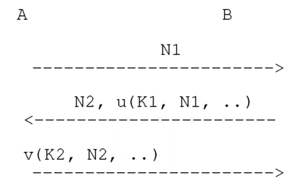

Parallel Session attack：p(), q()与方向有关。从而攻击者不能利用服务器的计算。比如发起者会加一个xor，被挑战者会加一个左移

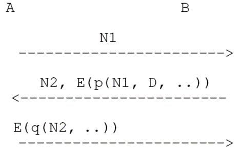

offset attack：

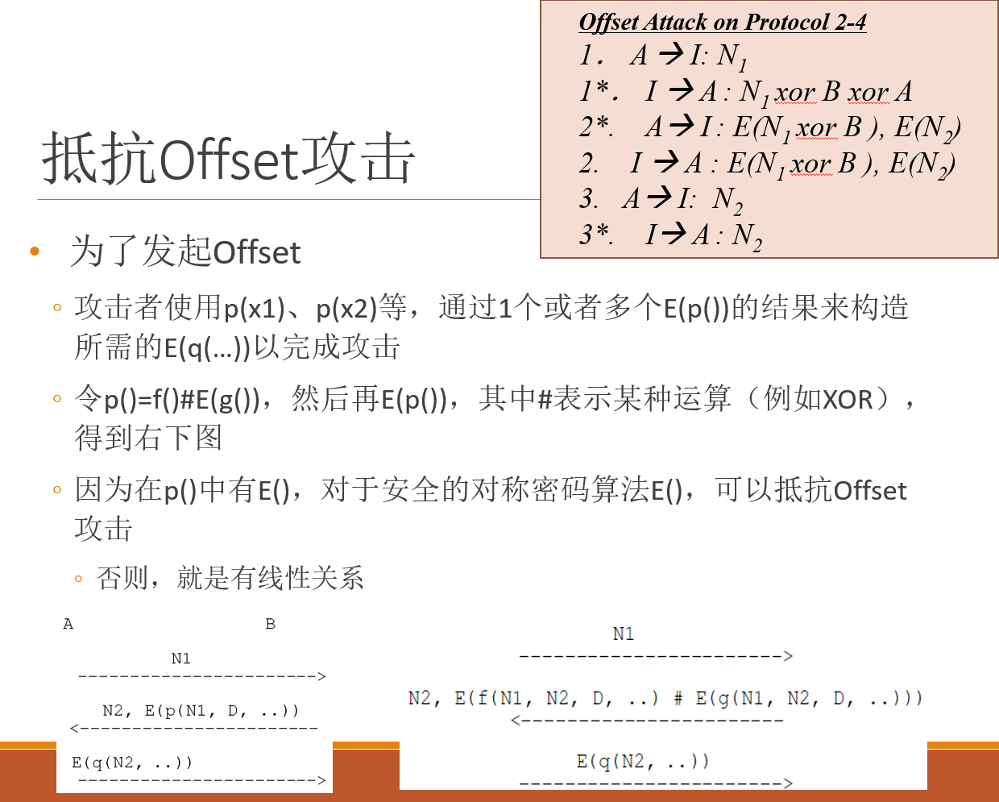

可信第三方，kobras

非对称：数字签名和验证

单向（带一个时间戳之类的约定好的东西）、双向（A发给B后B还要发给A）

PPT标红好好看看

## 05+06 PKI技术

CA：认证机构，权威第三方，公钥（证书）可信发布[根CA、子CA]

RA：注册机构，审查信息，防止CA职能太多导致一个出问题导出都出问题

repository（存数据的吧）

CRL（Certificate Revocation List，证书撤销列表）

Online Certificate Status Protocol（OCSP）一种通信协议，专门用于检查证书是否已经被撤销 相应的服务器称为OCSP Server->（证书有三种状态）Good、Revoked、Unknown ：未撤销、已经撤销、未知

ASN.1-基本数据类型-DER编码-sequence-implicit/explicit tag  稍微看一下

## 07 证书拓展

证书基本域

证书扩展域 X.509版本3 18种，了解功能即可

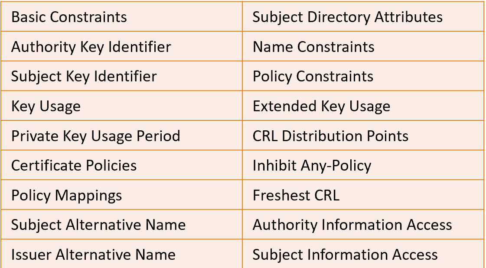

拓展有关键和非关键，如果关键出了错（识别不出来），直接认定证书非法。非关键出错则忽略拓展

Basic Constraints：区分是否是CA证书（能否签发其他证书）以及路径的深度（说明CA可以有多少层次的下级）

Authority Key Identifier：证书链中可能有多个公钥，这个确定哪个是用来验证证书的颁发者（CA）的公钥

Subject Key Identifier：证书链中可能有多个公钥，确定哪个是证书自己的公钥

Key Usage：密钥的用途。7种+2种辅助用途

Private Key Usage Period：给出证书有效的开始到结束的时间

ssuer Alternative Name：放置签发者（CA）的消息（DN存放CA信息，子CN没法用DN，就用这来放）

Subject Alternative Name：防止证书拥有者的消息

Subject Directory Attributes：可加入任何与Subject有关的信息，例如，民族、生日等

Name Constraints：限制下级CA所能够签发证书的订户的名字空间（只在下级CA中有用）

Certificate Policies（CP）：区分不同证书的安全等级

Inhibit Any-Policy：（CP的Any-Policy指对于该CA所签发的订户证书的CP没有限制），值是整数N，表示：在证书路径中，本证书之下的N个证书可带有Any-Policy的证书

Policy Mappings：说明了不同CA域之间的CP等级的相互映射关系

Policy Constraints：对于证书认证路径的策略映射过程中，有关CP的处理，进行限制。N：在N个证书后，不允许再进行策略映射；M：在M个证书后，就必须要有认识的、明确的CP

Extended Key Usage：证书/密钥可用的用途（拓展）

CRL Distribution Points：和应用系统约定在哪儿获取CRL

Freshest CRL：增量CRL情况下，获取最新的增量CRL的地址

Authority Information Access：如何在Internet上面，访问一些CA的信息（目前只有 1、上级CA的情况 2、OCSP服务器的情况两个信息）

Subject Information Access： l如何在Internet上面，访问一些用户的信息 （目前只有 1、资料库的地址（针对CA）2、TSA服务地址（针对TSA服务器））

## 08 PKI信任体系

信任模型

单根CA

多根CA 根之间要互相通信-**CTL**（用户自主+权威发布）***沟通方式、原理、优缺点，应用***

CTL（信任锚）由权威机构统一地发布1个可信的信任锚列表（Certificate Trust List）包括多个根CA证书文件的HASH结果和受信任CA对其签名

【信任锚里有根CA证书的hash、其他CA证书、CRL、信任策略和规则等。然后由一个我信任的CA对CTL签名，一般不用CTL里信任的CA来签名。】

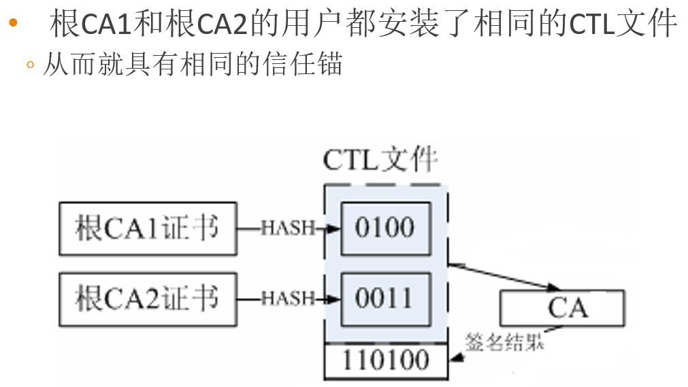

方式：1、不同PKI域用同一个CTL 2、加一个ACA的信任锚说明哪些根CA是可以信任的

交叉认证-网状mesh->桥CA

相当于将对方CA认作是我的子CA。

mesh->信任链变成信任网

桥CA->不同域之间的证书传递

## 09 证书撤销

验证签名-验证有效期-验证撤销状态

撤销状态 CRL、OCSP、CRT 原理

CA/CRL Issuer定期地签发CRL CRL，certificate revocation list

完全CRL－Complete CRL：所有CRL信息一次发布

增量CRL－Delta CRL：发布新增的CRL信息发布

直接CRL－Direct CRL：证书签发者签发CRL

间接CRL－Indirect CRL：使用CRL issuer签发CRL

OCSP在线证书状态协议 Online Certificate Status Protocol 在线服务器

CRT：证书撤销树，对于各证书序列号进行一定的结构化，形成了HASH链

使用了merkle hash tree

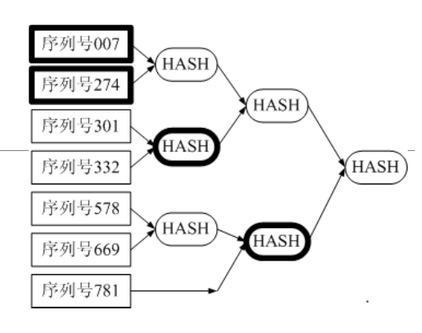

拿加粗的子哈希算哈希，就可以推出根hash，验证起来需要更少的那啥

## 10 TLS

handshake怎么shake的

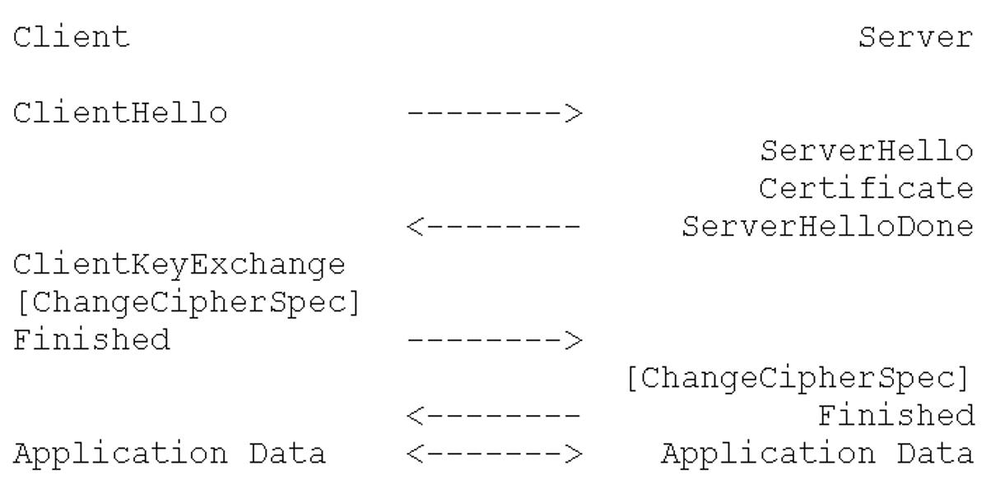

两张图里的消息有什么含义 1.3和1.2的区别

## 10.5wifi认证

WPA-PSK共享口令 （路由器上做）

WPA-802.1X 基于账号的身份鉴别 （身份鉴别server）

客户端或网页 （微信、短信）

## 11 不考

## 12 PKI安全增强

### 入侵容忍 解决了什么问题？怎么解决的 原理

解决了在入侵场景下的高可用。黑客侵入了其中一个PKI节点无法获利，同时PKI系统任然保持可用性

【门限密码学：把密钥分成L份，当有其中f+1份时可以解密，否则解密不了】

eg. Shamir's Secret Sharing 基于拉格朗日差值法

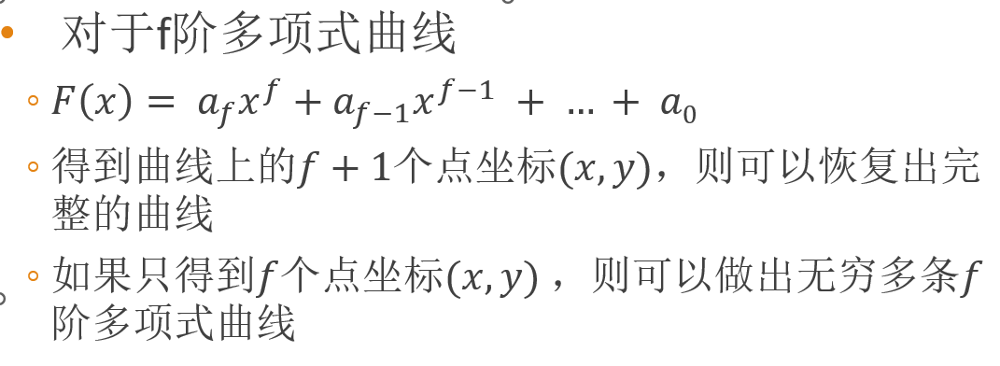

eg2. ITTC 基于离散对数的子密钥分配

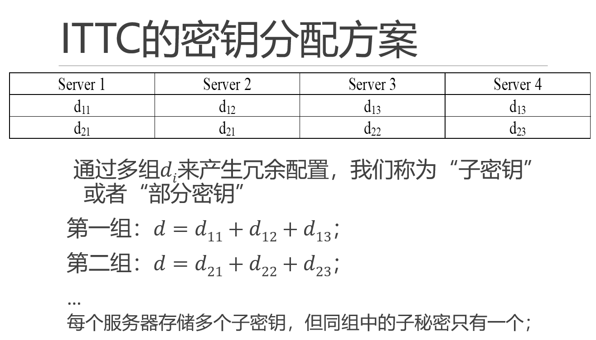

server上用密码算，CA来整合

也就是说黑客就算攻入了一个节点，他仍然无法获取PKI用来签名证书的私钥，同时其他节点还能继续工作。

### 信任增强 解决方式原理

信任机制基本假设：1、CA行为不会出错，证书中的信息不会出错【只有可能是错误操作导致的签发给错误的人】 2、无限制权利

三个思路：

1、 浏览器端实施检测：

（1）浏览器维护证书信息

（2）多个回话之间互相比较

2、限制CA权利

（1）假定server只会向同一个国家的CA申请证书

（2）限定CA能签发的顶级域名范围

（3）域名拥有者可以控制哪个CA给他签发证书

（4）server再次确认机制：

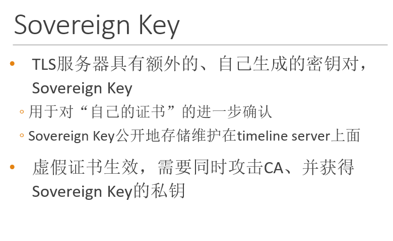

server在多一个sovereign Key的公私钥对挂在timeline上，浏览器看到timeline上有sovereign Key，会要求server再次拿sovereign Key私钥签名，黑客控制了CA，却无法获取server的sovereign Key私钥，因此仍然无法伪造身份

3、证书透明化：

假定CA也会出错，审计CA

## 13 证书透明化

虚假证书：证书可以被严格验证通过，但是证书对应的私钥并不被证书主体拥有，而是被其他人拥有（CA被人黑了，一顿乱发）

透明化增加哪些步骤SCT相关特点弄清楚一点

增加

1. 公开日志服务器（Public Log Server）：保存和维护记录证书的公开日志（Public Log）

   收到证书并验证通过后，公开日志服务器会向提交者返回一个凭据（SCT）Signed Certificate Timestamp。（有可能多个公开日志服务器，就会返回多个SCT）用户不仅需要验证证书，还需要验证相应的SCT（将SCT放入证书中，作为证书扩展）

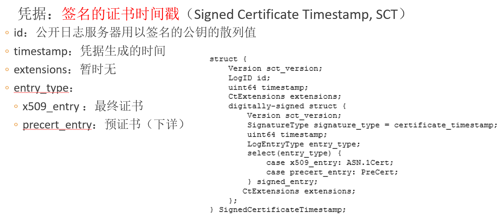

    用户不仅需要验证证书，还需要验证相应的SCT（将SCT放入证书中，作为证书扩展）

    怎么获得SCT呢？

    1.从X.509证书扩展项获得SCT

    2.从连接建立时TLS扩展项获得SCT ->TLS客户端要支持

    3.从OCSP stapling的扩展项获得SCT

下面不重要

2. 监视员（Monitor）：周期性的访问公开日志服务器，寻找和发现可疑的证书
3. 审计员（Auditor）：审计公开日志的行为

## 14 隐式证书

传统和隐式的结构和使用的区别

在带宽、计算能力、存储资源有限制的环境下，隐式证书是传统X.509证书的一种高效替代

X.509证书基本内容：订户身份信息+公钥数据+CA数字签名

隐式证书基本内容：中间公钥数据$P_U$  + 订户身份标识。 最终公钥 P=$P_{CA}$+$P_U$以及身份信息也有关  $P_{CA}$：CA证书公钥

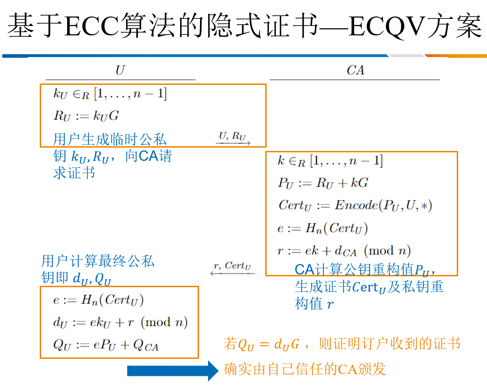

使用：

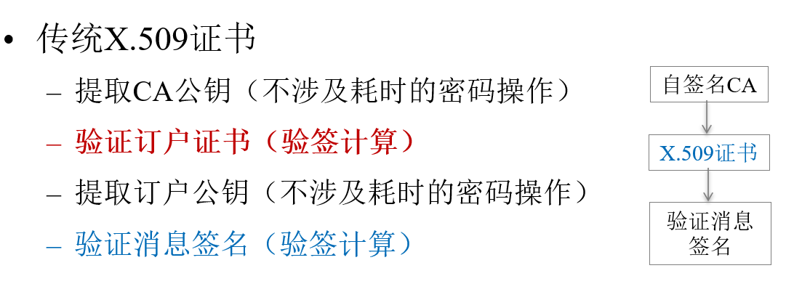

X.509： 需要对订户证书进行CA签名的验证

隐式证书：需要重构出订户公钥，在对消息的验签时同时完成对证书本身的验证

隐式证书中，没有对CA数字签名的验证，取而代之的是，重构公钥的计算，后者的计算量较小。

假名证书不考

## 15 kerberos

可信第三方TTP，基于对称密码，也支持在某些过程使用非对称

获得一个TGT，用TGT和要访问的目，请求问kerberos服务器，来获取访问目标的票据（不是TGT，TGT只是告诉kerberos我已经被验证过了）

kerberos票据流程

长期密钥（主密钥）Long-term Key/Master Key： 长期保持不变的密钥。被长期密钥（主密钥）加密的数据尽量不在网络上传输。（防止暴力破解、分析）

短期密钥（会话密钥）Short-term Key/Session Key： 加密需要进行网络传输的数据。只在一段时间内有效，即使被加密的数据包被黑客截获并破解成功后，这个Key早就已经过期了。

KDC（Key Distribution Center）：kerberos server作为可信第三方，维护所有帐户（client、server）的注册信息、用户名、口令、用户主密钥、服务器主密钥

Server 与Client之间基于共享秘密短期密钥key实现身份鉴别

KDC仅仅是允许进入应用系统，至于有什么权限、由应用系统自主决定

获取TGT：

client发请求，KDC用client的master key加密一个会话密钥$S_{KDC-Client}$，用KDC的master key加密TGT，TGT里包含会话密钥和client信息（让client 鉴别KDC是KDC而非被伪造）

获取ST：

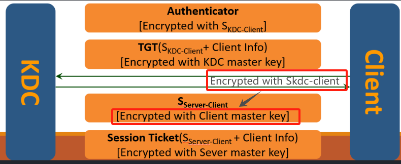

***这个图有问题，KDC还给client的不是用clinet的master key，而是用session key。***

当client要访问server的时候，给KDC自己的TGT和要访问的server。

KDC根据TGT来对client进行认证，生成$S_{Server-Client}$和ST(session ticket)

$S_{Server-Client}$：用client的主密钥加密一个会话密钥，

ST：用server的主密钥加密，ST包含会话密钥和client的信息。

将这两个被加密的Copy一并发送给Client

client得到会话密钥后，用session key解密，创建Authenticator（Client Info + Timestamp）并用会话密钥加密

client将ST和Authenticator访问server，server用自己的主密钥解密ST得到会话密钥，在用会话密钥解密Authenticator，比较Authenticator里的client info和ST里的client info来确定client就是client

那如果TGT没过期，session key过期了呢？可以用TGT再申请一个，因为TGT用KDC的master key加密，KDC可以得到旧的session key和client info，进而再发一个session key。由于session key是TGT的一部分，这其实也就相当于重新申请了TGT

client鉴别server（双向鉴别）：

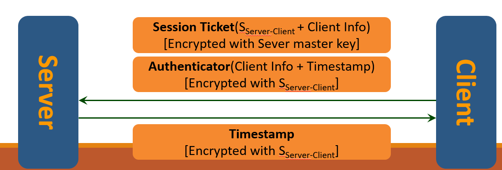

在Authenticator里在加一个flag要求server自证。

server看到后，用ST里得到的会话密钥解密Authenticator，把里面的timestamp用会话密钥加密发给client

## 16 OAuth&OIDC

单点登录(Single Sign on)在某个地方认证了之后，在整个域里都不用再认证了。

SSO 口令记录器->保存在edge/chrome

OAuth 协议流程图，理解认证的流程，有那几个角色，分别做了什么

OIDC 协议流程图，理解认证的流程

## 17 FIDO

在服务器端将用户与移动终端的可信环境进行身份绑定
将用户与服务器之间的直接鉴别转变为两段式鉴别
1 移动终端鉴别用户主要是靠生物特征
2 服务器端鉴别移动终端主要是靠数字签名
