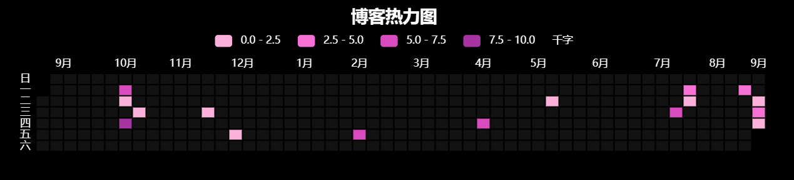

+++
title = 'HugoStackHeatmap明暗主题适配'
date = 2024-09-05T00:15:06+08:00
draft = false
tags = ["前端"]
categories = ["前端"]
description = "对hugo的stack主题的heatmap进行明暗主题的适配"
image = "index/1725472577216.png"
+++

## 导语

水一篇！

看了https://yelleis.top/p/hugo-theme-stack-beautification-2/的stack添加热力图，实装后发现和我的高对比度暗色主题巨不适配，遂改之。

## 操作

先搞清楚stack这个明暗主题切换的原理，在 `\assets\ts\main.ts`里，有

```ts
new StackColorScheme(document.getElementById('dark-mode-toggle'));
```

追踪看到在 `\assets\ts\colorScheme.ts`里有

```ts
    constructor(toggleEl: HTMLElement) {
        this.bindMatchMedia();
        this.currentScheme = this.getSavedScheme();

        this.dispatchEvent(document.documentElement.dataset.scheme as colorScheme);

        if (toggleEl)
            this.bindClick(toggleEl);

        if (document.body.style.transition == '')
            document.body.style.setProperty('transition', 'background-color .3s ease');
    }

    private saveScheme() {
        localStorage.setItem(this.localStorageKey, this.currentScheme);
    }

    private bindClick(toggleEl: HTMLElement) {
        toggleEl.addEventListener('click', (e) => {
            if (this.isDark()) {
                /// Disable dark mode
                this.currentScheme = 'light';
            }
            else {
                this.currentScheme = 'dark';
            }

            this.setBodyClass();

            if (this.currentScheme == this.systemPreferScheme) {
                /// Set to auto
                this.currentScheme = 'auto';
            }

            this.saveScheme();
        })
    }
```

会在 `getElementById('dark-mode-toggle')` onclick的时候把scheme存在localstorage里，首先的想法是直接监听 `dark-mode-toggle`的onclick，但是还是要存scheme，于是在这里存saveScheme里直接抛出一个事件 `window.dispatchEvent(newEvent('colorSchemeChange'));`

```ts
    private saveScheme() {
        localStorage.setItem(this.localStorageKey, this.currentScheme);
        window.dispatchEvent(new Event('colorSchemeChange')); // through event
    }
```

再在heatmap.html里用js监听这个事件， 一旦事件发生就执行更新heatmap样式的函数

再利用echarts.min.js对应的颜色设置，把之前的代码重构了哈，需要的话直接在genOption里改颜色即可。我这个的效果可以直接在我的主页看

```html
<div id="heatmap" style="
  max-width: 1900px;
  height: 180px;
  padding: 2px;
  text-align: center;
  "
></div>
<script src="https://cdn.jsdelivr.net/npm/echarts@5.3.0/dist/echarts.min.js"></script>
<script type="text/javascript">
  var chartDom = document.getElementById('heatmap');
  var myChart = echarts.init(chartDom);
  window.onresize = function() {
      myChart.resize();
  };
  // 生成颜色的option
  function genOption(){
    var option;
    const colorSchemeItem = localStorage.getItem('StackColorScheme'); // 可以获取到当前主题模式，但是我需要的是变了主题模式自动切换
    if (colorSchemeItem == 'light') {
      var color_t = ['#a8e4a0', '#7aa874', '#4e8a4c','#2c5f2d' ]; // 写的多和少颜色的深度，light是绿色调
      var color_font = '#000'; // 日期、月份的颜色，light是黑色
      var color_cube = '#f1f1f1'; // 空方块颜色，light是灰色
      var color_title = '#000'; // 标题颜色，light是黑色
      var color_border = '#fff'; // 边框颜色，light是白色
      var color_split_month = 'rgba(0, 0, 0, 0.0)'; // 月份之间的分割线颜色，light是透明，想改的话可以改
    } else {
      var color_t = ['#fbb1d9', '#f770d4', '#d94bbf', '#a734a2' ]; // 写的多和少颜色的深度，dark是粉色调
      var color_font = '#fff'; // 日期、月份的颜色，dark是白色
      var color_cube = '#121212'; // 空方块颜色，dark是深灰色
      var color_title = '#fff'; // 标题颜色，dark是白色
      var color_border = '#000'; // 边框颜色，dark是黑色
      var color_split_month = 'rgba(0, 0, 0, 0.0)'; // 月份之间的分割线颜色，dark也是透明，想改的话可以改
    }
    option = {
      title: {
          top: 0,
          left: 'center',
          text: '博客热力图',
          textStyle: {
            color: color_title,
            fontSize: 20,
          }
      },
      tooltip: {
        hideDelay: 1000,
        enterable: true,
        formatter: function (p) {
          const date = p.data[0];
          const posts = dataMap.get(date);
          var content = `${date}`;
          for (const [i, post] of posts.entries()) {
              content += "<br>";
              var link = post.link;
              var title = post.title;
              var wordCount = (post.wordCount / 1000).toFixed(1);
              content += `<a href="${link}" target="_blank">${title} | ${wordCount} k</a>`
          }
          return content;
        }
      },
      visualMap: {
        min: 0,
        max: 10,
        type: 'piecewise',
        orient: 'horizontal',
        left: 'center',
        top: 30,

        inRange: {   
          //  [floor color, ceiling color]
          color: color_t,
        },
        splitNumber: 4,
        text: ['千字', ''],
        showLabel: true,
        itemGap: 20,
        textStyle: {
          color: color_font,
        }
      },
      calendar: {
        top: 80,
        left: 20,
        right: 4,
        cellSize: ['auto', 13],
        range: getRangeArr(),
        itemStyle: {
            color: color_cube,
            borderWidth: 1.5,
            borderColor: color_border,
        },
        monthLabel: { color: color_font },
        dayLabel: { color: color_font },
        yearLabel: { show: false },
        // the splitline between months. set to transparent for now.
        splitLine: {
          lineStyle: {
            color: 'rgba(0, 0, 0, 0.0)',
            // shadowColor: 'rgba(0, 0, 0, 0.5)',
            // shadowBlur: 5,
            // width: 0.5,
            // type: 'dashed',
          }
        }
      },
      series: {
        type: 'heatmap',
        coordinateSystem: 'calendar',
        data: data,
      }
  };
    return option;
  }
  
  // echart heatmap data seems to only support two elements tuple
  // it doesn't render when each item has 3 value
  // it also only pass first 2 elements when reading event param
  // so here we build a map to store additional metadata like link and title
  // map format {date: [{wordcount, link, title}]}
  // for more information see https://blog.douchi.space/hugo-blog-heatmap
  var dataMap = new Map();
  {{ range ((where .Site.RegularPages "Type" "post")) }}
    var key = {{ .Date.Format "2006-01-02" }};
    var value = dataMap.get(key);
    var wordCount = {{ .WordCount }};
    var link = {{ .RelPermalink}};
    var title = {{ .Title }};
  
    // multiple posts in same day
    if (value == null) {
      dataMap.set(key, [{wordCount, link, title}]);
    } else {
      value.push({wordCount, link, title});
    }
  {{- end -}}

  var data = [];
  // sum up the word count
  for (const [key, value] of dataMap.entries()) {
    var sum = 0;
    for (const v of value) {
      sum += v.wordCount;
    }
    data.push([key, (sum / 1000).toFixed(1)]);
  }

  var startDate = new Date();
  var year_Mill = startDate.setFullYear((startDate.getFullYear() - 1));
  var startDate = +new Date(year_Mill);
  var endDate = +new Date();

  var dayTime = 3600 * 24 * 1000;
  startDate = echarts.format.formatTime('yyyy-MM-dd', startDate);
  endDate = echarts.format.formatTime('yyyy-MM-dd', endDate);

  // change date range according to months we want to render
  function heatmap_width(months){         
    var startDate = new Date();
    var mill = startDate.setMonth((startDate.getMonth() - months));
    var endDate = +new Date();
    startDate = +new Date(mill);

    endDate = echarts.format.formatTime('yyyy-MM-dd', endDate);
    startDate = echarts.format.formatTime('yyyy-MM-dd', startDate);

    var showmonth = [];
    showmonth.push([
        startDate,
        endDate
    ]);
    return showmonth
  };

  function getRangeArr() {
    const windowWidth = window.innerWidth;
    if (windowWidth >= 600) {
      return heatmap_width(12);
    } else if (windowWidth >= 400) {
      return heatmap_width(9);
    } else {
      return heatmap_width(6);
    }
  }
  var option = genOption();
  myChart.setOption(option);
  myChart.on('click', function(params) {
    if (params.componentType === 'series') {
      // open the first post on the day
      const post = dataMap.get(params.data[0])[0];
      const link = window.location.origin + post.link;
      window.open(link, '_blank').focus();
    }
});

  function updateChartColors() {
    option = genOption();
    myChart.setOption(option);
  }

  window.addEventListener('colorSchemeChange', updateChartColors);
</script> 

```

最后结果大概这样




