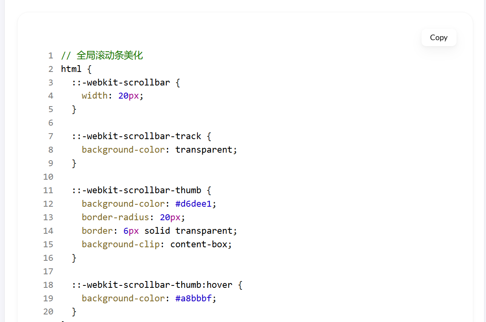
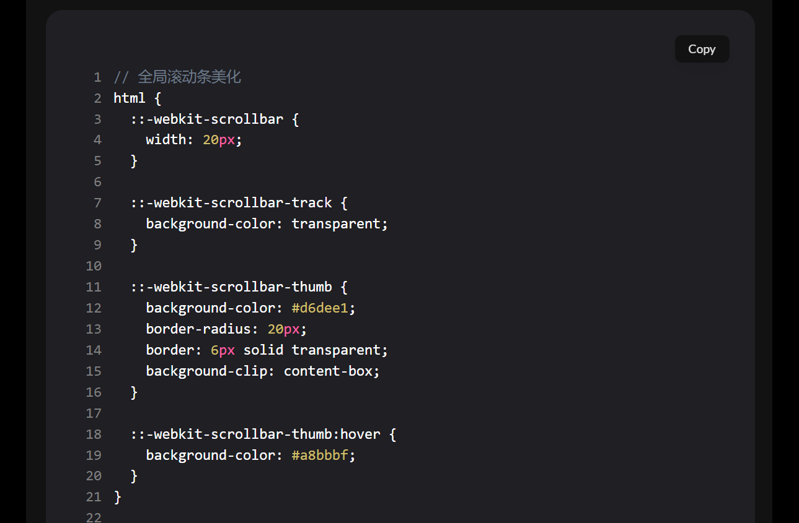
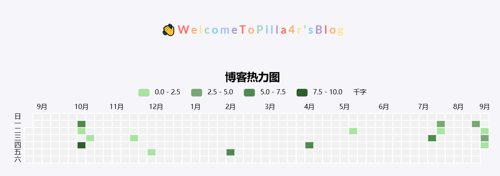
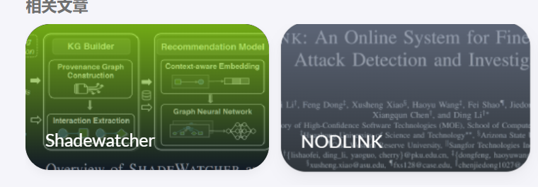
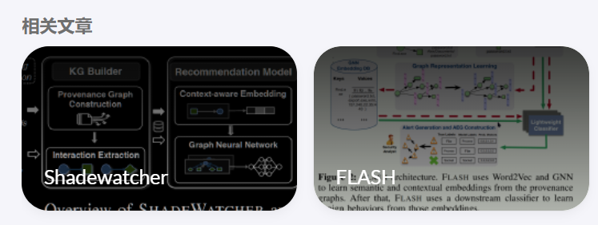

+++
title = 'HugoStack装修'
date = 2024-09-04T15:43:00+08:00
draft = false
tags = ["前端"]
categories = ["前端"]
description = "我的hugo博客都做了哪些优化呢？"
image = "index/1725472639010.png"
+++

## 导语

博客就是拿来装修的，发文其实不重要（？

## 综述

我使用的是hugo stack博客，hugo博客有一个好处就是你可以将所有的更改放在博客根目录下，这会覆盖掉theme里对应的同名文件，同时很多主题（比如stack）支持以submodule的模式安装，所以就可以安心的更新主题，使用主题的最新特性了

这篇装修主要参考了以下大佬们的教程，あぃがとう❣以下排名不分先后

https://thirdshire.com/hugo-stack-renovation/

[Hugo-theme-Stack 魔改美化 | Naive Koala (xalaok.top)](https://www.xalaok.top/post/stack-modify/)

[给博客添加heatmap | Liminal Negative Space](https://blog.liminalnegativespace.xyz/posts/heatmap/)

https://mogeko.me/zh-cn/posts/zh-cn/033/

## 具体操作

### custom.scss

hugo的custom.scss是优先级最高的scss，其他所有的scss都会被他覆盖掉，这里我们通过修改css实现了

* 各种棱角的磨圆，以及某些本来看着不够圆的磨得更圆
* 滚动条的美化
* light模式和dark模式的色彩修改（还没改完，这玩意你自己看着改就行，不知道改哪个变量可以去 `\assets\scss\variables.scss`找
* 修复引用块内容窄页面显示问题
* 文章内容图片圆角阴影
* 文章内容引用块样式
* 代码块基础样式修改以及highlight主题变更（其实没啥用，而且还挺麻烦，有后续步骤，觉得麻烦也可以不改）
* 设置选中字体的区域背景颜色
* 文章封面高度更改
* 全局页面布局间距调整
* 页面三栏宽度调整
* 全局页面小图片样式微调
* 归档页面双栏
* 链接三栏
* 头像旋转动画

在 `assets\scss\custom.scss`里写

```scss
// 全局滚动条美化
html {
  ::-webkit-scrollbar {
    width: 20px;
  }

  ::-webkit-scrollbar-track {
    background-color: transparent;
  }

  ::-webkit-scrollbar-thumb {
    background-color: #d6dee1;
    border-radius: 20px;
    border: 6px solid transparent;
    background-clip: content-box;
  }

  ::-webkit-scrollbar-thumb:hover {
    background-color: #a8bbbf;
  }
}

// 页面基本配色
:root {
  // 全局顶部边距
  --main-top-padding: 30px;
  // 全局卡片圆角
  --card-border-radius: 25px;
  // 标签云卡片圆角
  --tag-border-radius: 8px;
  // 卡片间距
  --section-separation: 40px;
  // 全局字体大小
  --article-font-size: 1.8rem;
  --emphasize-text-color: #9e8f9f; // Add emphasize font color
  // // 行内代码背景色
  // --code-background-color: #f8f8f8;
  // // 行内代码前景色
  // --code-text-color: #e96900;
  // 暗色模式下样式
  &[data-scheme="dark"] {
    // 背景色
    --body-background: #000000;
    // 滚动条按钮色
    --scrollbar-thumb: #24242480;
    // 文章卡片背景色
    --card-background: #121212;
    --emphasize-text-color: #d5cfc4; // Add emphasize font color for dark scheme
  }
}

//------------------------------------------------------
// 修复引用块内容窄页面显示问题
a {
  word-break: break-all;
}

code {
  word-break: break-all;
}

//---------------------------------------------------
// 文章内容图片圆角阴影
.article-page .main-article .article-content {
  img {
    max-width: 96% !important;
    height: auto !important;
    border-radius: 8px;
  }
}

//------------------------------------------------
// 文章内容引用块样式
.article-content {
  blockquote {
    border-left: 6px solid #358b9a1f !important;
    background: #3a97431f;
  }
}
// ---------------------------------------
// 代码块基础样式修改
.highlight {
  max-width: 102% !important;
  background-color: var(--pre-background-color);
  padding: var(--card-padding);
  position: relative;
  border-radius: 20px;
  margin-left: -7px !important;
  margin-right: -12px;
  box-shadow: var(--shadow-l1) !important;

  &:hover {
    .copyCodeButton {
      opacity: 1;
    }
  }

  // keep Codeblocks LTR
  [dir="rtl"] & {
    direction: ltr;
  }

  pre {
    margin: initial;
    padding: 0;
    margin: 0;
    width: auto;
  }
}

// light模式下的代码块样式调整
[data-scheme="light"] .article-content .highlight {
  background-color: #fff;
}

[data-scheme="light"] .chroma {
  // color: #ff6f00;
  background-color: #fff;
}

// dark模式下的代码块样式调整
[data-scheme="dark"] .article-content .highlight {
  background-color: #1f1f24;
}

[data-scheme="dark"] .chroma {
  // color: #ff6f00;
  background-color: #1f1f24;
}

//-------------------------------------------
// 设置选中字体的区域背景颜色
//修改选中颜色
::selection {
  color: #fff;
  background: #34495e;
}

a {
  text-decoration: none;
  color: var(--accent-color);

  &:hover {
    color: var(--accent-color-darker);
  }

  &.link {
    color: #4288b9ad;
    font-weight: 600;
    padding: 0 2px;
    text-decoration: none;
    cursor: pointer;

    &:hover {
      text-decoration: underline;
    }
  }
}

//-------------------------------------------------
//文章封面高度更改
.article-list article .article-image img {
  width: 100%;
  height: 150px;
  object-fit: cover;

  @include respond(md) {
    height: 200px;
  }

  @include respond(xl) {
    height: 305px;
  }
}

//---------------------------------------------------
// 全局页面布局间距调整
.main-container {
  min-height: 100vh;
  align-items: flex-start;
  padding: 0 15px;
  gap: var(--section-separation);
  padding-top: var(--main-top-padding);

  @include respond(md) {
    padding: 0 37px;
  }
}

//--------------------------------------------------
//页面三栏宽度调整
.container {
  margin-left: auto;
  margin-right: auto;

  .left-sidebar {
    order: -3;
    max-width: var(--left-sidebar-max-width);
  }

  .right-sidebar {
    order: -1;
    max-width: var(--right-sidebar-max-width);

    /// Display right sidebar when min-width: lg
    @include respond(lg) {
      display: flex;
    }
  }

  &.extended {
    @include respond(md) {
      max-width: 1024px;
      --left-sidebar-max-width: 25%;
      --right-sidebar-max-width: 22% !important;
    }

    @include respond(lg) {
      max-width: 1280px;
      --left-sidebar-max-width: 20%;
      --right-sidebar-max-width: 30%;
    }

    @include respond(xl) {
      max-width: 1453px; //1536px;
      --left-sidebar-max-width: 15%;
      --right-sidebar-max-width: 25%;
    }
  }

  &.compact {
    @include respond(md) {
      --left-sidebar-max-width: 25%;
      max-width: 768px;
    }

    @include respond(lg) {
      max-width: 1024px;
      --left-sidebar-max-width: 20%;
    }

    @include respond(xl) {
      max-width: 1280px;
    }
  }
}

//-------------------------------------------------------
//全局页面小图片样式微调
.article-list--compact article .article-image img {
  width: var(--image-size);
  height: var(--image-size);
  object-fit: cover;
  border-radius: 17%;
}

//------------------------------------------------
//将滚动条修改为圆角样式
//菜单滚动条美化
.menu::-webkit-scrollbar {
  display: none;
}


//--------------------------------------------------
//归档页面双栏
/* 归档页面两栏 */
@media (min-width: 1024px) {
  .article-list--compact {
    display: grid;
    grid-template-columns: 1fr 1fr;
    background: none;
    box-shadow: none;
    gap: 1rem;

    article {
      background: var(--card-background);
      border: none;
      box-shadow: var(--shadow-l2);
      margin-bottom: 8px;
      border-radius: 16px;
    }
  }
}

//--------------------------------------------------
//链接三栏
@media (min-width: 1024px) {
  .article-list--compact.links {
    display: grid;
    grid-template-columns: 1fr 1fr 1fr; //三个1fr即为三栏,两个1fr则为双栏,以此类推即可.
    background: none;
    box-shadow: none;
    gap: 1rem;

    article {
      background: var(--card-background);
      border: none;
      box-shadow: var(--shadow-l2);
      margin-bottom: 8px;
      border-radius: var(--card-border-radius);

      &:nth-child(odd) {
        margin-right: 8px;
      }
    }
  }
}

.article-list--tile article {
  transition: .6s ease;
}

.article-list--tile article:hover {
  transform: scale(1.03, 1.03);
}

.article-content {
  .highlight:before {
    content: '';
    display: block;
    background: url(/code-header.svg);
    height: 32px;
    width: 100%;
    background-size: 57px;
    background-repeat: no-repeat;
    margin-bottom: 5px;
    background-position: -1px 2px;
  }
}

// 头像旋转动画
.sidebar header .site-avatar .site-logo {
  transition: transform 1.65s ease-in-out; // 旋转时间
}

.sidebar header .site-avatar .site-logo:hover {
  transform: rotate(360deg); // 旋转角度为360度
}
```

#### 设置不同的highlight

hugo使用的marker自带一个highlight的插件，但是只能全局适用，就是说light和dark都是一个highlight，stack自己设置了白天夜里两套highlight，在 `assets\scss\partials\highlight`里

使用 `hugo gen chromastyles --style=xcode-dark > syntax.css`可以生成[Chroma Style Gallery (xyproto.github.io)](https://xyproto.github.io/splash/docs/longer/all.html)中对应的highlight的css，直接把对应的改成light.scss和dark.scss即可，然后再把common.scss的

```scss
.chroma .lntd {
    vertical-align: top;
    padding: 0;
    margin: 0;
    border: 0;
}

/* LineTable */
.chroma .lntable {
    border-spacing: 0;
    padding: 0;
    margin: 0;
    border: 0;
    width: 100%;
    display: block;

    > tbody {
        display: block;
        width: 100%;
        > tr {
            display: flex;
            width: 100%;
            > td:last-child {
                overflow-x: auto;
            }
        }
    }
}
```

这一部分复制过来保存为scss。然后由于可能报看，还要在 `custom.scss`里应用这些调整来让代码块看着好看

```scss
// light模式下的代码块样式调整
[data-scheme="light"] .article-content .highlight {
  background-color: #fff;
}

[data-scheme="light"] .chroma {
  // color: #ff6f00;
  background-color: #fff;
}

// dark模式下的代码块样式调整
[data-scheme="dark"] .article-content .highlight {
  background-color: #1f1f24;
}

[data-scheme="dark"] .chroma {
  // color: #ff6f00;
  background-color: #1f1f24;
}
```

我调的xcode的highlight大概长这样





只能说见仁见智了，我觉得其实不调也没啥，要再个性化的话可能就有点工作量太大了

### 字数统计

在 `layouts/partials/footer/footer.html`中增加

```scss
<!-- Add total page and word count time -->
<section class="totalcount">
    {{$scratch := newScratch}}
    {{ range (where .Site.Pages "Kind" "page" )}}
        {{$scratch.Add "total" .WordCount}}
    {{ end }}
    发表了{{ len (where .Site.RegularPages "Section" "post") }}篇文章 · 
    总计{{ div ($scratch.Get "total") 1000.0 | lang.FormatNumber 2 }}k字
</section>
```

注意如果你是用zh-cn ja ko语言，需要在config.yaml里设置 `hasCJKLanguage:true`，否则只会按照英文单词那样以空格分来统计

在 `assets/scss/partials/footer.scss`里增加

```scss
.totalcount {
    color: var(--card-text-color-secondary);
    font-weight: normal;
    margin-bottom: 5px;
    }
```

### 统计运行时间

在 `layouts/partials/footer/custom.html`里添加

```html
<!-- Add blog running time -->
<script>
    let s1 = '2023-3-18'; //website start date
    s1 = new Date(s1.replace(/-/g, "/"));
    let s2 = new Date();
    let timeDifference = s2.getTime() - s1.getTime();

    let days = Math.floor(timeDifference / (1000 * 60 * 60 * 24));
    let hours = Math.floor((timeDifference % (1000 * 60 * 60 * 24)) / (1000 * 60 * 60));
    let minutes = Math.floor((timeDifference % (1000 * 60 * 60)) / (1000 * 60));

    let result = days + "天" + hours + "小时" + minutes + "分钟";
    document.getElementById('runningdays').innerHTML = result;
</script>

```

然后再在 `layouts/partials/footer/footer.html` 里添加

```html
<!-- Add blog running time -->
<section class="running-time">
本博客已稳定运行
<span id="runningdays" class="running-days"></span>
</section>
```

在 `assets/scss/partials/footer.scss`里添加

```scss
.running-time {
    color: var(--card-text-color-secondary);
    font-weight: normal;

    .running-days {
        font-weight:bold;
        color: var(--emphasize-text-color);
    }   
}

```

然后在variable.scss的 `:root`里加light和dark模式下的--emphasize-text-color的值

```scss
--emphasize-text-color: #9e8f9f; 
```

当然也可以在custom.scss里加，我在custom.scss里加了，你可以ctrl+F搜拿来参考。

### 自定义菜单

stack主题可以自定义菜单，他提供了两种方法，一种是在 `config.yaml`里添加

```yaml
menu:
#     main:
        # - name: 课程
        #   url: /post/class
        #   weight: 1
        #   params:
        #       icon: book-2

        # - name: 论文
        #   url: /post/thesis
        #   weight: 2
        #   params:
        #       icon: school

        # - name: 技术
        #   url: /post/tech
        #   weight: 3
        #   params:
        #       icon: device-desktop

        # - name: 杂项
        #   url: /post/misc
        #   weight: 4
        #   params:
        #       icon: topology-star-3
```

这样的设置，但是会出现选中的时候不高亮的问题，但是第二个可以高亮这个应该就可以高亮，只能说bug没修

第二种方式是在content/post里的_index.md的开头写，类似这样

```yaml
title:"👨🏻‍💻技术"

description:"一些我感兴趣的学科相关的技术"

menu:

  main:

    name:"技术"

    weight:3

    params:

      icon:device-desktop
```

这里icon要放在 `assets\icons`下，我建议在https://tabler-icons.io/里找对于的svg，这样整体风格是一致的

### heatmap

在 `layouts\shortcodes`和 `\layouts\partials`里添加一个heatmap.html

```html
<div id="heatmap" style="
  max-width: 1900px;
  height: 180px;
  padding: 2px;
  text-align: center;
  "
></div>
<script src="https://cdn.jsdelivr.net/npm/echarts@5.3.0/dist/echarts.min.js"></script>
<script type="text/javascript">
  var chartDom = document.getElementById('heatmap');
  var myChart = echarts.init(chartDom);
  window.onresize = function() {
      myChart.resize();
  };
  var option;

  // echart heatmap data seems to only support two elements tuple
  // it doesn't render when each item has 3 value
  // it also only pass first 2 elements when reading event param
  // so here we build a map to store additional metadata like link and title
  // map format {date: [{wordcount, link, title}]}
  // for more information see https://blog.douchi.space/hugo-blog-heatmap
  var dataMap = new Map();
  {{ range ((where .Site.RegularPages "Type" "post")) }}
    var key = {{ .Date.Format "2006-01-02" }};
    var value = dataMap.get(key);
    var wordCount = {{ .WordCount }};
    var link = {{ .RelPermalink}};
    var title = {{ .Title }};
  
    // multiple posts in same day
    if (value == null) {
      dataMap.set(key, [{wordCount, link, title}]);
    } else {
      value.push({wordCount, link, title});
    }
  {{- end -}}

  var data = [];
  // sum up the word count
  for (const [key, value] of dataMap.entries()) {
    var sum = 0;
    for (const v of value) {
      sum += v.wordCount;
    }
    data.push([key, (sum / 1000).toFixed(1)]);
  }
  
  var startDate = new Date();
  var year_Mill = startDate.setFullYear((startDate.getFullYear() - 1));
  var startDate = +new Date(year_Mill);
  var endDate = +new Date();

  var dayTime = 3600 * 24 * 1000;
  startDate = echarts.format.formatTime('yyyy-MM-dd', startDate);
  endDate = echarts.format.formatTime('yyyy-MM-dd', endDate);

  // change date range according to months we want to render
  function heatmap_width(months){         
    var startDate = new Date();
    var mill = startDate.setMonth((startDate.getMonth() - months));
    var endDate = +new Date();
    startDate = +new Date(mill);

    endDate = echarts.format.formatTime('yyyy-MM-dd', endDate);
    startDate = echarts.format.formatTime('yyyy-MM-dd', startDate);

    var showmonth = [];
    showmonth.push([
        startDate,
        endDate
    ]);
    return showmonth
  };

  function getRangeArr() {
    const windowWidth = window.innerWidth;
    if (windowWidth >= 600) {
      return heatmap_width(12);
    } else if (windowWidth >= 400) {
      return heatmap_width(9);
    } else {
      return heatmap_width(6);
    }
  }

  option = {
    title: {
        top: 0,
        left: 'center',
        text: '博客热力图'
    },
    tooltip: {
      hideDelay: 1000,
      enterable: true,
      formatter: function (p) {
        const date = p.data[0];
        const posts = dataMap.get(date);
        var content = `${date}`;
        for (const [i, post] of posts.entries()) {
            content += "<br>";
            var link = post.link;
            var title = post.title;
            var wordCount = (post.wordCount / 1000).toFixed(1);
            content += `<a href="${link}" target="_blank">${title} | ${wordCount} k</a>`
        }
        return content;
      }
    },
    visualMap: {
        min: 0,
        max: 10,
        type: 'piecewise',
        orient: 'horizontal',
        left: 'center',
        top: 30,
    
        inRange: {   
          //  [floor color, ceiling color]
          color: ['#7aa8744c', '#7AA874' ] 
        },
        splitNumber: 4,
        text: ['千字', ''],
        showLabel: true,
        itemGap: 20,
    },
    calendar: {
        top: 80,
        left: 20,
        right: 4,
        cellSize: ['auto', 13],
        range: getRangeArr(),
        itemStyle: {
            color: '#F1F1F1',
            borderWidth: 1.5,
            borderColor: '#fff',
        },
        yearLabel: { show: false },
        // the splitline between months. set to transparent for now.
        splitLine: {
          lineStyle: {
            color: 'rgba(0, 0, 0, 0.0)',
            // shadowColor: 'rgba(0, 0, 0, 0.5)',
            // shadowBlur: 5,
            // width: 0.5,
            // type: 'dashed',
          }
        }
    },
    series: {
        type: 'heatmap',
        coordinateSystem: 'calendar',
        data: data,
    }
  };
  myChart.setOption(option);
  myChart.on('click', function(params) {
    if (params.componentType === 'series') {
      // open the first post on the day
      const post = dataMap.get(params.data[0])[0];
      const link = window.location.origin + post.link;
      window.open(link, '_blank').focus();
    }
});
</script> 

```

如果在html模板中使用，就在要用的位置写 `{{ partial "heatmap" . }}`

如果在Markdown里用，在要用的位置写

```
{{/* heatmap */}}
```

大概长这样



好像对暗色模式的适配不是很好，之后看看怎么改毕比较合理。

更新：[优化完毕~]()


### 取消相关推荐的图片的奇怪的彩色阴影

把 `\assets\ts\main.ts`的第9行

```ts
	// import { getColor } from 'ts/color';
```

和33到59行

```ts
 	// const articleTile = document.querySelector('.article-list--tile');
        // if (articleTile) {
        //     let observer = new IntersectionObserver(async (entries, observer) => {
        //         entries.forEach(entry => {
        //             if (!entry.isIntersecting) return;
        //             observer.unobserve(entry.target);

        //             const articles = entry.target.querySelectorAll('article.has-image');
        //             articles.forEach(async articles => {
        //                 const image = articles.querySelector('img'),
        //                     imageURL = image.src,
        //                     key = image.getAttribute('data-key'),
        //                     hash = image.getAttribute('data-hash'),
        //                     articleDetails: HTMLDivElement = articles.querySelector('.article-details');

        //                 const colors = await getColor(key, hash, imageURL);

        //                 articleDetails.style.background = `
        //                 linear-gradient(0deg, 
        //                     rgba(${colors.DarkMuted.rgb[0]}, ${colors.DarkMuted.rgb[1]}, ${colors.DarkMuted.rgb[2]}, 0.5) 0%, 
        //                     rgba(${colors.Vibrant.rgb[0]}, ${colors.Vibrant.rgb[1]}, ${colors.Vibrant.rgb[2]}, 0.75) 100%)`;
        //             })
        //         })
        //     });

        //     observer.observe(articleTile)
        // }
```

注释掉

会从这样



变成这样


