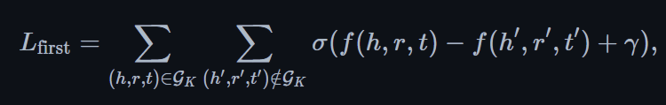
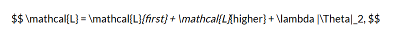

+++
title = 'Markdown下的Tex渲染失败解决'
date = 2024-09-03T17:39:50+08:00
draft = false
tags = ["工具"]
categories = ["工具"]
description = "解决hugo博客的数学公式渲染问题"
image = "/img/placeholder.jpeg"
+++

## 导语

最近在用hugo写博客的时候遇到某些公式一直渲染不对的问题，经过一番查证，最终找到了结果，遂把解决过程放在这里供大家参考。

## 问题引入

某天，柱桑在写论文笔记的时候，突然发现在他的vscode里Markdown的tex都被渲染了



而hugo server -D却怎么都不渲染，还出现了斜体



好不容易学会的latex公式的敲法（虽然这里用了gpt-4o多模态图转公式），结果不显示，这不得气死？？


### 出现原因

这个斜体是切入点，Markdown语法中，用'\_'包裹的文字会变成斜体，也就是说这是因为我的公式里的\_被Markdown先转成了 `<em>`标签，然后tex引擎一看，你这\$里包的也不是公式啊？于是就没有渲染。

## 解决办法

知道了出现原因就好办了，只需要让Markdown引擎不要渲染，留给tex引擎渲染就好。

hugo stack使用[goldmark](https://github.com/yuin/goldmark)来渲染作为Markdown的渲染引擎，你可以在你的config里再确认一遍

```yaml
markup:
    goldmark:
        renderer:
            ## Set to true if you have HTML content inside Markdown
            unsafe: true
```

同时他还用了KATEX作为tex公式渲染引擎，在 `\layouts\partials\article\components`可以再确认一遍

```html
{{- partial "helper/external" (dict "Context" . "Namespace" "KaTeX") -}}
<link rel="stylesheet" href="https://cdn.jsdelivr.net/npm/katex@0.16.9/dist/katex.min.css" integrity="sha384-n8MVd4RsNIU0tAv4ct0nTaAbDJwPJzDEaqSD1odI+WdtXRGWt2kTvGFasHpSy3SV" crossorigin="anonymous">
<script defer src="https://cdn.jsdelivr.net/npm/katex@0.16.9/dist/katex.min.js" integrity="sha384-XjKyOOlGwcjNTAIQHIpgOno0Hl1YQqzUOEleOLALmuqehneUG+vnGctmUb0ZY0l8" crossorigin="anonymous"></script>
<script defer src="https://cdn.jsdelivr.net/npm/katex@0.16.9/dist/contrib/auto-render.min.js" integrity="sha384-+VBxd3r6XgURycqtZ117nYw44OOcIax56Z4dCRWbxyPt0Koah1uHoK0o4+/RRE05" crossorigin="anonymous"></script>
<script>
    window.addEventListener("DOMContentLoaded", () => {
        renderMathInElement(document.querySelector(`.article-content`), {
            delimiters: [
                { left: "$$", right: "$$", display: true },
                { left: "$", right: "$", display: false },
                { left: "\\(", right: "\\)", display: false },
                { left: "\\[", right: "\\]", display: true }
            ],
            ignoredClasses: ["gist"]
        });})
</script>
```

这里delimiters就是KATEX的auto-render用来看哪些是他需要渲染的部分，没有任何毛病，只需要让goldmark不去渲染即可。

经过我的不懈查找，有多个解决办法，首先是我的解决办法：

### 使用goldmark的passthrough插件

这也是hugo官方建议的解决办法：https://gohugo.io/content-management/mathematics/

在config里进行相应的设置，这里是使用了goldmark的passthrough拓展，把用 `\[ \]` 和 `$$`括起来的块和行内用 `\(\)`和 `$`括起来的部分不解析

```yaml
markup:
    goldmark:
        renderer:
            ## Set to true if you have HTML content inside Markdown
            unsafe: true
        extensions: 
            passthrough:
                delimiters:
                    block:
                        - - \[
                          - \]
                        - - $$
                          - $$
                    inline:
                        - - \(
                          - \)
                        - - $
                          - $
                enable: true
```

it suits me fine.

### 用goldmark-katex或goldmark-mathjax

我没试这个，但是我觉得他应该是没问题的

https://github.com/litao91/goldmark-mathjax

https://github.com/FurqanSoftware/goldmark-katex
