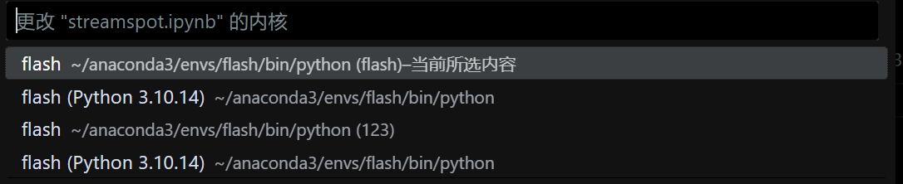
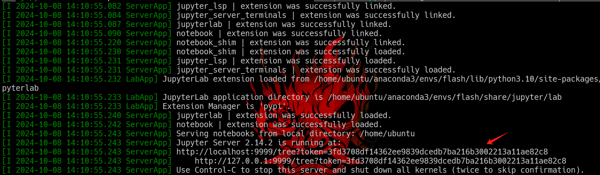
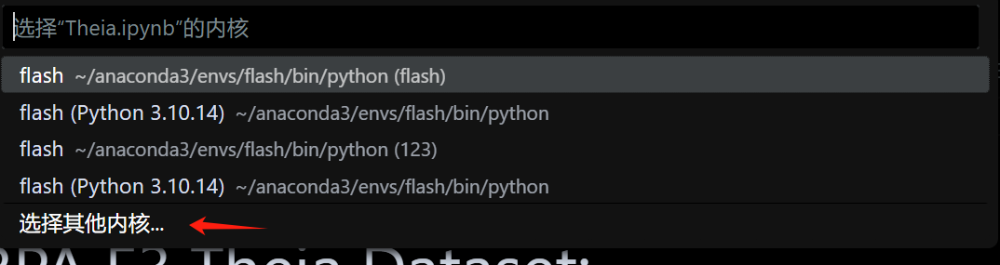
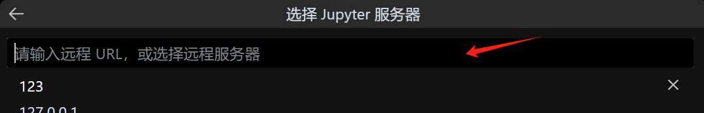

+++
title = 'VS连接远程服务器的conda的jupynotebook'
date = 2024-10-08T16:37:46+08:00
draft = false
tags = ["环境"]
categories = ["环境"]
description = "用vscode ssh连接远程服务器，并使用特定的conda环境使用jupyter notebook"
image = "index/1728377258643.png"
+++

## 导语

复现论文的时候需要特定的版本的cuda、torch、pyG，同时希望使用jupyternotebook来记录复现的过程，把我遇到的坑在这里总结一下。

## 插件

ssh：直接用ssh插件


python：直接用python插件


jupynotebook：直接用jupyter插件


## 操作

在服务器上安装ipykernel就可以，在vscode打开ipynb的文件的时候，右上角就可以选择对应的内核




## 坑

其实直接用上面的方法就可以获取相对合理的远程环境使用体验了，但是如果你用了pyG（也就是torch_geometric）并且依赖某个特定版本的cuda，而这个版本的cuda是使用conda环境装的的话，会因为LD_LIBRARY_PATH没用被引入而一直用不了，提示

```bash
OSError: libcusparse.so.xx: cannot open shared object file: No such file or directory
```

这时候就要在服务器上的对应的conda环境里，使用这个命令

```bash
python -m ipykernel install --user --name flash --display-name "flash"
```

来将这个环境的内核注册到jupyternotebook里，同时使用

```bash
export LD_LIBRARY_PATH=/home/ubuntu/anaconda3/envs/flash/lib:$LD_LIBRARY_PATH
```

将这个lib引入，接下来使用

```bash
jupyter-notebook --port 9999
```

来启动一个jupyter server，会有对应的地址



然后再用vscode连接到服务器，打开对应的ipynb，右上角会有选择内核，选择其他内核-现有jupyter服务器输入刚才的url






在这里你就可以看到你要的环境了。


## 后记

感觉大模型的幻觉还是挺严重的，还是说只有我遇到了这个问题啊？我按着大模型给我的方法用ipynb的魔术方法引入对应的.so，打印环境变量有，但是代码还是跑不了，搞得我很烦，一番折腾终于搞成了。
