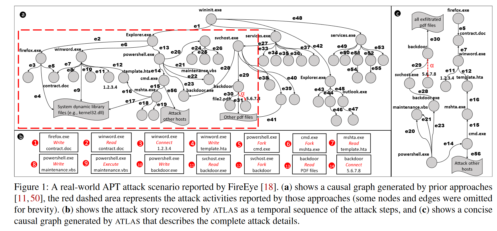
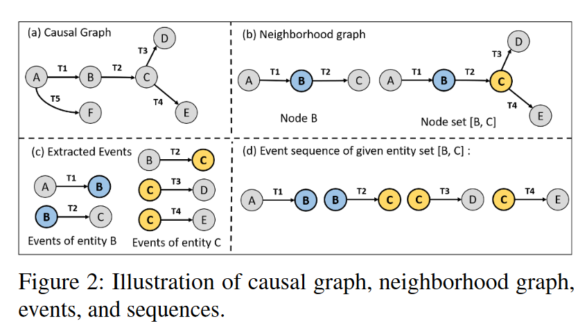

+++
title = 'ATLAS'
date = 2024-03-02T20:16:17+08:00
draft = true
+++

文章可以在[这里](https://www.usenix.org/conference/usenixsecurity21/presentation/alsaheel)获取

## introduction

APT攻击涉及长期的多个攻击步骤，其调查需要分析大量日志以确定其攻击步骤。因此提出ATLAS从现成的审计日志构建端到端攻击故事的框架。

ATLAS基于的观察：***无论利用的漏洞和执行的有效载荷如何，不同的攻击可能具有相似的抽象攻击策略***。

ATLAS利用因果关系分析、自然语言处理和机器学习技术的新颖组合来构建**基于序列**的模型，该模型从**因果图**中建立攻击和非攻击行为的关键模式。

取证分析从多个主机、应用程序和网络接口收集各种审计日志。海量日志通常被离线分析或实时监控，以调试系统故障并识别复杂的威胁和漏洞。

现有方法：

1. 从审计日志中构建因果依赖关系图，并使用查询系统来定位关键攻击阶段（例如，受损进程或恶意负载）。
2. 扩展机器学习（ML）技术，从日志中提取特征/序列，以自动检测入侵和故障。
3. 构建了通过事件关联发现不同日志事件之间关联的技术

这些方法在很大程度上无法精确定位关键攻击步骤，从而有效地突出端到端攻击故事。因此我们希望从审计日志中识别关键实体（节点），帮助网络分析师构建 APT 攻击的关键步骤。

ATLAS将自然语言处理 （NLP） 和深度学习技术集成到数据来源分析中，以识别攻击和非攻击序列。分为三个阶段

1. 处理系统日志并构建自己的优化因果依赖图
2. 通过NLP技术从因果图中构建语义增强序列（时间戳事件）
3. 学习表示攻击语义的基于序列的模型，这有助于在推理时恢复描述攻击故事的关键攻击实体。

ATLAS不会带来额外开销，不同的审计日志可以很容易地集成到 ATLAS 日志解析器中用来构建因果图并获得精确的序列和模型

我们的方法基于：***因果依赖关系图中不同攻击的关键步骤可能具有相似的模式***。这些模式可以通过NLP技术（即词形还原和词嵌入）转换为序列，将攻击和非攻击实体之间各种变化形式的关系组合在一起。它为模型提供了具有不同因果关系的更深层次的**记忆**。，进而提高了序列模型从未知审计日志中识别攻击步骤的准确性。

但是这样的方法面对以下三个挑战，相应的，ATLAS采取手段来应对：

1. 因果图通常庞大而复杂，这使得序列构建变得困难-->采用定制化的图优化算法来降低图的复杂度
2. 它需要一种方法来精确构建序列，以有效地模拟合法和可疑的活动-->提出一种从事件中提取攻击模式序列的新技术
3. 需要一种自动化方法来识别给定的攻击症状中的攻击事件-->通过攻击症状进行攻击调查，以恢复攻击事件，帮助全面构建攻击故事。

总的来说，ATLAS做了

1. 引入了 ATLAS，这是一个用于攻击故事恢复的框架，它利用自然语言处理和基于序列的模型学习技术来帮助网络分析师从审计日志中恢复攻击步骤.
2. 提出了一种新的序列表示，通过词形还原和词嵌入来抽象攻击和非攻击语义模式。这些序列使 ATLAS 能够构建一个有效的基于序列的模型，以识别构成攻击故事的攻击事件
3. 我们在受控环境中通过其真实世界报告开发的 10 种现实 APT 攻击中验证了 ATLAS。结果表明，ATLAS能够高精度、最小开销地识别攻击故事的关键攻击条目。

## Motivation and Definitions

整篇论文中设定了一种攻击场景：攻击者通过电子邮件向企业中的目标用户发送恶意Microsoft Word文件（contract.doc）。用户被欺骗使用 Firefox 从 Gmail 下载和打开 Word 文件。该文档包含一段恶意代码，该代码利用易受攻击的 Microsoft Word （winword.exe） 并发出 HTTPS 请求以下载恶意 Microsoft HTA 脚本 （template.hta）。此脚本执行恶意 Visual Basic 脚本 （maintenance.vbs），其中包含安装后门以泄露敏感文件的 PowerShell 命令。最后，攻击者横向移动到其他主机。

调查这个场景通常从从审核日志中收集有关攻击的数据开始，例如系统事件、DNS 查询和浏览器事件。攻击调查工具通常以因果图（或来源图）的形式表示审核日志，该图用作取证工具，使安全调查人员能够执行根本原因分析，并更好地了解攻击的性质。大多数先前的研究将因果图中的攻击故事恢复为子图，其中该图中的节点和边与攻击症状具有因果关系。图 1 （a） 显示了由这些工具生成的示例攻击场景的因果关系图。红色虚线箭头表示从中启动攻击调查的警报事件（α，可疑网络连接），红色虚线矩形区域表示已恢复的攻击子图。

但是即使应用了不同的图优化技术，这样的图仍然非常大，并且在实践中难以解释。这些工作很大程度上依赖于启发式或硬编码**规则**，这些**规则**的开发和维护非常耗时。**领域知识专家**需要不断更新这些规则，以涵盖新开发的攻击。而ATLAS只需要更多的攻击训练数据来学习新的攻击模式。

其他人提出了**基于异常的方法**，该方法可以学习用户行为，并将任何偏离该行为的行为识别为异常。虽然基于异常的方法可以识别未知攻击，但随着用户行为随时间的变化，它们可能会出现许多**误报**。为了解决这个问题，ATLAS旨在学习攻击模式和用户行为，以确定两者之间的异同。

与ATLAS类似，基于学习的方法使用ML算法从日志中对攻击事件进行建模。虽然这些方法可以有效地减少日志条目的数量，但仍需要**大量的手动工作**才能找到攻击事件的高级视图。为了解决这个问题，ATLAS调查旨在识别攻击**关键实体**（节点），使其能够自动识别相关攻击事件的子集。

APT攻击可以概括为从审计日志中获取的攻击阶段的**时间序列，** 例如图1（b）中所示的步骤1-14，类似于自然语言中描述的攻击步骤。这些攻击步骤通常适合在特定上下文中作为表示攻击语义的唯一序列，这可以与审核日志中的正常活动区分开来。

ATLAS 在推理时给定攻击症状节点（警报事件α包含的恶意 IP 地址），提取一组与症状节点关联的候选序列，并使用基于序列的模型来识别序列中的哪些节点参与了攻击。此后，它使用已识别的攻击节点来构建攻击故事，其中包括已识别的攻击节点的事件，从而使攻击调查更加简洁，更容易被调查人员解读。

图 1 （c） 说明了 ATLAS 为激励示例恢复的攻击故事，其中包括示例攻击的完整关键攻击步骤。此过程大大减少了从大型因果图中进行攻击调查的手动工作，该图排除了对攻击没有影响的事件，并减少了调查大型因果图所需的时间。

### definition

因果图G：因果图是从审计日志中提取的数据结构，通常用于来源跟踪，指示主题（例如，流程）和对象（例如，文件或连接）之间的因果关系。因果图由节点组成，节点代表主体和客体，边缘连接，边缘代表主体和客体之间的动作（例如，读取或连接）。我们在这里考虑一个有向循环因果图，它的边缘从主体指向对象。

实体e：实体是从因果图中提取的唯一系统主体或对象，在其中它表示为节点。我们考虑的实体包括进程、文件和网络连接（即IP地址和域名）

邻域图。给定因果图，如果两个节点u和v通过一条边连接，则称它们为邻居。节点 n 的邻域是由节点 n 和连接相邻节点与节点 n 的边组成的 G 子图。类似地，给定一组节点 {n1,n2,...,nn}，我们提取一个统一的邻域图，其中包括将它们连接到相邻节点的所有节点和边。

事件：事件ε是一个四元组（src、action、dest、t），源 （src） 和目标 （dest） 是与动作相关的两个实体。t 是显示事件发生时间的事件时间戳。给定一个实体 e，可以从 e 邻域图中提取其事件，其中包括与 e 的邻居相关的所有操作。例如，给定一个实体Firefox.exe和一个邻域图，其中包含从节点 Firefox.exe 到节点 Word.doc 的操作 open 和时间戳 t，那么 （Firefox.exe， open， Word.doc， t） 是 Firefox 进程在时间 t 打开 Word 文件的事件

序列：给定一个实体 e，可以从因果图中提取序列 S。序列 S 按时间顺序包括实体 e 的邻域图的所有事件，使得 S{e} ：= {ε1， ε2， . . . ， εn}。同样，如果给定一组实体，我们可以从它们的统一邻域图中提取一个包含所有事件的序列。

图 2 （a） 说明了具有六个实体 {eA， eB， . . . ， eF} 的因果图。图 2 （b） 显示了 eB 的邻域图，其中包括节点 B、相邻节点 {A， C} 及其连接边 {EAB， EBC}。类似地，实体集 {eB， eC} 的邻域图包括节点 {A， B， C， D， E} 和边 {EAB， EBC， ECD， ECE}，如图 2 （b） 所示。实体 eB 的事件为 εAB =< eA， a1， eB， t1 > 和 εBC =< eB， a2， eC， t2 >如图 2 （c） 所示。图 2 （d） 显示了实体集 {eB， eC} 的事件序列。

## 我的想法

利用NLP的方法，将问题转为序列识别问题。使用了新颖的数据增强方法。
