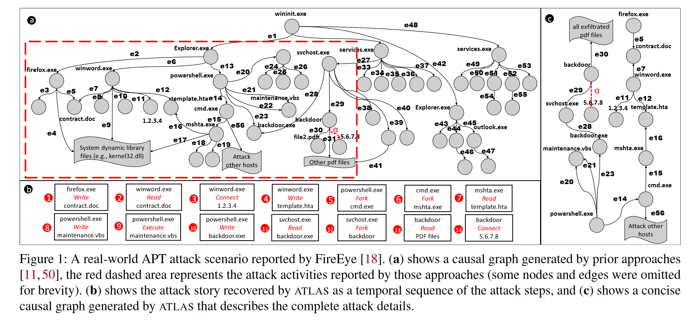
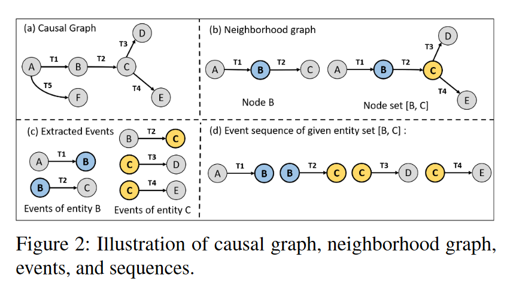
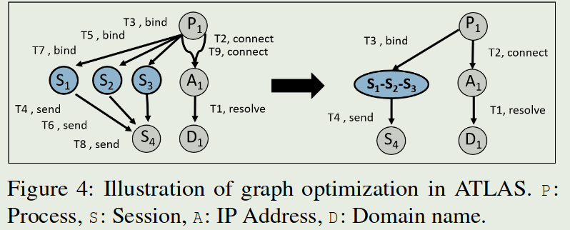
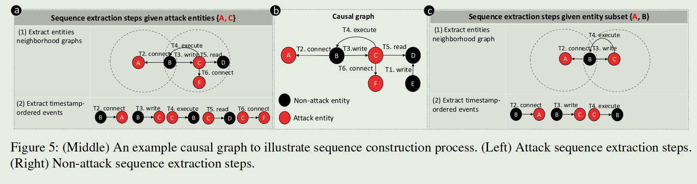
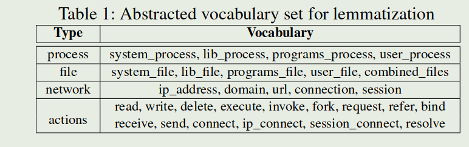

+++
title = 'ATLAS'
date = 2024-03-02T20:16:17+08:00
draft = false
tags = ["溯源图", "论文笔记"]
categories = ["论文"]
description = "将溯源图转为序列的方法"
image = "ATLAS/1709635161753.png"
+++

文章可以在[这里](https://www.usenix.org/conference/usenixsecurity21/presentation/alsaheel)获取

## introduction

APT攻击涉及长期的多个攻击步骤，其调查需要分析大量日志以确定其攻击步骤。因此提出ATLAS从现成的审计日志构建端到端攻击故事的框架。

ATLAS基于的观察：**无论利用的漏洞和执行的有效载荷如何，不同的攻击可能具有相似的抽象攻击策略**。

ATLAS利用因果关系分析、自然语言处理和机器学习技术的新颖组合来构建**基于序列**的模型，该模型从**因果图**中建立攻击和非攻击行为的关键模式。

取证分析从多个主机、应用程序和网络接口收集各种审计日志。海量日志通常被离线分析或实时监控，以调试系统故障并识别复杂的威胁和漏洞。

现有方法：

1. 从审计日志中构建因果依赖关系图，并使用查询系统来定位关键攻击阶段（例如，受损进程或恶意负载）。
2. 扩展机器学习（ML）技术，从日志中提取特征/序列，以自动检测入侵和故障。
3. 构建了通过事件关联发现不同日志事件之间关联的技术

这些方法在很大程度上无法精确定位关键攻击步骤，从而有效地突出端到端攻击故事。因此我们希望从审计日志中识别关键实体（节点），帮助网络分析师构建 APT 攻击的关键步骤。

ATLAS将自然语言处理 （NLP） 和深度学习技术集成到数据来源分析中，以识别攻击和非攻击序列。分为三个阶段

1. 处理系统日志并构建自己的优化因果依赖图
2. 通过NLP技术从因果图中构建语义增强序列（时间戳事件）
3. 学习表示攻击语义的基于序列的模型，这有助于在推理时恢复描述攻击故事的关键攻击实体。

ATLAS不会带来额外开销，不同的审计日志可以很容易地集成到 ATLAS 日志解析器中用来构建因果图并获得精确的序列和模型

我们的方法基于：**因果依赖关系图中不同攻击的关键步骤可能具有相似的模式**。这些模式可以通过NLP技术（即词形还原和词嵌入）转换为序列，将攻击和非攻击实体之间各种变化形式的关系组合在一起。它为模型提供了具有不同因果关系的更深层次的**记忆**。，进而提高了序列模型从未知审计日志中识别攻击步骤的准确性。

但是这样的方法面对以下三个挑战，相应的，ATLAS采取手段来应对：

1. 因果图通常庞大而复杂，这使得序列构建变得困难-->采用定制化的图优化算法来降低图的复杂度
2. 它需要一种方法来精确构建序列，以有效地模拟合法和可疑的活动-->提出一种从事件中提取攻击模式序列的新技术
3. 需要一种自动化方法来识别给定的攻击症状中的攻击事件-->通过攻击症状进行攻击调查，以恢复攻击事件，帮助全面构建攻击故事。

总的来说，ATLAS做了

1. 引入了 ATLAS，这是一个用于攻击故事恢复的框架，它利用自然语言处理和基于序列的模型学习技术来帮助网络分析师从审计日志中恢复攻击步骤.
2. 提出了一种新的序列表示，通过词形还原和词嵌入来抽象攻击和非攻击语义模式。这些序列使 ATLAS 能够构建一个有效的基于序列的模型，以识别构成攻击故事的攻击事件
3. 我们在受控环境中通过其真实世界报告开发的 10 种现实 APT 攻击中验证了 ATLAS。结果表明，ATLAS能够高精度、最小开销地识别攻击故事的关键攻击条目。

## Motivation and Definitions

整篇论文中设定了一种攻击场景：攻击者通过电子邮件向企业中的目标用户发送恶意Microsoft Word文件（contract.doc）。用户被欺骗使用 Firefox 从 Gmail 下载和打开 Word 文件。该文档包含一段恶意代码，该代码利用易受攻击的 Microsoft Word （winword.exe） 并发出 HTTPS 请求以下载恶意 Microsoft HTA 脚本 （template.hta）。此脚本执行恶意 Visual Basic 脚本 （maintenance.vbs），其中包含安装后门以泄露敏感文件的 PowerShell 命令。最后，攻击者横向移动到其他主机。

调查这个场景通常从从审核日志中收集有关攻击的数据开始，例如系统事件、DNS 查询和浏览器事件。攻击调查工具通常以因果图（或来源图）的形式表示审核日志，该图用作取证工具，使安全调查人员能够执行根本原因分析，并更好地了解攻击的性质。大多数先前的研究将因果图中的攻击故事恢复为子图，其中该图中的节点和边与攻击症状具有因果关系。图 1 （a） 显示了由这些工具生成的示例攻击场景的因果关系图。红色虚线箭头表示从中启动攻击调查的警报事件（α，可疑网络连接），红色虚线矩形区域表示已恢复的攻击子图。

但是即使应用了不同的图优化技术，这样的图仍然非常大，并且在实践中难以解释。这些工作很大程度上依赖于启发式或硬编码**规则**，这些**规则**的开发和维护非常耗时。**领域知识专家**需要不断更新这些规则，以涵盖新开发的攻击。而ATLAS只需要更多的攻击训练数据来学习新的攻击模式。

其他人提出了**基于异常的方法**，该方法可以学习用户行为，并将任何偏离该行为的行为识别为异常。虽然基于异常的方法可以识别未知攻击，但随着用户行为随时间的变化，它们可能会出现许多**误报**。为了解决这个问题，ATLAS旨在学习攻击模式和用户行为，以确定两者之间的异同。

与ATLAS类似，基于学习的方法使用ML算法从日志中对攻击事件进行建模。虽然这些方法可以有效地减少日志条目的数量，但仍需要**大量的手动工作**才能找到攻击事件的高级视图。为了解决这个问题，ATLAS调查旨在识别攻击**关键实体**（节点），使其能够自动识别相关攻击事件的子集。

APT攻击可以概括为从审计日志中获取的攻击阶段的**时间序列，** 例如图1（b）中所示的步骤1-14，类似于自然语言中描述的攻击步骤。这些攻击步骤通常适合在特定上下文中作为表示攻击语义的唯一序列，这可以与审核日志中的正常活动区分开来。

ATLAS 在推理时给定攻击症状节点（警报事件α包含的恶意 IP 地址），提取一组与症状节点关联的候选序列，并使用基于序列的模型来识别序列中的哪些节点参与了攻击。此后，它使用已识别的攻击节点来构建攻击故事，其中包括已识别的攻击节点的事件，从而使攻击调查更加简洁，更容易被调查人员解读。

图 1 （c） 说明了 ATLAS 为激励示例恢复的攻击故事，其中包括示例攻击的完整关键攻击步骤。此过程大大减少了从大型因果图中进行攻击调查的手动工作，该图排除了对攻击没有影响的事件，并减少了调查大型因果图所需的时间。

### definition

因果图G：因果图是从审计日志中提取的数据结构，通常用于来源跟踪，指示主题（例如，流程）和对象（例如，文件或连接）之间的因果关系。因果图由节点组成，节点代表主体和客体，边缘连接，边缘代表主体和客体之间的动作（例如，读取或连接）。我们在这里考虑一个有向循环因果图，它的边缘从主体指向对象。

实体e：实体是从因果图中提取的唯一系统主体或对象，在其中它表示为节点。我们考虑的实体包括进程、文件和网络连接（即IP地址和域名）

邻域图。给定因果图，如果两个节点u和v通过一条边连接，则称它们为邻居。节点 n 的邻域是由节点 n 和连接相邻节点与节点 n 的边组成的 G 子图。类似地，给定一组节点 {n1,n2,...,nn}，我们提取一个统一的邻域图，其中包括将它们连接到相邻节点的所有节点和边。

事件：事件ε是一个四元组（src、action、dest、t），源 （src） 和目标 （dest） 是与动作相关的两个实体。t 是显示事件发生时间的事件时间戳。给定一个实体 e，可以从 e 邻域图中提取其事件，其中包括与 e 的邻居相关的所有操作。例如，给定一个实体Firefox.exe和一个邻域图，其中包含从节点 Firefox.exe 到节点 Word.doc 的操作 open 和时间戳 t，那么 （Firefox.exe， open， Word.doc， t） 是 Firefox 进程在时间 t 打开 Word 文件的事件

序列：给定一个实体 e，可以从因果图中提取序列 S。序列 S 按时间顺序包括实体 e 的邻域图的所有事件，使得 S{e} ：= {ε1， ε2， . . . ， εn}。同样，如果给定一组实体，我们可以从它们的统一邻域图中提取一个包含所有事件的序列。

图 2 （a） 说明了具有六个实体 {eA， eB， . . . ， eF} 的因果图。图 2 （b） 显示了 eB 的邻域图，其中包括节点 B、相邻节点 {A， C} 及其连接边 {EAB， EBC}。类似地，实体集 {eB， eC} 的邻域图包括节点 {A， B， C， D， E} 和边 {EAB， EBC， ECD， ECE}，如图 2 （b） 所示。实体 eB 的事件为 εAB =< eA， a1， eB， t1 > 和 εBC =< eB， a2， eC， t2 >如图 2 （c） 所示。图 2 （d） 显示了实体集 {eB， eC} 的事件序列。

## Method

### 序列生成

首先从日志中提取出平台无关的因果图（图缩减）：

1. 消除攻击节点无法访问到的所有节点和边缘【这缩的有点狠啊】
2. 从审计日志中构建具有非重复边的因果图，构建的因果图中不包含重复的边（边属性相同且首尾节点相同）
3. 如果某些节点和边引用相同类型的事件，则 ATLAS 会合并它们，合成的边的时间戳按原始边中最早的。
   

构造序列：

将因果图转换为标记为“攻击”或“非攻击”的序列，并将词形还原和选择性采样扩展到序列构造中，以有效地抽象攻击和非攻击模式，最后，使用词嵌入将序列转换为实数向量，并通过 LSTM 学习基于序列的模型。

对于攻击节点：

对于一个图中的攻击节点，构建攻击节点子集，子集节点数$\geq$2，因此对于n个攻击节点的集合，有$\sum_{i=2}^k C_n^i$个子集，这个方法在面对攻击节点数量很多的时候复杂度会爆炸，但是攻击者一般会为了隐藏而最小化攻击节点数量【这样每个攻击子图都得比较小才合适，怪不得图缩减缩得这么狠】。

1、对于攻击实体中的每个实体，ATLAS提取其在攻击子图中的邻域图，即捕捉与攻击节点节点有因果关系的实体，2、从邻域图中获取按照时间戳排序的攻击事件。如果源节点或目标节点代表攻击实体，则事件被标记为攻击。3、最后，ATLAS 将提取的时间戳排序的攻击事件转换为序列，并在以下情况下将其标记为攻击：（a） 它仅包含攻击事件， （b）它包括实体子集的所有攻击事件。【还是在缩减，这样攻击序列理论上是最小的】

对于非攻击节点：

意义不是很大，主要学习攻击序列。同时，对于一个有k个攻击节点和k'个非攻击节点的因果图，会有$\sum^{k}_{i=1} C^i_k.k'$(攻击节点的子集（子集节点数不必$\geq$ 2)+非攻击节点的全集)。提取非攻击序列的方法和提取攻击序列的方法的1、2步骤一样，3、如果序列与任何提取的攻击序列不匹配，则 ATLAS 会将其标记为非攻击，否则，处理后的序列将被丢弃。

下面这张图是例子

### 序列还原

ATLAS使用**词形还原**化将序列转换为表示序列模式的广义文本，以便进行语义解释。

表1显示了 ATLAS 用于抽象序列中的实体和操作的四种不同的词汇类型以及每种类型中的词汇。词汇表总共包括 30 个单词，能够将单词的**屈折形式**和**派生形式**简化为共同的基本形式。词汇根据单词的细粒度语义分为四种类型：进程、文件、网络和动作。

ATLAS解析每个序列，查找实体并将每个实体映射到相应的词汇表。词形还原过程后的序列被转换为“类似句子”的中间表示，其中包含广义序列模式的完整语义。

我们注意到，在对序列进行词形还原后，可能会发生攻击和非攻击序列的意外重复。为了使用非重复序列训练模型，我们丢弃了所有与攻击序列重叠的非攻击序列，然后再将其传递到**选择性序列采样**

### 选择性序列采样

构建的攻击和非攻击序列的数量可能不平衡。原因是日志条目中的攻击实体通常少于非攻击实体。例如，我们在通过分析审计日志进行评估时发现，攻击实体的平均数量为 61，而非攻击实体的平均数量约为 21K。为了平衡训练数据集，ATLAS首先对具有一定相似性阈值的非攻击序列进行**欠采样**。然后，使用过采样机制随机**变异**攻击序列，直到它们的总数达到相同数量。不能直接采取复制的过采样因为会造成过拟合。

#### 欠采样

通过Levenshtein Distance计算相似性，用80%作为阈值。复杂度为$O(n^2)$

#### 过采样

对于攻击序列，ATLAS会随机将一种词汇类型变异为另一种相同类型的词汇。

### 序列学习

通过**词表示嵌入**将词形还原序列转换为表示序列模式的广义文本（30个词->4type)【对……对吗？】，然后用了多种方法生成嵌入向量并在后文进行了比较。

通过LSTM和CNN来进行序列学习

### 攻击还原

遍历所有节点，来判断是否是攻击节点，O(n)复杂度。

为了了识别未知的攻击实体，ATLAS首先从因果图中获取所有未知实体，构建只包含一个未知实体的子集。然后，ATLAS 将攻击实体附加到每个子集;因此，每个子集包含所有已知的攻击症状实体和一个未知实体。ATLAS 使用这些子集从因果图中提取序列，LSTM 模型用于通过预测分数预测每个序列是攻击还是非攻击。此过程通过检查这两个实体的时间顺序事件是否形成模型先前学习的攻击模式来识别未知实体是否与攻击症状实体密切相关。

ATLAS 攻击故事恢复的目标是从攻击调查阶段识别与已识别攻击实体关联的攻击事件。ATLAS提取已识别攻击实体的邻域图，并将所有包含的事件作为攻击事件获取。这些事件按其时间戳进一步排序，作为恢复的攻击故事。ATLAS 的有效性不受跨多个主机执行的攻击的影响，它只需要对来自单个主机的审计日志执行分析即可发现所有攻击实体

## 工作亮点

1. 新的图缩减方法来构建因果图
2. 通过因果图生成序列用于学习（词型还原+词表示嵌入+过采样&欠采样)

## 我的想法

图缩减方法是没见过的，按照文章的结果，这种图缩减方法也很值得参考，一顿猛缩减可以导致每个小子图的学习代价比较小（或者说因为序列长度有限制吧？)。把图学习转成序列识别的方法很有意思，这样直接就不用使用图学习了。但是感觉他这个识别是否攻击节点计算量也不小，O(n)是n*100s感觉也没啥用啊？抽时间复现下看看。

## 补充知识

### 屈折形式（Inflectional Forms）和派生形式（Derivational Forms）

屈折形式是指单词在不同语法环境下的形式变化，这种变化不改变单词的基本词义或词类。屈折形式主要用于表示语法信息，如时态、数、格、性、比较级等。

* walk -> walked -> walking
* book -> books
* big -> bigger -> biggest

派生形式是通过添加前缀或后缀来改变单词的词性或基本词义，生成新的单词的过程。派生通常会改变单词的基本意义和/或词类。

* clear (清楚的) -> unclear (不清楚的)
* happy (形容词) -> happiness (名词)

### Levenshtein Distance

Levenshtein Distance，也称为编辑距离（Edit Distance），是一种衡量两个字符串之间差异的度量方法。它计算将一个字符串转换为另一个字符串所需的最少单字符编辑操作次数，这些操作包括插入（insertion）、删除（deletion）和替换（substitution）。Levenshtein Distance广泛应用于文本处理、拼写检查、语音识别、DNA序列比对等领域。它可以帮助确定两个字符串的相似度，或者在搜索时提供近似匹配。

{{ `<heatmap>` }}
