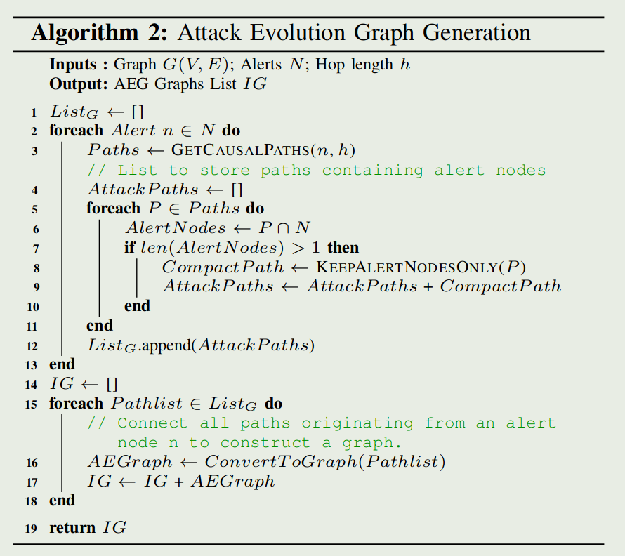

+++
title = 'FLASH'
date = 2024-04-18T10:51:57+08:00
draft = false
+++

## 导语

IEEE S&P 2024, doi is [here](https://doi.ieeecomputersociety.org/10.1109/SP54263.2024.00139)

## motivation

简单来说还是对效率问题提出了一个解，针对大的溯源图，开发了一个嵌入回收数据库来**存储**在训练阶段生成的节点嵌入，检测的时候读嵌入数据库即可，不用重新算嵌入

Q:为什么训练阶段的节点嵌入在检测时能用到，覆盖率怎么搞？

## Introduction

现有的溯源图IDS的存在局限

1. 通常会忽略有价值的语义数据，例如来源图中的进程名称、命令行参数、文件路径和 IP 地址。【Q：但是不是说这些内容容易造成混淆吗？把这些通过word2vec编码成向量不是还是容易造成混淆吗？】（A：意思是不带这些可以提升泛化性，对于没见过的攻击比较管用，但是可能因为学的不够多而有误报，我觉得还是泛化性更重要一点。差评)
2. 一些IDS忽略了系统事件的时间顺序和因果顺序的重要性。
3. 可扩展性问题，尤其是在处理大型来源图时。
4. 粗粒度检测：许多 IDS 识别恶意子图而不是单个恶意节点，这使得警报验证和攻击重建对安全分析师来说既耗时又容易出错。
5. GNN技术不可扩展，而且速度非常慢
6. 现有方法都是学习良性行为

因此，这篇文章

1. 采用基于Word2Vec的嵌入技术，将来源图中存在的各种节点属性（如进程名称、命令行参数、文件路径和IP地址）编码为语义丰富的特征向量。
2. **修改了 Word2Vec 技术以获得时间敏感的嵌入，解决了忽略事件之间时间顺序的问题。(咋修改的？)**
3. 通过仅选择与威胁识别相关的边来提高图表示学习中图遍历的效率，设计了一个GNN嵌入数据库，该数据库的灵感来自以前应用于**语言模型的嵌入回收技术（2022)**
4. 报告危险节点（node)而非危险子图（graph)，能够对adversarial mimicry attacks on provenance-based IDSes【Q：这是啥？】（A：http://dx.doi.org/10.1145/586110.586145)鲁棒。根据检测生成的演变图（AEG)来帮助溯源。说是检测危险边（edge)的消耗太大，node是最好的trade off

这篇文章首次（2024年以来)在Darpa OpTC数据集上进行了评估，该数据集是DARPA迄今为止发布的最大的系统日志数据集。这些数据集涵盖了广泛的攻击场景和系统行为。说是比SOTA快三倍

作者的小结：

• 我们提出了一种基于来源的IDS，即FLASH，它利用来源图中的上下文和结构信息来增强其检测能力。

• 我们引入了一个两步过程，分别使用 Word2Vec 和 GNN 生成语义和上下文嵌入。在此过程之后，通过轻量级分类器模型进行实时异常检测，确保系统的可扩展性和效率。

• 我们提供两种方案——选择性图遍历和嵌入回收数据库——使图表示学习在 IDS 设置中变得实用。

• 我们在真实世界的数据集上对我们的技术进行全面评估。结果突出了FLASH在识别恶意活动方面的有效性，其对对抗性模拟攻击的弹性，以及加速警报验证过程的能力

## Motivation

### OpTC的攻击场景

攻击者会向目标受害者发送网络钓鱼电子邮件。这些电子邮件包含恶意的 PowerShell Empire 暂存器。打开电子邮件附件后，攻击者将获得对受害者系统的访问权限。然后，攻击代理与命令和控制 （C&C） 服务器建立连接，并秘密地在系统中停留数天。代理的目标是检查系统配置并搜索敏感数据。为了保持隐身性，攻击者执行最少的系统活动并模仿良性系统实体的行为。代理找到所需文件后，会从命令服务器下载有效负载，并将数据泄露到服务器。

在数据收集过程中，这种特殊的攻击是作为 DAPRA 红队演习的一部分执行的。红队在系统上安装了 C&C 代理，该代理使用find.exe搜索关键文件并收集系统信息。然后，攻击代理通过Chrome.exe从 news.com:8080 下载了一个名为fileTransfer1000.exe的程序。该程序压缩文档目录中的文件并将它们泄露到 news.com:9999。这是数据泄露攻击的典型示例，攻击者旨在从目标系统中窃取敏感信息，同时通过模拟良性系统进程来保持未被发现。

### 现有方法缺陷

主要通过学习良性方法

* Semantic Encoding（语义编码)：在节点编码过程中是否考虑了语义信息如进程名称、命令行或文件路径。
* Temporal Encoding（时间编码)：是否考虑系统事件的时间顺序
* Scalability（可拓展性)：GNN的高计算需求会阻碍系统的可扩展性，是否通过方法降了GNN计算开销
* Detection Granularity（检测粒度)：是否有粗细粒度的区分（检测出异常子图、检测出异常节点/边)
* Contextual Alerts（上下文警报)：按照他原文还是子图粒度和节点/边粒度的问题，他意思是能检测出节点/边的就能更好重建攻击（那为啥要分两条？多少沾点)
* Robustness Against Mimicry Attacks（对模仿攻击的鲁棒性)：对抗溯源图检测的模仿攻击指操纵分布图编码，修改攻击图中的节点邻域以模仿良性起源图中的节点邻域。归根接地还是要节点粒度/边粒度的检测（嗯是让你凑了三条啊？)

## FLASH design

五个关键模块组成：

1. 来源图构造函数
   流式读，节点分为进程节点和对象节点，对象节点包括文件、网络流、模块和其他系统对象，节点包含属性，例如进程名称、命令行、文件路径、IP 地址、端口号和模块路径。边带有指定事件类型（系统调用）的标签，标签代表连接节点与事件时间戳之间的因果关系
2. 基于 Word2Vec 的语义编码器
   系统日志包含与各种系统实体相关的丰富属性。独热、词袋转换的向量过于稀疏，采用Word2Vec模型，将属性转换到密集的向量空间。考虑节点的以下属性：进程节点的进程名称和命令行参数、文件节点的文件路径、套接字节点的网络 IP 地址和端口以及模块节点的模块名称。通过结合语义属性和节点与其 1-hop 邻居之间的因果事件类型（系统调用）来为每个节点形成摘要句子。系统事件按时间戳排序，以保持时间顺序。每个句子都通过在良性系统日志上训练的 Word2Vec 模型编码为固定长度的向量。【就是说将节点的属性和对应1hop邻居的系统事件关系形成一个长句子在word2vec到固定长度】
   标准的Word2Vec 模型不保留句子中单词的顺序，我们设计了一种为每个单词嵌入分配单独的权重的时间编码方案，为每个单词嵌入分配单独的权重。这些权重累积在一个句子上，产生一个富含时间信息的嵌入。我们通过根据时间戳按时间顺序排列系统事件来启动这种方法，从而促进将时间顺序整合到我们的句子中。我们将从Transformers[65]借来的概念位置编码合并到输入嵌入中，以传达有关序列中每个标记位置的信息。Word2Vec 缺乏内置的顺序概念，因此位置编码允许模型根据其序列位置来区分标记。
   通过将Word2Vec嵌入与位置编码相结合，我们的模型不仅可以捕获单词之间的语义关联，还可以捕获摘要句子中单词的顺序。
3. 基于 GNN 的上下文编码器
   通过GNN需要通过对节点周围k-hop邻域结构进行编码可以有效识别溯源图中的隐蔽攻击节点，但开销巨大。基于上一部分的word2vec的嵌入的图表示学习则加雪上加霜。
   我们的GNN模型学习GraphSage的图遍历算法。我们设计了一系列图遍历原则。这些原则指导GraphSage在应用GNN之前有选择地聚合来自特定边缘的信息。我们用以下遍历原则：

   1. 唯一边采样：我们仅对两个节点之间相同类型的单个边进行采样，确保在遍历过程中只包含一次此类边。【不还是图缩减吗……说的好像很屌的样子】
   2. 低优先级事件排除：排除事件优先级的边和取证无关的系统事件的边。此类事件可能包括由进程临时创建且在系统执行期间从未与其他进程交互的文件的删除事件，以及表示为进程节点的自循环的退出事件。以前的工作也采用了类似的方法来减少系统日志中的噪声。
   3. 特定于执行的信息过滤：仅包含一次具有相同执行特定信息的节点和边。溯源图中的许多相邻节点可能仅因特定于执行的属性而有所不同，但在其他方面是相同的。比如具有相同4元组但开始和结束时间不同的网络流
   4. 用户特定属性处理：将仅在用户特定属性上不同的节点或边视为相同，例如，如果两个模块具有相同的模块路径，但不同的用户ID不同，则它们可能会有所不同。对于此类节点，我们忽略特定于用户的属性，仅选择其中一个。

   我们采用半监督节点分类方法来训练我们的新GNN模型。我们的模型使用节点的输入特征和图形结构来对其类型进行分类。GNN模型使用标记数据进行训练，学习识别良性节点的类型【你他妈不还是学的良性吗？你在这说什么p话呢？】。使用加权交叉熵来解决数据不平衡的问题，
4. 嵌入数据库
   我们的系统利用训练好的图神经网络（GNN）模型为存在于我们良性数据集中的所有节点生成结构化嵌入。为了在实时威胁检测期间高效检索和存储这些GNN输出向量，我们设计了一个专门的键值存储结构。**键**被设计为**持久节点标识符**（PNI），它与节点属性相关联，这些属性在不同的系统执行过程中保持不变。这些属性包括进程名称、文件路径、模块路径和网络流IP地址。相应的**值**则包含了由GNN导出的嵌入，以及与该特定节点相关联的一组邻居节点。
   我们利用属性抽象技术来**删除特定于用户和执行的信息**。这确保了存储的嵌入是可通用的。具体来说，有以下几种抽象模式

   1. 用户抽象模式：针对进程和文件节点类型实现，该模式从进程名称和文件路径中省略**用户ID**，实现高度泛化。例如，文件路径 /Users/john/.bashrc 被抽象为 /Users/\*/.bashrc。
   2. 网络连接抽象架构：应用于套接字节点类型，此架构消除了**开始和结束时间**，从而增强了不同系统执行的通用性
   3. 模块路径抽象架构：模块节点具有路径和基址属性。当基址更改时，路径在不同的执行中保持不变。此架构仅保留模块路径，确保模块节点的一致和可泛化表示。

   通过对具有稳定邻域结构的节点进行预计算和存储GNN嵌入，可以优化实时异常检测和减少计算开销。其中，邻域集起着关键作用。它有助于确定实时分析期间节点的邻域结构是否与良性阶段观察到的邻域结构相匹配。如果匹配就直接拿数据库里的嵌入，不需要再通过邻域关系进行图表示计算。如果不匹配则默认为实时生成的 Word2Vec 特征进行异常检测。【Q：对吗？是特征？不是应该是GNN算出来的节点嵌入吗？】我们使用 **Jaccard 索引**来比较节点的存储邻域和当前邻域。
5. 异常检测器
   我们选择了 XGBoost 作为我们的异常检测任务的分类器。XGBoost 最小化正则化目标函数 $J = L(y， f (x))+Ω(f)$，使用梯度提升以迭代方式向集合添加新树。每个新树都旨在最小化损失函数相对于当前集成预测的梯度。XGBoost 模型使用每个节点的串联 Word2Vec 编码向量和 GNN 嵌入向量。它从预训练的键值存储中检索 GNN 嵌入，实时生成 Word2Vec 特征，执行推理，并保存输出以供下一管道阶段使用。这种强大的流程巩固了我们IDS的性能和可扩展性。
   FLASH通过比较预测节点类型和实际节点类型来检测异常节点。

还有个攻击演化图的构造，用于更直观的溯源

6. 从FLASH生成的大型来源图和警报中构建紧凑的攻击演化图（AEG）。中心概念是在来源图中相互链接因果相关的警报，从而构建一系列简洁的 AEG。这些 AEG 仅封装警报节点及其因果链接，从而提供警报节点交互的简化和清晰视图。这种减少大大简化了原始图形，使分析师更容易快速有效地掌握攻击进展。
   

## Evaluation

懒得写了

## 主要贡献

嵌入回收数据库存储在训练阶段生成的节点嵌入

1. 通过图神经网络（GNN）在数据溯源图上利用图表示学习
2. 使用基于Word2Vec的语义编码器来捕获基本的语义属性和时间顺序
3. 采用了基于GNN的上下文编码器，可以有效地将局部和全局图结构编码为富有表现力的节点嵌入。

## 补充知识

### 加权交叉熵

加权交叉熵（Weighted Cross-Entropy）是一种改进的交叉熵损失函数，它通过为不同类别的样本分配不同的权重来调整损失的计算。在标准的交叉熵损失函数中，所有类别的样本对损失的贡献是相同的。然而，在实际应用中，数据集往往存在类别不平衡的问题，即某些类别的样本数量远多于其他类别。这种不平衡会导致模型在训练时偏向于预测样本数量多的类别，从而忽视了样本数量少的类别。

加权交叉熵通过引入权重系数来解决这个问题。对于样本数量较少的类别，可以为其分配一个较大的权重，而对于样本数量较多的类别，则分配一个较小的权重。这样，在计算损失时，样本数量少的类别对损失的贡献会更大，从而促使模型更加关注这些类别的样本，提高模型对这些类别的预测能力。

### Jaccard 索引

Jaccard 索引，也称为 Jaccard 相似系数或 Jaccard 系数，是一种衡量两个集合相似度的统计量。它定义为两个集合的交集大小与它们的并集大小的比值。Jaccard 索引的取值范围在 0 到 1 之间，其中 1 表示两个集合完全相同，0 表示两个集合没有共同元素。

Jaccard 索引的数学表达式如下：

J(A, B) = |A ∩ B| / |A ∪ B|

### XGBoost

XGBoost（eXtreme Gradient Boosting）是一种基于决策树的集成机器学习算法，它以梯度提升（Gradient Boosting）框架为基础，通过优化目标函数和高效地处理大规模数据集而广受欢迎

XGBoost 在各种机器学习任务中都有广泛的应用，如分类、回归、排序等。由于其优异的性能和灵活性，XGBoost 成为了数据科学家和机器学习工程师的常用工具之一。

XGBoost有以下优点：

1. XGBoost 在传统的梯度提升框架基础上，引入了一个正则化项，用于控制模型的复杂度，从而减少过拟合的风险。这使得 XGBoost 在训练过程中能够生成更加稳健和泛化能力更强的模型。
2. XGBoost 采用了一些优化技巧，如近似算法、特征分位点、缓存优化等，以提高算法的计算效率。这使得 XGBoost 能够处理大规模数据集，并在较短的时间内完成训练。
3. XGBoost 提供了丰富的参数设置，用户可以根据具体问题的需求调整模型的性能。这些参数包括树的深度、学习率、子采样比例等，通过合理地设置这些参数，可以进一步提高模型的性能。
4. XGBoost 可以处理多种类型的数据，包括数值型、类别型和缺失值等。这使得 XGBoost 在实际应用中具有很高的灵活性
5. XGBoost 支持在多线程环境下进行并行计算，以及在分布式系统中进行计算，这使得 XGBoost 能够处理更大规模的数据集，并在更短的时间内完成训练。

## 我的评价

感觉没啥特别的，就一个嵌入数据库比较有意思，抽空把嵌入回收那篇的原文读了吧。

学到了用加权交叉熵来解决数据不平衡，但是我觉得KAIROS的欠采样和过采样更好一点。

剩下的图缩减的优化算法其实感觉也都大差不差，都是尽可能缩就完了……
