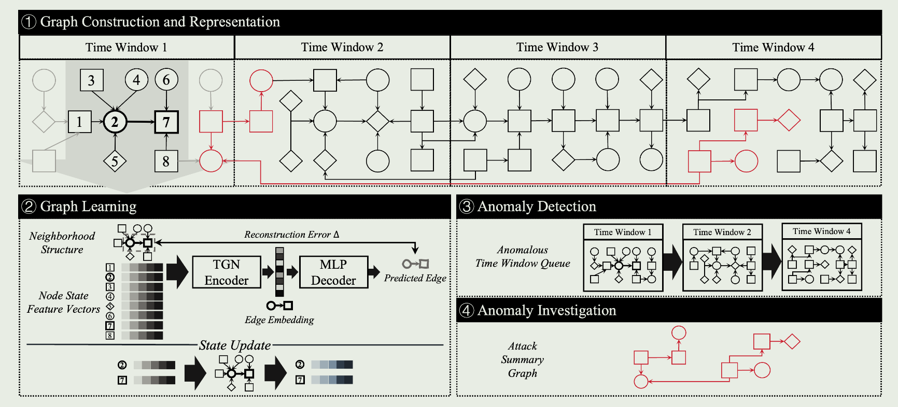

+++
title = 'KAIROS'
date = 2024-03-02T20:15:55+08:00
draft = false
categories = ["论文"]
description = "使用TGN进行图学习，使用过采样和欠采样的数据增强解决数据不均衡问题"
image = "KAIROS/1715250405508.png"
+++

## 导语

SP24

doi is [here](https://doi.org/10.48550/arXiv.2308.05034)

## Abstract

溯源图是描述系统执行历史的结构化审计日志。最近的研究探索了多种技术来分析自动主机入侵检测的溯源图，特别关注高级持续威胁（APT）。通过筛选他们的设计文档，我们确定了推动基于溯源图的入侵检测系统 (PIDS) 开发的四个常见维度：范围（能否检测到渗透到应用程序边界的现代攻击？）、攻击不可知性（能否检测到新颖的攻击而无需攻击特征的先验知识？）、及时性（能否在主机系统运行时有效地监控主机系统？）以及攻击重建能力（能否从大型溯源图中提取攻击活动，以便系统管理员能够轻松理解并快速响应系统入侵？） 。我们提出了 KAIROS，这是第一个同时满足所有四个维度的需求的 PIDS，而现有方法至少牺牲了一个维度，并且难以实现可比的检测性能。 KAIROS 利用基于新型图神经网络的编码器-解码器架构，该架构可以学习溯源图结构变化的时间演化，以量化每个系统事件的异常程度。然后，基于这些细粒度信息，KAIROS 重建攻击足迹，生成紧凑的摘要图，准确描述系统审核日志流上的恶意活动。使用最先进的基准数据集，我们证明 KAIROS 优于以前的方法。

## senario

来自DARPA E3-THEIA的溯源图的摘要，描述了一种攻击活动，由KAIROS自动生成。矩形、椭圆形和菱形分别表示进程、文件和套接字。R=读取，W=写入，O=打开，S=发送，Rc=接收，C=克隆，E=执行。为了清晰起见，我们添加了颜色和虚线元素，以突出显示 KAIROS 生成的输出。KAIROS从原始来源图中提取实体节点和边，以重建攻击。根据攻击地面真相，虚线粉红色节点和边缘是 KAIROS 错过的与攻击相关的活动。蓝色节点和边是基本事实中未明确提及但包含在 KAIROS 中的活动。

## challenge

1. 不可知性：有没见过的攻击，需要模型具有泛化性
2. 攻击重建：很难通过溯源图得到并重现完整的攻击流程
3. 及时性：作为入侵检测系统（IDS)需要及时性，这就要求模型性能比较高

## Method

KAIROS是一个基于异常的入侵检测和攻击调查系统。它通过来源图中的因果依赖关系，利用最先进的**深度图学习**和**社区发现**， 可以做到

1. 在事先不了解任何特定攻击特征的情况下检测异常系统行为。
2. 根据信息流关联检测到的异常内核对象之间。 KAIROS 提供简洁且有意义的摘要图表，用于节省人力的人机交互取证分析。

下图描述了KAIROS的架构，由四个主要组件组成：

1. 图的构建和表示。
   KAIROS以流式传输方式分析图表，按时间顺序摄取图表中出现的边。KAIROS 考虑**三种类型的内核对象和九种类型的交互**（即系统事件）。 KAIROS 将每个事件转换为有向、带时间戳的边，其中源节点代表事件的主体，目标节点代表所作用的对象。使用**基于节点属性的分层特征哈希技术**对节点的特征进行编码（但是感觉是先层次花，再用FeatureHasher，感觉也没有多次hash，而且他的形式化表达里映射正负的$\mathcal{H}$也没看到啊。)

   
2. 图学习。
   当图中出现新的边缘，KAIROS 使用编码器-解码器架构来重建边缘。编码器将边缘周围的邻域结构和邻域中节点的状态作为输入。节点的状态是与每个节点关联的特征向量，描述节点邻域的变化历史。然后，解码器根据编码器输出的边缘嵌入重建边缘。原始边缘和重建边缘之间的差异称为重建误差。在训练阶段，KAIROS同时训练编码器和解码器，以最大限度地减少良性边缘的重建误差。在部署过程中，各个边缘的重建误差被用作异常检测和调查的基础。此外，KAIROS更新新边的源节点和目标节点的状态。在encoder-decoder结构中，使用基于节点属性的分层特征哈希技术对节点的特征进行编码，利用时间图网络（TGN）对边进行嵌入，通过新的边（事件）动态更新节点特征，可以有效地将时序特征保存在节点特征中，同时边的嵌入也基于邻域内节点的特征向量。这样可以有效地保存事件的时序信息（感觉这个想法还挺常见的，就是要获取时间相关的特征)。
3. 异常检测。
   KAIROS 构建时间窗口队列来检测部署期间的异常情况。为此，KAIROS根据边的重建误差在每个时间窗口中识别一组可疑节点。具有重叠可疑节点的两个时间窗口被排在一起。当新的时间窗口添加到队列时，KAIROS 也会根据重建错误更新队列的异常分数。如果分数超过阈值，KAIROS会认为队列异常并触发警报。因此，KAIROS以时间窗口的间隔定期执行异常检测。在图中，KAIROS 检测到由时间窗口 1、2 和 4 组成的异常队列。
4. 异常调查。
   为了帮助系统管理员推理警报，KAIROS 自动从异常时间窗口队列生成紧凑的攻击摘要图。这涉及识别具有高重建误差的边缘社区以提高易读性。图形简化是必要的，因为与图像和文本不同，图形即使是人类专家也很难可视化和解释。在图中，系统管理员只需要了解 KAIROS 中的一个小的汇总图，而不是跟踪触发警报的异常时间窗口队列中的一个大得多的图。

## 补充知识

### 分层特征哈希

在传统的哈希技术中，常见的方法是将特征空间的维度映射到固定大小的哈希表中。然而，当特征空间非常大时，这种方法可能会导致哈希冲突，进而影响模型的性能。

分层特征哈希通过将特征空间分解为多个层级来解决这个问题。每个层级都具有不同的哈希函数，用于将特征映射到不同的桶中。通常，初始层级的哈希函数将原始特征映射到较小的中间空间，然后通过逐渐应用更多的哈希函数，将特征映射到最终的哈希桶中。

分层特征哈希将高维输入向量投影到低维特征空间，同时保留原始输入之间的分层相似性。分层特征哈希在处理大规模高维数据时具有很好的效果，例如在文本分类、推荐系统和图像检索等任务中经常被使用。

### TGN

TGN，全称Temporal Graph Networks，是一种针对时间图的网络嵌入方法。在许多实际应用中，包括社交网络、交通网络等，图的拓扑结构和节点的交互是随着时间发展而变化的，这种图被称为时间图。TGN的目标是为时间图中的节点和边生成嵌入向量，以便在这些向量上进行各种预测任务，如链接预测、节点分类等。

TGN对边的嵌入主要涉及以下步骤：

1. **节点嵌入更新**：当新的边事件（如用户间的交互）发生时，TGN会根据新的边事件信息更新对应节点的嵌入。具体来说，TGN采用了记忆化的节点嵌入更新机制，即根据节点的历史嵌入和新的边事件信息共同决定节点的新的嵌入。
2. **边嵌入生成**：在节点嵌入更新后，TGN会生成新的边的嵌入。具体来说，边的嵌入是由连接该边的两个节点的嵌入和边事件的时间信息共同决定的。例如，一种简单的方法是将两个节点的嵌入和边事件的时间信息拼接起来，然后通过一个全连接网络生成边的嵌入。
3. **时间编码器**：为了捕获边事件的时间信息，TGN引入了一个时间编码器，它可以将边事件的时间戳编码为一个连续的向量。在生成边的嵌入时，会将这个时间向量和节点的嵌入一起考虑。

通过以上步骤，TGN能够处理时间图中的边事件，并为每个边事件生成一个嵌入向量，这个嵌入向量同时考虑了边事件的拓扑结构信息和时间信息。这使得TGN能够适应图的动态变化，并进行各种预测任务。

## 我的评价

贡献主要有：

1. 提出了PIDS的四个重要指标
2. 提出了新的三对象九交互的建图模式（但是没怎么证明有效性)
3. 提出了时间窗口的社区发现的攻击重建方法，比较紧凑，会更方便溯源人员重建攻击。
4. 实验做的很丰富，包括对不同数据集的分析，以及在相应的数据集上和其他的现有方法的对比做的很好。

我的评价是，这篇文章最厉害的是实验部分，他把DARPA的数据集都做了检测，其他的感觉中规中矩也就，但是他能发SP你有意见吗？
