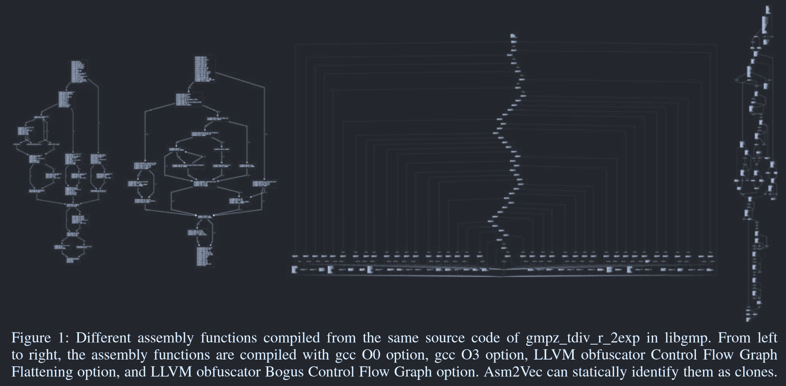
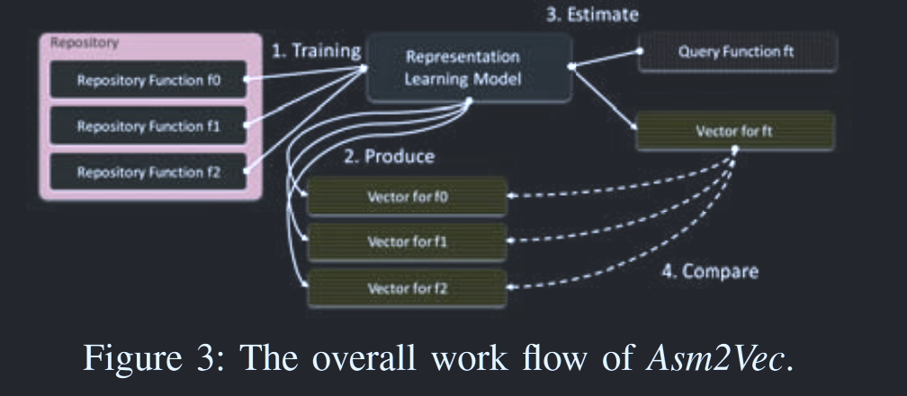
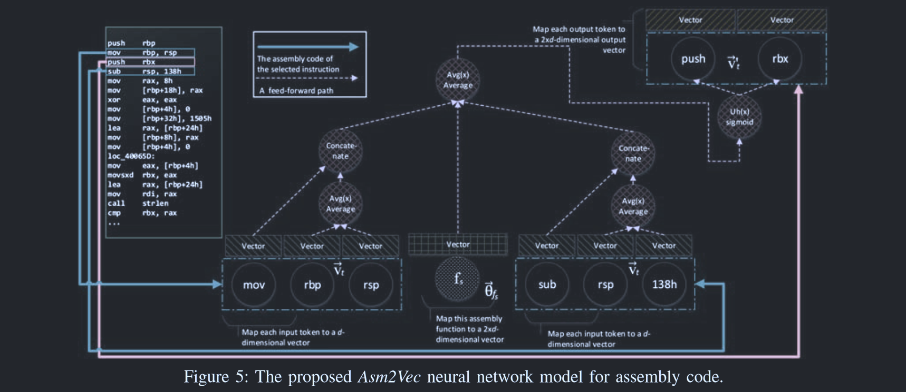

+++
title = 'MalConv1'
date = 2024-07-29T21:47:30+08:00
draft = true
tags = ["论文笔记", "克隆检测"]
categories = ["论文"]
description = "通过表示学习得到汇编函数的一个高质量表示。针对一个目标函数，在表示向量空间找寻函数的相似性，判断是否是某函数的克隆"
image = "index/1722273560961.png"
+++

## 导语

[doi](https://doi.org/10.1109/SP.2019.00003) is here 2019 S&P

## Introduction

如今，代码复用非常的常见，很少有从零开始写的一段软件代码。汇编代码克隆搜索正在成为一种信息检索 （IR） 技术，可帮助解决与安全相关的问题。它已被用于不同的二进制文件，以定位更改的部分，识别已知的库功能，如加密，在现有软件或物联网（IoT）设备固件中搜索已知的编程错误或零日漏洞，以及在源代码不可用时检测软件剽窃或GNU许可证侵权， 然而，设计一个有效的搜索引擎是困难的，因为编译器优化和混淆技术的多样性使得逻辑上相似的汇编函数看起来截然不同。

现有的通过人工设计的方法可以分为动态和静态两种，动态方法通过动态分析汇编代码的 I/O 行为来建模语义相似性。静态方法通过查找汇编代码在语法或描述性统计方面的静态差异来建模汇编代码之间的相似性。与动态方法相比，静态方法更具可扩展性，并提供更好的覆盖范围。动态方法对语法变化更可靠，但可扩展性较差。静态方法存在两个的问题，如果缓解，静态方法甚至可以比最先进的动态方法获得更好的性能。

1. 现有的最先进的静态方法**未能考虑特征之间的关系**。LSH-S [16]、ngram [8]、n-perm [8]、BinClone [15] 和 Kam1n0 [17] 将**汇编代码片段**建模为操作和分类操作数的**频率**值。Tracelet [14] 将汇编代码建模为**指令序列之间的编辑距离**。Discovre [7] 和 Genius [6] 构造了描述性特征，例如**算术汇编指令的比率、传输指令的数量、基本块的数量等**。所有这些方法都**假定每个特征或类别都是一个独立的维度**。但是，xmm0 流式处理 SIMD 扩展 （SSE） 寄存器与 SSE 操作（如 movaps）相关。Afclose libc 函数调用与其他文件相关的 libc 调用（如 fopen）相关。Astrcpy libc 调用可以替换为 memcpy。**这些关系提供了比单个标记或描述性统计信息更多的语义信息**。
   * 为了解决这个问题，我们建议将词汇语义关系纳入特征工程过程。在实践中，从汇编语言的先验知识中手动指定所有可能的关系既耗时又不可行。相反，我们建议直接从普通汇编代码中学习这些关系。Asm2Vec 探索了标记之间的共现关系，并发现了标记之间丰富的词汇语义关系（见图 2）。例如，memcpy、strcpy、memncpy 和 mempcpy 在语义上看起来彼此相似。SSE 寄存器与 SSE 操作数相关。Asm2Vec在培训过程中不需要任何先验知识。
2. 现有的静态方法**假设特征同样重要****，或者需要等效汇编函数的映射来学习权重**。所选的权重可能不包含将一个装配函数与另一个装配函数区分开来的重要模式和多样性。有经验的逆向工程师不会通过平等地查看整个内容或逻辑来识别已知函数，而是根据过去的二元分析经验，确定识别特定函数的关键点和重要模式。也不需要等效汇编代码的映射。
   * 为了解决这个问题，我们发现可以模拟有经验的逆向工程师的工作方式。受**表示学习**的最新发展的启发，我们建议训练一个**神经网络模型**来读取许多汇编代码数据，并让模型识别出将一个函数与其他函数区分开来的最佳表示。

本篇工作的贡献是：

1. 我们提出了一种新的汇编克隆检测方法。这是第一部采用表示学习来为汇编代码构建特征向量的工作，作为缓解当前手工制作特征中两个问题的一种方式。
2. 我们开发了一种表示学习模型，即Asm2Vec，用于汇编代码语法和控制流图。该模型学习标记之间的潜在词汇语义，并将汇编函数表示为集体语义的内部加权混合。学习过程不需要任何有关汇编代码的先验知识，例如编译器优化设置或汇编函数之间的正确映射。它只需要汇编代码函数作为输入。
3. 我们发现，与最先进的静态特性和动态方法相比，Asm2Vec 对代码混淆和编译器优化的适应能力更强。我们的实验涵盖了编译器的不同配置和一个强大的混淆器，它替换指令，分割基本块，添加虚假逻辑，并完全破坏原始的控制流图。我们还对公开可用的漏洞数据集进行了漏洞搜索案例研究，其中 Asm2Vec 实现了零误报和 100% 召回率。它的性能优于动态的最先进的漏洞搜索方法。

## Problem Definition

在汇编克隆检索文献中，有四种类型的克隆：类型 I：完全相同；类型 II：语法上等价；类型 III：稍微修改过的；类型 IV：语义上相似。我们关注类型 IV 克隆，其中汇编函数在语法上可能有所不同，但在源代码中共享类似的功能逻辑。例如，同样的源代码在经过和未经过混淆时，或不同版本之间的修补源代码。

我们使用以下概念：

* 函数：汇编函数
* 源函数：源代码编写的原始函数，例如 C++
* 库函数：在库中索引的汇编函数
* 目标函数：要查询的汇编函数。

给定一个汇编函数，我们的目标是从库 RP 中搜索其语义克隆。我们将搜索问题正式定义如下：

给定一个目标函数 $f_t$，搜索问题是检索 top-k 存储库函数 $f_s ∈ RP$，按它们的语义相似性进行排序，因此它们可以被视为 IV 型克隆。

## Overall Workflow

整个过程分为四个步骤：步骤 1：给定一个汇编函数的库，我们首先为这些函数构建一个神经网络模型。我们只需它们的汇编代码作为训练数据，无需任何先验知识。步骤 2：在训练阶段结束后，模型为每个库函数生成一个向量表示。步骤 3：给定一个目标函数 $f_t$，该函数没有使用此模型进行训练，我们使用模型来估计它的向量表示。步骤 4：我们通过使用余弦相似度将 $f_t$ 的向量与库中的其他向量进行比较，以检索排名前 k 的候选结果。

训练过程是一次性的工作，可以有效地学习查询的表示形式。如果将新的汇编函数添加到存储库中，我们将按照步骤 3 中的相同过程来估计其向量表示。可以定期重新训练模型，以保证向量的质量。

## Assembly Code Representation Learning

在本节中，我们提出了一种用于汇编代码的表示学习模型。具体来说，我们的设计基于PV-DM模型。PV-DM 模型根据文档中的token学习文档表示。然而，文档是顺序排列的，这与汇编代码不同，因为后者可以表示为图形，并具有特定的语法。在本章中，我们首先描述原始的 PV-DM 神经网络，该网络学习文本段落的向量化表示。然后，我们构建我们的 Asm2Vec 模型，并描述它如何在给定函数的指令序列上进行训练。之后，我们详细说明如何将控制流图建模为多个序列。

### PV-DM

PV-DM 模型是为文本数据设计的。它是原始 word2vec 模型的扩展。它可以联合学习每个单词和每个段落的向量表示。

给定一个包含多个句子的文本段落，PV-DM 会在每个句子上应用一个滑动窗口。滑动窗口从句子的开头开始，并在每一步向前移动一个单词。例如，在图 4 中，滑动窗口的大小为 5。在第一步中，滑动窗口包含五个单词“the”、“cat”、“sat”、“on”和“a”。中间的单词“sat”被视为目标词，周围的单词被视为上下文。在第二步中，窗口向前移动一个单词，并包含“cat”、“sat”、“on”、“a”和“mat”，其中单词“on”是目标。【给上下，预测正中间的，2k+1的窗口，给上下k预测中间】

在每个步骤中，PV-DM 模型都执行多类预测任务（参见图 4）。它根据段落 ID 将当前段落映射到向量中，并将上下文中的每个单词映射到基于单词 ID 的向量中。该模型对这些向量进行平均，并通过 softmax 分类从词汇表中预测目标词。反向传播的分类误差将用于更新这些向量。PV-DM 专为按顺序布局的文本数据而设计。但是，汇编代码比纯文本具有更丰富的语法。它包含在结构上与纯文本不同的操作、操作数和控制流。这些差异需要不同的模型架构设计，而 PV-DM 无法解决这些问题。接下来，我们提出了一个集成了汇编代码语法的表示学习模型。

### Asm2Vec model

一个汇编函数可以表示为控制流图（CFG）。我们建议将控制流图建模为多个序列。每个序列对应于一个潜在的执行轨迹，包含线性排列的汇编指令。给定一个二进制文件，我们使用 IDA Pro 反汇编工具提取汇编函数列表、基本块和控制流图。图 5 显示了模型的神经网络结构。它与原始的 PV-DM 模型不同。

首先，我们将每个存储库函数 $f_s$ 映射到向量 $θ_{f_s}$ ∈ $\mathbb R ^{2×d}$。  $θ_{f_s}$ 是在训练中要学习的函数 $f_s$ 的向量表示。d 是用户选择的参数。类似地，我们收集了库 RP 中的所有唯一token。我们将汇编代码中的操作数和操作视为token。我们将每个标记 t 映射到一个数值向量 $ v_t \in \mathbb{R}^d  $和另一个数值向量 $v'_t \in \mathbb{R}^{2 \times d} $。$ v_t $是标记 t 的向量表示，经过训练后，它表示标记的词汇语义。$v_t$ 向量用于图 2 中可视化标记之间的关系。$ v'_t$用于标记预测。所有 $\theta_{fs}$和$ v_t$初始化为接近零的小随机值。所有$v'_t $初始化为零。我们使用 $2 \times d $来表示$f_s$，因为我们连接操作和操作数的向量以表示一条指令。【就是把操作和操作数都视作token，然后用不同的初值学两个向量，$v_t$是用来表示token的，$v't$是用来做预测的】
