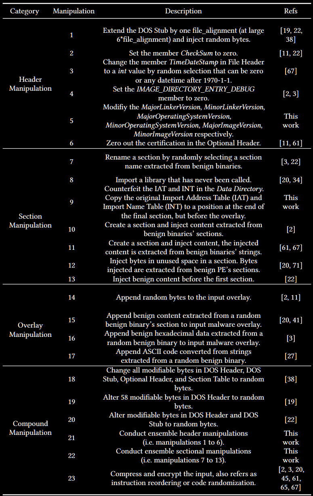

+++
title = 'MalwareTotal'
date = 2024-08-26T18:00:42+08:00
draft = true
tags = ["论文笔记","恶意软件"]
categories = ["论文"]
description = ""
image = "/img/placeholder.jpeg"
+++

## 导语

doi is [here](https://doi.org/10.1145/3597503.3639141)

这是一篇讲 **生成恶意软件** 绕过反病毒软件 的论文。感觉比较偏工程。

## Abstract

基于机器学习 （ML） 的静态恶意软件检测模型容易受到对抗性攻击。但是，生成的恶意软件通常无法推广到生产级反恶意软件 （AMS），因为它们通常涉及多种检测方法。在这项工作中，我们演示了所提出的方法 MalwareTotal 如何允许恶意软件变体在基于 ML、基于签名和混合的反恶意软件中绕过检测。给定恶意二进制文件，我们开发了顺序绕过策略，使恶意行为能够隐藏在多方面的操作中。通过对真实恶意软件的 12 次实验，我们证明攻击者可以在不修改恶意软件功能的情况下持续绕过检测。我们进一步证明，我们的方法在攻击成功率和查询消耗（对目标模型的查询数量）方面都优于最先进的对抗性恶意软件生成技术。此外，我们的方法生成的样本在实际集成的恶意软件检测器 VirusTotal 中证明了可转移性。

## Introduction

在过去十年中，新发现的恶意软件样本不断扩展，每天达到数十万个，这给软件开发社区带来了持续的挑战。为应对这一挑战而提出的启发式和机器学习 （ML） 技术确实显示出前景。然而，不能只依赖机器学习，因为机器学习存在对抗性攻击的固有脆弱性，其中难以察觉的输入扰动会导致错误的预测。先前的研究已经对基于 ML 的模型发起了此类攻击，并取得了有价值的进展。然而，我们的调查表明，它们对现实世界的防病毒软件（AV）的有效性有限。据我们所知，现有的恶意软件生成方法在商用自动驾驶汽车上的平均攻击成功率都没有达到 50% 以上，这对于现实世界的恶意软件检测来说是不够的。

在静态恶意软件检测技术方面，总结了阻碍最佳规避能力的四个潜在因素

1. 操作的设计缺乏多样性。例如，Demetrio et al. 操纵恶意文件的 DOS 头，因为受害者模型 MalConv更关注 Windows 可移植可执行 （PE）头功能
2. 最近的方法遵循一个假设，即目标探测器的完整信息是已知的，这对于商用自动驾驶汽车来说是不可行的。
3. 大多数现有工作都是为一种或单一类型的恶意软件检测器设计的，而商用自动驾驶汽车通常以混合底层模型架构为特征。
4. 现有工作旨在优化注入内容的良性评分以实现最小注入。这是理想的，并且在对抗性攻击的开始阶段是一个关键目标，此时过多的修改会导致输入发生明显的变化。我们认为这是一个不必要的目标，因为它可能会受到具有固定注入字节阈值的查询预算的限制。【可能注入过多就可以绕过检测大小的限制，但是感觉一般AV会拿文件长度做评价指标吧，而且太长了下载的人也很容易发现】

在上述挑战的推动下，我们提出了 MalwareTotal，这是一种序列感知对抗性恶意软件生成方法。序列感知操作不仅专注于最小化注入的内容，还强调识别可以成功逃避检测的易受攻击的序列。为了实现对不同防病毒架构的稳健规避，我们仔细收集并扩展了散布在文献中的多种可移植可执行 （PE） 文件修改，并最终发现了 23 个功能保留操作。我们将它们分为四类：头部操控、节操控、覆盖操控和指令操控。利用恶意软件变异的顺序特性，我们通过利用近端策略优化（PPO）[58]，一种用于迭代更新操控策略的基于梯度的算法，优化恶意软件变异过程。据我们所知，本文提出了首个能稳健绕过现实世界商业杀毒软件的黑箱恶意软件生成方法。结果表明，恶意软件规避在基于机器学习、基于签名和混合反恶意软件产品中是普遍存在的，强调了改进软件工程实践在确保抵御不断演变的恶意软件威胁方面的重要作用。

本文贡献如下：

* 一种顺序感知的黑箱对抗攻击。我们提出了一种新颖的绕过策略，通过近端策略优化学习面向杀毒软件的脆弱序列。据我们所知，这是首个能够在完全黑箱场景下（也称为“奇迹”）稳健地绕过现实世界商业杀毒软件的检测恶意软件的方法，揭示了静态杀毒软件所面临的风险被低估了。
* 高效的规避性能。我们对MalwareTotal的端到端实现进行了全面评估，展示了其显著更强的攻击成功率，范围在16.55%到83.59%之间。生成变种的速度比最先进的方法快1.74倍。
* 有效的鲁棒性增强。我们展示了MalwareTotal生成示例的价值：使用这些对抗样本重新训练受害模型可以将针对MalwareTotal的鲁棒性提高88.51个百分点。此外，经过重新训练的模型对其他黑箱对抗攻击表现出更强的抗压能力。

## Related work

之前的工作分为两种：

白盒：知道检测模型完整信息，包括模型梯度、输出分数等。Kolosnjaji等[39]提出了Padding方法，该方法通过在梯度的正方向引导下，在PE文件叠加层中填充嵌入值来操纵恶意软件。Demetrio et al. [19] 提出了 Partial DOS 方法，该方法处理 DOS 报头中包含的前 58 个字节。Header Fields [3] 操作 Optional Header 中每个部分的名称，Full DOS [22] 提出了三种单独的攻击 Full DOS、Extend 和 Shift。

黑盒：Demetrio 等人 [20] 提出了两种攻击。第一，Gamma Section 通过修改部分section和应用打包器来进行攻击。另一种是 Gamma Padding 攻击，是 Padding、Partial DOS、Extend 和 Shift 的组合【就是一种用了不同策略的padding】;这种操作优化依赖于遗传算法。同样，Song 等人 [61] 提出了 MAB 方法，该方法利用一个打包程序和一组操作，并使用多臂老虎机作为优化器，MAB 需要 20 台服务器在他们的实验中进行操作。Aim [11] 利用了 Header Fields 中提出的相同操作，并利用遗传算法来最小化突变恶意软件的分数【黑盒的意思是只能得到分数是吗】。他们还使用沙盒来丢弃功能受损的恶意软件。

我们工作的创新之处在于

1. MalwareTotal 侧重于直接优化最小操作序列，而不是优化最小注入。【就是做最少的变异操作而不是追求最小的注入长度。】
2. MalwareTotal 简单易用，适用于现实场景，因为它是一种查询效率高的规避攻击，仅需要黑箱恶意软件检测器提供的硬标签。

## Preliminary

本节介绍了便携式可执行文件（PE）格式，提出生成恶意软件变种的问题。

我们关注于通过一种新颖的问题空间攻击来研究静态PE恶意软件检测中的鲁棒性。与特征空间攻击相比，恶意软件变种生成中的问题空间攻击直接操纵输入数据，使得在生成过程中更容易保留功能。该攻击属于黑箱类型，仅能在机器学习反恶意软件模型的测试阶段操纵恶意软件，因为反病毒软件的架构通常是未知的。

【问题空间攻击是直接改，特征空间是要针对AV的模型来进行有方向的改。可以说问题空间的攻击会更能推广一点，二特征空间的攻击会比较有针对性。】

### PE格式

(可以看我之前总结的，在[blog.pillar.fun](https://blog.pillar.fun/2020/03/19/PE%E6%A0%BC%E5%BC%8F/))

### 威胁模型

形式化表达就不在这敲了，主要就是通过找一个最小的操作序列，得到最大的AV模型的安全评分（就是看起来最不像是恶意代码）

## Methodology

本文提出了MalwareTotal（与集成的防病毒工具VirusTotal相对），这是一种黑箱攻击，利用不影响恶意软件功能的字节。该方法生成顺序绕过策略，将恶意行为嵌入多方面的操作中，如图所示。MalwareTotal分两个步骤来寻找被反恶意软件软件分类为良性的恶意软件变体。首先，它建立一个全面的操作集合；其次，它利用近端策略优化搜索脆弱的操作序列。

### 多面功能保留修改

【这段讲了一些修改的细节】

在本节中，我们在Windows PE文件格式的上下文中讨论MalwareTotal的操作。从原则上讲，有超过一百种修改可以应用于输入的恶意软件。我们将这些修改分为四类：头部、节、覆盖和复合操作。在对可能的修改进行保留功能测试时，我们发现由于各种内在限制，并不是所有的修改都是可行的。现在，我们将针对每个PE文件结构说明这些原因。

**头部操作**。在64字节长的DOS头中，除了e_magic和e_lfanew之外，所有字节都可以修改。由于DOS Stub在win32以上的系统上不会执行，因此其所有字节都可以修改。从理论上讲，DOS Stub可以无限扩展。然而，在实际操作中，对DOS Stub的任意修改可能会导致程序崩溃，因为存在一个未公开的上限，即文件对齐的六倍。在NT文件头中有三个成员，以及在NT可选头中有五个成员，从理论上讲也可以任意修改。

然而，我们的研究结果表明，这些成员中只有六个可以有条件地修改，其中MajorLinkerVersion的可选值为2、6、7、9、11、14；MinorLinkerVersion的可选值为0、16、20、22、25；MajorOperatingSystemVersion的可选值为4、5、6、10；MinorOperatingSystemVersion的可选值为0、1、3；MajorImageVersion的可选值为0、1、5、6、10；而MinorImageVersion的可选值为0、1、3。将这些成员分配给任何其他值都会触发程序的异常终止。

**段操作**。这部分涉及附加、移动和填充段的操作。我们的增强集中在两个方面。首先，关于功能性，我们注意到以前的实现中在插入段时没有包含上限检查。其次，尽管大多数操作注入的是随机字节，但我们受Zhou等人的启发，通过注入良性内容来改进这一过程。

**覆盖操作**。向覆盖区添加数据不应破坏功能性，因为覆盖区不会映射到内存中。然而，需要注意的是，直接覆盖原始覆盖区可能会导致崩溃，特别是当恶意软件是由Nullsoft Scriptable Install System (NSIS)或其他具有完整性检查功能的工具组装时。在这种情况下，附加的字节可能会触发警报，阻碍程序的执行。我们通过附加/NCRC（无循环冗余校验）执行前缀来克服这一障碍。

**复合操作**。这部分涉及对头部、段和覆盖区的一系列修改。考虑到单一操作可能会消耗查询资源，我们设计了几种从不同粒度派生的复合操作。对于注入字节位置离散的操作（操作21），我们注入随机字节；对于注入字节位置连续的操作（操作22），我们注入从良性二进制文件中提取的字节。

### 恶意软件变体生成优化

为了解决公式（1）中提出的问题，我们将问题建模为包含五个组成部分的马尔可夫决策过程（MDP）：(i) 一个有限的状态集合S，其中每个状态$s_t$（$s_t$ ∈ S）表示代理在时间步t的状态；(ii) 一个离散的动作集合A，其中每个动作$a_t$（$a_t$ ∈ A）表示代理在时间步t的动作；(iii) 转移概率$P(s_t+1 | s_t, a_t)$，表示代理通过采取动作$a_t$从状态$s_t$转移到状态$s_{t+1}$的概率；(iv) 奖励函数$R(s_t, a_t)$，表示如果代理在状态$s_t$采取动作$a_t$的预期奖励；以及(v) 一个标量折扣因子γ ∈ [0, 1]，其中较小的值更强调即时奖励。

根据上面的 MDP，该模型的最终目标是训练代理找到一个最佳策略，该策略可以在选定的一系列操作中最大化总奖励的预期，表示为：

$$
π^∗ = \argmax\limits_{\pi}  \mathbb E[R | π ],
$$

数学上，这可以通过最大化状态值函数 Vπ(s) 来实现，该函数定义为：

$$
V_{\pi}(x) = \mathbb{E} \left\{ \sum_{t=0}^{\infty} \gamma^t r_{t+1} \mid x_0 = x, \pi \right\},
$$

或者可以通过动作值函数来解决，定义为:

$$
Q_{\pi}(x, a) = \mathbb{E} \left\{ \sum_{t=0}^{\infty} \gamma^t r_{t+1} \mid x_0 = x, a_0 = a, \pi \right\}.
$$

翻译如下：

状态值函数描述了一个状态对代理来说有多好，而动作值函数则指示了在状态 \( s \) 下执行动作 \( a \) 对代理来说有多好。为了学习代理的策略网络，策略梯度算法定义了目标函数 $J(\theta) = \mathbb{E}_{s_0, a_0, \ldots \sim \pi_\theta} \left[ \sum_{t=0}^{\infty} \gamma^t r(t) \right]$，该函数是整个折扣奖励的期望。为了获得参数 $ \theta$，策略梯度迭代地应用随机梯度上升方法，以找到$ J(\theta)$ 的局部最大值。基于文献 [40]，对于任何可微的策略 $\pi_\theta(s, a) $，策略梯度可以表示为：

$$
\nabla_\theta J(\theta) = \mathbb{E}_{\pi_\theta} \left[ \nabla_\theta \log \pi_\theta(s, a) Q_{\pi_\theta}(s, a) \right] .
$$
