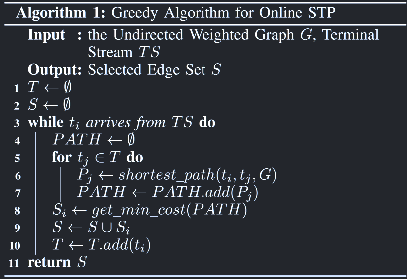

+++
title = 'NODLINK'
date = 2024-07-24T12:22:46+08:00
draft = false
tags = ["论文笔记", "溯源图"]
categories = ["论文"]
description = "优化STP算法，降低消耗实现威胁检测的在线检测"
image = "index/1722260277932.png"
+++

## 导语

NDSS24， doi is [here](https://doi.org/10.14722/ndss.2024.23204)

这也是一篇溯源图方向的论文，主要是优化基于**在线来源**的溯源图检测系统，即他的目标是让EDR能直接用上

## 贡献

1. 在基于在线来源的检测系统中，将APT攻击检测过程建模为斯坦纳树问题
2. 提出了一种新颖的内存缓存设计
3. 提出一种高效的攻击筛选方法
4. 提出一种新的STP近似算法【在APT攻击检测中比传统的算法更有效，同时保持了相同的复杂度】

## Introduction

### 目标

1. 降低基于溯源图的检测系统的开销
2. 增强及时性

### 基于STP的检测系统的挑战与应对方法

1. 长期攻击：STP需要提前了解整个溯源图。但是，由于数据大小的原因，不可能将所有来源数据保存在内存中，并且由于 I/O 瓶颈，将其存储在磁盘数据库中也不切实际。
   * 提出了一种新颖的内存缓存设计，该设计具有评分方法，可以优先考虑可能导致APT攻击的事件，并捕获STP时间窗口内长时间运行的攻击。
2. 有效地识别STP中的终端：现有的检测方法不适合在线系统
   * 设计了一个IDF加权的三层变分自编码器（VAE）
3. 目前用于 STP 的近似算法对于 APT 攻击检测仍然不够有效。现有的方法[需要找到两个节点之间的最短路径，开销太高
   * 开发了一种面向重要性的在线STP优化贪婪算法，该算法实现了低计算复杂度和有限竞争比。

除了这些之外，NODLINK在深信服的产品中应用了并在两天捕获了7个APT攻击（这也太不P了）

## Background

大部分都因为日志量大、建图成本等原因只能靠日志在事后进行溯源，所以最近有直接接受系统审计事件的系统，在发现攻击后以溯源子图的形式输出警报

现实世界中，在溯源APT时，攻击事件与良性事件之间的比率不平衡，精确检测攻击的难度高。

现有的基于源的检测系统可分为两类：基于规则的检测系统和基于学习的系统。然而，现有的系统无法同时实现足够的节点级精度和节点级召回率。

### 在线斯坦纳树问题

[斯坦纳树问题](https://oi-wiki.org/graph/steiner-tree/)：斯坦纳树问题是组合优化问题，与最小生成树相似，是最短网络的一种。最小生成树是在给定的点集和边中寻求最短网络使所有点连通。而最小斯坦纳树允许在给定点外增加额外的点，使生成的最短网络开销最小。

给定边为非负权重$w_e$的无向图 $G=(V,E)$，和一个顶点序列（其中的顶点被称作终端）$T=\{t_1, t_2, t_3, \dots , t_k\}$，它输出一个子图$S_i$，该子图覆盖$\{t_1, t_2, . . . , t_i\}$。其目标是最小化总成本。

这个贪心算法接受带权无向图G和终端流TS。

首先初始化终端集T和已选边集S为空集。对于TS中的每个终端$t_i$，初始化PATH集为空，与T中所有终端求最短路径$P_j$加入PATH集。选择PATH中最短的P，将他的点加入到S，将当前终端$t_i$加入到已选终端集T中。最终结果即是S。

这个算法的竞争比率为$O(\log{k})$，其中k是终端数，也就是说在线算法的最坏情况下的表现与最优离线算法的表现之比为$O(log{k})$

## overview

NODLINK是一个在线APT攻击检测系统。它接受从安装在受监控主机上的代理收集的系统源事件的事件流。NODLINK的输出是包含关键攻击步骤的简洁警报来源图。

算法每$\Delta$秒进行四个阶段，分别是

（1） 内存缓存构建（第 6 行）：把窗口内的事件存在内存里以避免IO瓶颈，还保持和更新异常节点。

（2） 终端识别（第 7 行）：通过分析本地特征（例如，命令行参数、进程名称、访问的文件等），NODLINK 可以对每个进程分配一个异常得分，用于衡量它是否存在异常行为。【这tm不还是规则】

（3） Hopset 构建（第 8 行）：hopset可以理解为溯源子图的构建，方便溯源用的。把攻击相关的过程视为终端【这你咋知道哪些攻击相关的？】，将有向图转换为无向图，每条边的权重为相等的非负权重，w = 1，以简化化解。【说是最novel的点】除了标准STP（算法1，第6行说是对于在线任务还是太耗时了），还设计了一个面向重要性的贪婪算法，将时间复杂度从$O(n^2)$变成了$O(n)$。

（4） 综合检测（第 9 行）：将Hopset 与之前构建的缓存数据相结合，分析子图的异常得分。

## 设计细节

### 内存缓存

内存中的缓存会缓冲以下子图：（1）具有较高的异常得分的子图（2）正在积极演变的子图。内存缓存会在每个长度为 ∆ 的时间窗口内更新当前时间窗口的最小 Steiner 树（STP）解决方案。

缓存以<srcid, dstid, attr>的形式保存，srcid 和 dstid 分别是边的源 ID 和目标 ID，attr 是边的属性，包括操作类型和时间戳。边的类型及其可用的操作类型如表I所示。

定义一个hopset的能量为$E=\epsilon^{age}*has(h)$，其中$\epsilon$是衰减因子，age 是自上次更新到跳跃集以来经过的时间窗口。如果给定的hopset在上一个时间窗口内已更新（例如，新事件已添加到图形中），则 age = 0。否则，NODLINK 每过一次窗口，年龄就会增加 1。缓存满的时候能量最低的hopset被淘汰，放Neo4j数据库里

从磁盘检索节点：为了检测长期攻击，NODLINK 设计了图数据库的存储策略，并在遇到被驱逐的节点时从数据库中检索子图。当将跳集驱逐到磁盘时，NODLINK 存储所有节点和边的关系和属性，包括异常得分，并将其移除。NODLINK 为每个节点分配一个唯一的 uuid，使用 md5 值生成。对于进程，NODLINK 计算 pid + tid + 命令行的 md5 值。对于文件，NODLINK 计算 /full/path/filename 的 md5 值。对于 IP，NODLINK 计算 src ip:port:dst ip:port 的 md5 值。这样，NODLINK 就可以检索被驱逐节点和跳集的属性。由于每个节点都有一个唯一的 uuid，我们可以通过在缓存中查找来检查节点是否被逐出到磁盘。由于缓存中的节点由哈希表组织，因此查找操作需要 O（1） 时间。

### 终端识别

NODLINK扫描内存缓存，并根据其节点级特征将可疑进程节点识别为终端。请注意，尽管 NODLINK 的输出仅包含异常进程，但它确实考虑了异常文件和 IP 地址。**NODLINK将异常文件和IP地址合并到访问它们的进程中。**【一个节点有三个内容，包括进程，文件和ip】此设计决策背后的逻辑是，恶意文件和 IP 在被进程访问之前无法生效。因此，关注异常进程可以减少文件和 IP 上的重复警报，而不会损失节点级别的准确性。NODLINK分析了三种类型的节点级特征：启动进程的命令行（命令行）、进程访问的文件（files）和进程（network）访问的IP地址。终端识别包括两个步骤：首先，它**基于节点级特征将过程节点嵌入到数值向量**中。其次，它使用**机器学习模型来检测异常**。

#### 嵌入

NODLINK首先将过程的节点级特征投影到数值向量上。在高层次上，进程的嵌入是三个节点级特征的嵌入向量的加权和。NODLINK选择使用自然语言处理（NLP）技术嵌入节点级特征，以处理节点级特征中看不见的模式。嵌入过程有两个步骤。NODLINK 首先分别嵌入命令行、文件名和 IP 地址。然后，它将它们的嵌入组合为进程的最终嵌入。

NODLINK将非字母数字符号转换为空格，以将节点级特征转换为句子。转换后，NODLINK使用FastText将句子转换为数值向量。

嵌入节点级特征的主要挑战是它们可能包含不属于自然语言的字符串。例如，“/var/spool/8b7dc29d0e”包含哈希字符串“8b7dc29d0e”。现有的基于 NLP 的文档嵌入技术无法处理这些特殊标记。因此，NODLINK通过删除NLP技术Nostril删除无效含义的标记来删除非自然语言。

嵌入的第二步是将三个节点级特征的数值向量相加，如下式

$$
V_{p} = w_{c} * V_{c} + \sum{w_{fi} * V_{fi}} + \sum{w_{ni} * V_{ni}}
$$

其中$V_{c}$, $V_{fi}$, $V_{ni}$是命令行、文件和网络连接的嵌入，$w_{c}$, $w_{fi}$,  $w_{ni}$ 是权重，正式来说，文件的权重 $w_{fi}$ 定义为 $w = \log(\frac{P}{P_{fi}})$，其中 $P$ 是所有进程的数量，而 $P_{f}$ 是操作文件 $fi$ 的进程数量。我们采用类似的方法来计算 IP 地址的权重 $w_{ni}$。这个设计背后的逻辑是针对不同进程共享的文件和 IP 地址进行处理。例如，所有进程都会加载$ \textit{libc}$ 文件，因此$ \textit{libc}$ 对于建模进程的本地特征并没有太大用处。为了提高进程建模的准确性，我们设计权重来降低像$ \textit{libc}$ 文件这样的文件或 IP 地址的影响。最后，命令行的权重 $w_c$ 是所有文件和 IP 的权重的平均值，以确保 $w_c$ 在文件和 IP 地址的数量级上具有相同的规模。

这个嵌入还是挺轻量的，因为NODLINK的设计目标就是速度。

为了检测终端，NODLINK利用VAE模型来计算来源图中每个进程节点的异常分数，然后将异常分数较高的节点识别为终端。VAE模型在其他任务中被广泛用作轻量级异常检测模型。具体就是将进程的嵌入给VAE重构，由于VAE在学习过程中学习数据的潜在分布，如果是输入数据属于训练数据的分布，VAE应该能够很好地重构它。因此重构前后的嵌入相差越大就越可能是异常节点。

然而重建误差可能会为不稳定的进程产生误报，比如Web 浏览器倾向于访问随机 IP 地址。直接使用重建错误会不断将 Web 浏览器等进程识别为终端，从而导致误报。为了解决这个问题，我们引入了稳定性评分SV来平衡不稳定过程的重建误差。我们将SV定义为历史数据中与p同名的过程的嵌入向量的簇数。假设我们有一个名为“web_browser”的进程，在历史数据中我们找到了100个名为“web_browser”的进程实例。我们对这100个进程的嵌入向量进行聚类分析，结果发现这些嵌入向量分成了10个簇。这表明名为“web_browser”的进程在历史数据中表现出10种不同的行为模式。于是，稳定性评分SV就等于10。

$$
AS(p) = \log(\frac{RE(p)}{SV(p)})
$$

RE是重构误差，SV是稳定性评分。这样，当一个进程的行为较为不稳定（SV较大）时，即使重构误差较大，异常评分也不会太高，从而减少了误报。

如果进程节点的 AS 高于历史数据中 AS 的第 90 个百分位数，则 NODLINK 会将其标记为异常。

离线模型训练：虽然NODLINK是一个在线检测框架，但它需要训练FastText模型、VAE模型、SV模型和阈值，才能从离线的历史数据中引发异常。NODLINK 在历史数据中的命令行、文件路径和 IP 地址上训练 FastText 模型。然后，NODLINK使用经过训练的嵌入向量来进一步训练VAE模型。NODLINK通过定期对历史数据运行DBSCAN算法[58]来离线计算SV。它首先将嵌入向量的过程分类为不同的组。然后，将进程名称及其集群数量存储在内存哈希表中，用于在线异常分数计算。

#### hopset构建

在终端识别步骤中检测到终端之后，NODLINK在当前时间窗口中运行Hopset构建来解决STP（最短路径树）问题。在某个时间窗口中的hopset是每个终端的邻域上下文，其中包括有界邻居节点和到这些节点的路径。NODLINK利用了一种称为重要性评分引导搜索（ISG）算法的贪心算法，基于本地信息（如AS和节点度）来构建hopset。Hopset构建输出一个具有低复杂度和有界竞争比的近似STP解。

优化主要在于算法 1 中，使用 Dijkstra 算法找到第 6 行的最短路径，时间复杂度为$O(n^2)$，我们设计的基于重要性评分的搜索的复杂度为$O(n)$

具体构建过程如下：假设终端集中有n个节点，Hopset构建首先启动n个搜索过程，每个搜索过程对应一个终端。搜索过程是通过一个重要性评分IV来进行贪心搜索的。每个贪心搜索过程生成一个hopset，并且节点数量是有界的。如果已经发现了θ个节点，NODLINK将停止探索新节点。这种提前停止的动机来自于攻击聚合假设。该假设指出在来源图中，攻击行为在拓扑上是接近的，因为攻击者需要通过一系列立足点逐步创建攻击行为的执行链。

我们的工具在贪婪搜索过程中合并重叠的hopset，以高效地连接终端，同时限制节点探索，而不是使用经典贪婪算法中复杂度较高的最短路径算法。这种近似解决方案通过识别拓扑上相近的与攻击相关的异常，减少了异常检测中的假阳性。跳集构建为每个跳集分配一个HAS（hopset anomaly score）以便未来调查，重点关注基于异常分数(高)和与终端的距离(近)的重要节点。这使得远离的节点优先级降低，从而排除假阳性，并利用APT攻击的攻击多态性，后者指出攻击相关的事件级异常在起源图中是拓扑上相近的，因为攻击者通过少数的立足点（如后门或反向Shell）进行攻击活动。

Hopset Construction的关键组成部分是重要性分数的设计，首先是异常分数 AS。第二个是与终端中最近节点的距离【直觉是利用 APT 攻击的攻击聚合性】。

$$
IV(n)={\alpha}^i({\beta}*AS(n)+{\gamma}*FANOUT(n))
$$

${\alpha}^i$反映了节点$n$与终端之间的距离。当$n$远离终端时，$IV$会降低。具体而言，$0<{\alpha}<1$是一个距离衰减因子，$i$是$n$与其最近的终端之间的跳数。$AS(n)$是该节点的异常分数。我们还为节点$n$引入了一个补充因子$FANOUT(n)$，其定义为$FANOUT(n)=out\_degree(n)/(in\_degree(n) + 1)$。引入这个术语是因为我们观察到某些过程倾向于生成大量不传播数据和控制流依赖的“叶子”节点。这些“叶子”节点对于\ac{apt}攻击检测和调查并不重要。因此，我们使用$FANOUT$术语来降低它们的优先级。我们将$FANOUT$和$AS$结合，使用两个权重$\beta$和$\gamma$。需要注意的是，$AS$是主要因素，而$FANOUT$是补充因素。因此，需要满足$\beta >> \gamma$。

hopset的异常分数HAS是hopset中所有节点的异常分数之和。

#### 全面检测

首先使用在当前时间窗口内构造的跳跃集更新内存中的缓存跳跃集。NODLINK将当前时间窗口的跳跃集与缓存中的跳跃集（如果它们具有相同的节点）合并。但是，如果我们直接合并跳跃集，在最坏的情况下，一个长时间运行的进程被识别为终端，并在每个时间窗口内更新θ个不同的邻居，就有可能导致依赖性爆炸。为了防止这种情况的发生，我们限制了 θ 节点内每个终端的跳集，并在合并时将 IV 值较低的节点替换为 IV 值较高的节点。

合并跳集之后将HAS也随之更新，通过HAS将每个时间窗口的STP解和全局解结合起来。NODLINK利用Grubbs检验来检测HAS异常高的跳跃集。Grubbs 检验检测一组样本的最大值是否为异常值。我们之所以选择 Grubbs 检验，是因为它是非参数化的，并且对污染的训练数据集具有鲁棒性。NODLINK 在内存缓存上运行 Grubbs 测试多轮，直到没有标记异常值。最后，将检测到的异常值标识为攻击活动，并发出警报。

【Grubbs检验是一种用于检测数据集中异常值（即极端值或离群值）的统计方法。它基于假设检验的原理，通常用于正态分布的数据。】

#### 理论分析

终端识别过程中，NODLINK需要通过复杂度为O（E）的边缘来探索节点级的特征

在 Hopset 构造中，NODLINK 通过贪婪探索 θ 节点为每个终端构造 hopset。因此，检测的复杂度为 O（θN），其中 N 是来源图中的节点数。

竞争比率：在第 V-C 节中，我们将算法 1 第 6 行的最短路径探索替换为 importancescore 引导的搜索。这种替换可能会导致检测中出现更大的 Steiner 树，从而影响简洁性。因此，在本节中，我们分析了新的竞争比率，即我们的算法生成的斯坦纳树的大小与理论上最优解之间的比率。回想一下，标准在线 STP 优化算法的竞争比率为 O（log（k）），其中 k 是终端数。因此，我们只需要将我们的方法与标准的在线STP优化算法进行比较。

总而言之，由于 θ 是一个常数，因此 NODLINK 可以得到 2θ log（k） = O（log（k）） 有界竞争比率。

## 我的评价

论文写的稀烂，看得我头皮发麻。

我觉得这篇文章只把进程作为节点，把和他相关的东西作为节点属性，比如启动这个进程的cmd，这个进程访问的文件、ip等，这些在其他常见的方法里都被当做实体，当做节点。

这样做图的规模就会变小很多，对于节点属性的处理也是fasttext转成向量， 然后拿VAE去生成节点异常值，都是现成的东西。

感觉他就是一个优化STP的工作，而寻找联通量大的节点也是出于一种恶意节点会创建很多子进程的直觉吧。

但是讲道理他这也就是把一个子图变成节点了，把别人的子图粒度的检测在他这说成节点粒度的检测，感觉ndss不愧是曾经B里的A，现在纯纯是A里的B，这也太工程了。
