+++
title = 'TFE GNN'
date = 2024-02-16T16:28:03+08:00
draft = false
math = true
tags = ["流量检测", "论文笔记"]
+++

# abstract

目的：实现加密流量[VPN、tor]的分类

现有局限性：只能提取低级别特征，基于统计的方法对**短流**无效，对header和payload采取**不平等**的处理，难以挖掘字节之间的潜在相关性。

提出方法：

1. 基于逐点互信息(PMI)的字节级流量图构建方法
2. 基于图神经网络(TFE-GNN)进行特征提取的时序融合编码器模型
3. 引入了一个双嵌入层、一个基于GNN的流量图编码器以及一个交叉门控特征融合机制。[分别嵌入header和payload，然后通过融合实现数据增强]

结果：两个真实数据集（WWT和ISCX）优于SOTA

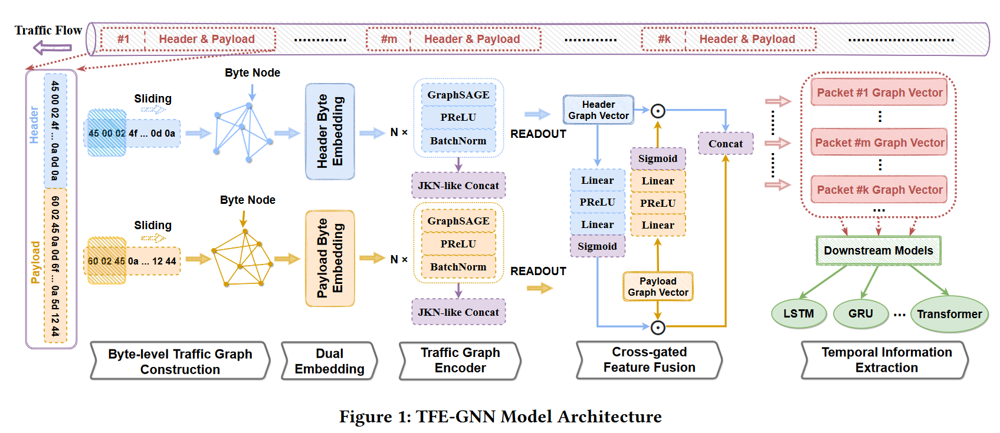

# introduction

加密流量保存用户隐私同时也给了攻击者藏身的机会。

传统的数据包检测（DPI）挖掘数据包中的潜在模式或关键词，面对加密数据包时**耗时**且准确性低。

由于动态端口的应用，基于端口的工作不再有效。

通过数据流的统计特征（e.g.数据包长度的平均值）采用机器学习分类器（e.g.随机森林）来实现分类的方法，需要手工制作的特征工程，并且在某些情况下可能会由于不可靠/不稳定的fow级统计信息而失败。与长流相比，短流的统计特征有更大的偏差（e.g.长度通常服从长尾分布）意味着不可靠的统计特征普遍存在。我们使用**数据包字节**而非统计特征。

GNN 可以识别图中隐含的特定拓扑模式，以便我们可以用预测标签对每个图进行分类。目前大多数GNN根据数据包之间的相关性来构建图，这实际上是统计特征的另一种使用形式，导致上述问题。

用了数据包字节的方法

1. 平等地对待header和payload，忽略了它们之间的含义差异。
2. 原始字节利用不足，只是将数据包视为节点，将原始字节作为节点特征，不能充分利用。

本文提出了一种基于逐点互信息（PMI）的字节级图构建方法，一种基于图神经网络(TFE-GNN)进行特征提取的时序融合编码器模型。通过挖掘字节之间的相关性来构建流量图，用作TFE-GNN的输入。

TFE-GNN由三大子模块组成（即双嵌入、流量图编码器和交叉门控特征融合机制）。双嵌入层分别嵌入header和payload；图编码器将图编码为高维图向量；交叉门控特征融合机制对header和payload的图向量融合，得到数据包的整体表示向量。

使用端到端训练（从输入数据到最终输出直接进行训练，而无需将任务分解为多个独立的阶段或模块），采用时间序列模型，获得下游任务的预测结果。

实验使用了自收集的WWT（WhatsApp、WeChat、Telegram）和公开的ISCX数据集，与十几个baseline比较得出TFE-GNN效果最好。

# preliminary

1、图的定义

G = { $V,\varepsilon,X$}表示一个图，V是节点集合，$\varepsilon$是边集，X是节点的初始特征矩阵（每个节点的特征向量拼起来）

$A$是大小为$\lvert V \lvert * \lvert V \lvert$图的邻接矩阵

$N(v)$是节点v相邻的节点

$d_l$是第l层的嵌入维度

TS(traffic segment)=[$P_{t_1},P_{t_2}...P_{t_n}$]是一段时间内的数据包的集合。$P_{t_i}$是时间戳为$t_i$的数据包，n是流量序列的长度。$t_1,t_2$是流量序列的开始和结束时间。

2、加密流量分类

M是训练样本数量

N是分类类别

$bs^j_i=[b^{ij}_1, b^{ij}_2,...,b^{ij}_m]$，m是字节序列长度，$b^{ij}_k$是第i个流量样本第j个字节序列的第k个字节

$s_i=[bs^i_1,bs^i_2,...,bs^i_n)]$，n是序列长度$bs^i_j$为第i个样本的第j个字节序列，可以理解为就是TS

3、 MP-GNN

MP-GNN 是 Message Passing Graph Neural Network（消息传递图神经网络）的简称，节点嵌入向量可以通过特定的聚合策略将节点的嵌入向量集成到邻域中，从而迭代更新节点嵌入向量。

第l层 MP-GNN 可以形式化为两个过程

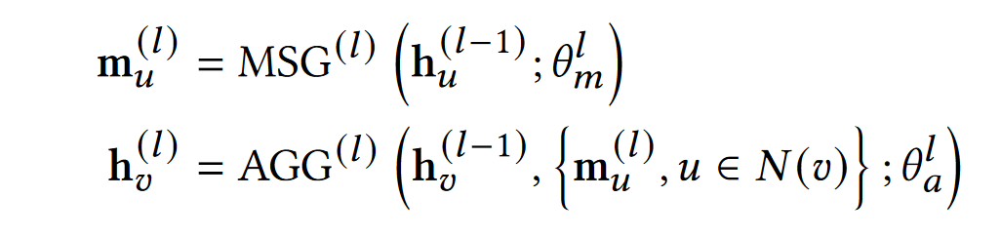

其中$h^{(l)}_u,h^{(l)}_v$是节点u和v在第l层的嵌入向量，$m^{(l)}_u$是l层中节点u的计算信息，$MSG^{(l)}$是消息计算函数，$AGG^{(l)}$是消息聚合函数，$\theta$是他们对应的参数

# methodology

## 字节级流量图构造 Byte-level Traffic Graph Construction

节点：某一个字节，注意相同的字节值共享同一个节点，因此节点个数不会超过256，这样能够保持图在一定的规模下，不会太大。

字节之间的相关性表示：采用点互信息（PMI）来建模两个字节之间的相似性，字节i和字节j的相似性用$PMI(i,j)$表示。

边：根据PMI值来构造边，PMI值为正：表示字节之间的语义相关性高；而PMI值为零或负值：表示字节之间的语义相关性很小或没有。因此，我们只在PMI值为正的两个字节之间创建一条边。

节点特征：每个节点的初始特征为字节的值，维度为1，范围为[0,255]

图构建：由于$PMI(i,j)=PMI(j,i)$，因此该图是个无向图。

### PMI

PMI：是一种用于衡量两个事件之间相关性的统计量。

$$
PMI(A, B) = \log \frac{P(A, B)}{P(A) \cdot P(B)}
$$

值大于零，则表示 A 和 B 之间有正相关性；如果值等于零，则表示它们之间没有关联；如果值小于零，则表示它们之间有负相关性。

## 双嵌入 dual embedding

原因：字节值通常用作进一步向量嵌入的初始特征。具有不同值的两个字节对应两个不同的嵌入向量。然而，字节的含义不仅随字节值本身而变化，还随它所在的字节序列的部分而变化。换句话说，在数据包的header和payload中，具有相同值的两个字节的表示含义可能完全不同。对于header和payload，使用**两个不共享参数的嵌入层**的双嵌入，嵌入矩阵分别是$E_{header}$和$E_{payload}$

## 交叉门控特征融合的流量图编码器 Traffic Graph Encoder with Cross-gated Feature Fusion

因为要double embedding，所以encoder也要两个。

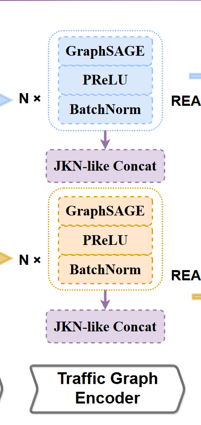

这里堆叠了N个GraphSAGE

### GraphSAGE

对于图 G 中的每个节点 v，GraphSAGE 通过使用节点 v 的度数归一化其嵌入向量，计算来自每个相邻节点的消息。

通过逐元素均值运算（element-wise mean operation）计算所有相邻节点$N(v)$的整体消息，并通过串联运算聚合整体消息以及节点v的嵌入向量

对节点A的嵌入向量进行非线性变换，完成一个GraphSAGE层的正向过程

GraphSAGE的消息聚合和计算可以描述为

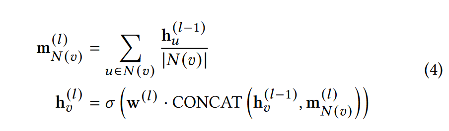

$m^{(l)}_{N(v)}$是将v节点所有临接节点的上一层嵌入向量求平均的结果

$h_v^{(l)}$是本层v节点的嵌入向量，$\sigma(\cdot)$是激活函数，$CONCAT(\cdot)$是连接函数。然后通过BatchNorm对h进行批量归一化

激活函数选择PReLU，将每个负元素值按不同因子缩放，不但引入了非线性，还由于每个负元素的缩放因子的不同而起到类似于注意力机制的作用。

由于深度GNN模型中的过度平滑问题，我们最多只堆叠GraphSAGE4层，并将输出拼接起来。这与跳转知识网络（JKL）相类似

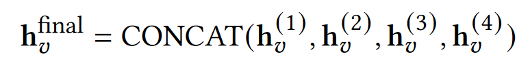

最后，通过对每个节点的最终嵌入使用meanpooling来得到图嵌入

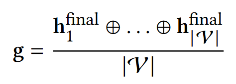

用$g_h,g_p$表示header和payload得到的图嵌入

## Cross-gated Feature Fusion

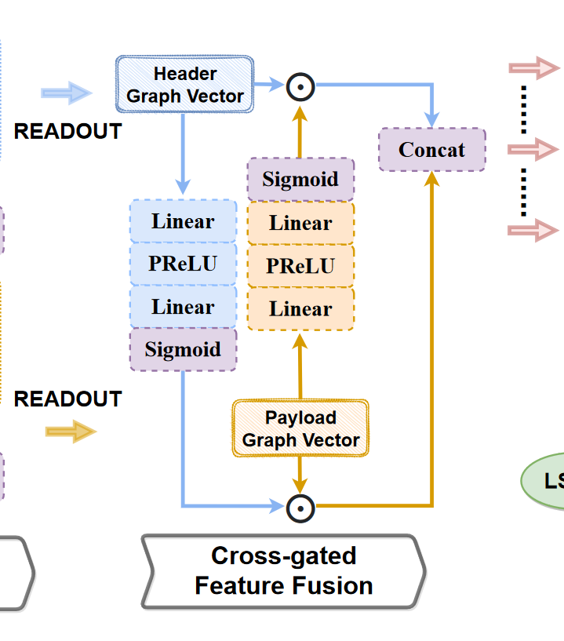

交叉门控特征融合，这个模块的目标是将$g_h,g_p$融合，获取门控矢量$s_h,s_p$。

如上图，我们用了两个filter，每个filter的组成都是线性层、PReLU、线性层、Sigmoid。

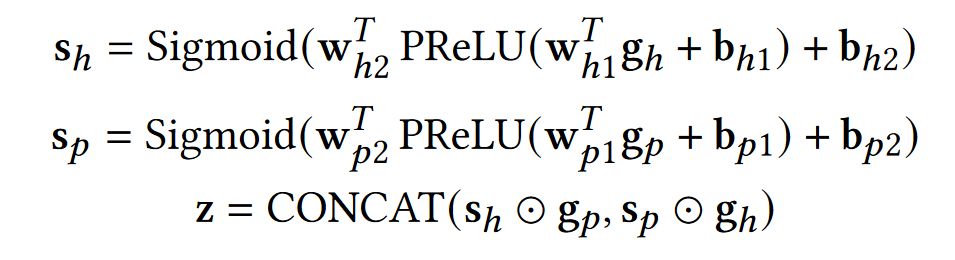

其中w和b分别是线性层的weight和bias。z 是数据包字节的整体表示向量。

## 端到端的下游任务训练 End-to-End Training on Downstream Tasks

由于我们已经将流量段中每个数据包的原始字节编码为表示向量z，因此可以将段级分类任务视为时间序列预测任务。

这里我们使用双层Bi-LSTM作为baseline，他的输出喂给一个带PReLU的两层线性分类器，使用交叉熵作为损失函数

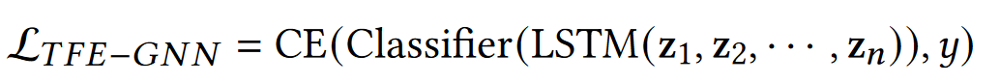

n是长度，CE是交叉熵，y是ground truth（标注数据的分类标签）

实验部分还有一个用transformer的

# experiments

介绍了实验设置，在很多数据集和baseline上做了对比实验，**做了消融实验（good）**

还分析了TFE-GNN的灵敏度，回答了

1. 每个组件的功能
2. 哪个GNN架构效果最好
3. TFE-GNN的复杂度如何
4. 超参数的变化在多大程度上会影响TFE-GNN的有效性

## 实验设置

数据集：ISCX VPN-nonVPN , ISCX Tor-nonTor , self-collected WWT datasets.

预处理：对于每个数据集，筛除

1. 空流或空段：所有数据包都没有有效负载（用于establish 连接）
2. 超长流或超长段：长度（即数据包数）大于 10000

然后对于每个数据包，删掉以太网标头，源 IP 地址和目标 IP 地址以及端口号都将被删除，以消除IP地址和端口号的敏感信息的干扰##

细节：一个样本的最大数据包数设置为50，最大有效负载字节长度和最大标头字节长度分别设置为 150 和 40，PMI 窗口大小设置为 5

epoch设置为120，lr为1e-2，用Adam优化器分512批次将lr从1e-2衰减到1e-4。warmup为0.1，droupout为0.2.\

运行了10次实验。

用AC、PR、RC和F1做评估

和基于传统特征工程的方法（即 AppScanner [31]、CUMUL [23]、K-FP （K-Fingerprinting） [8]、FlowPrint [32]、GRAIN [43]、FAAR [19]、ETC-PS [40]）、基于深度学习的方法（即 FS-Net [18]、 EDC [16]、FFB [44]、MVML [4]、DF [30]、ET-BERT [17]）和基于图神经网络的方法（即 GraphDApp [29]、ECD-GNN [11]）做比较。

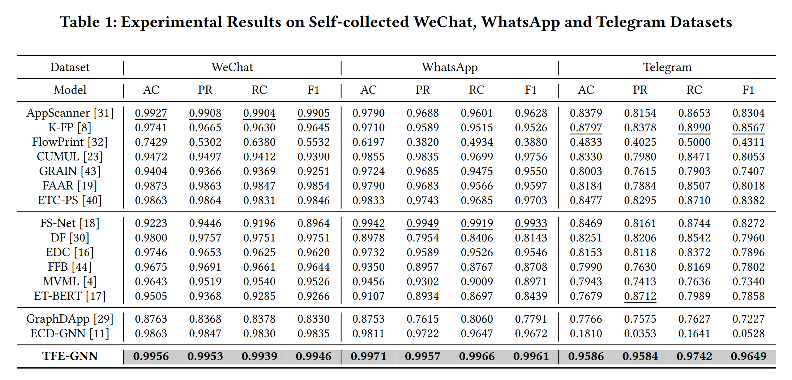

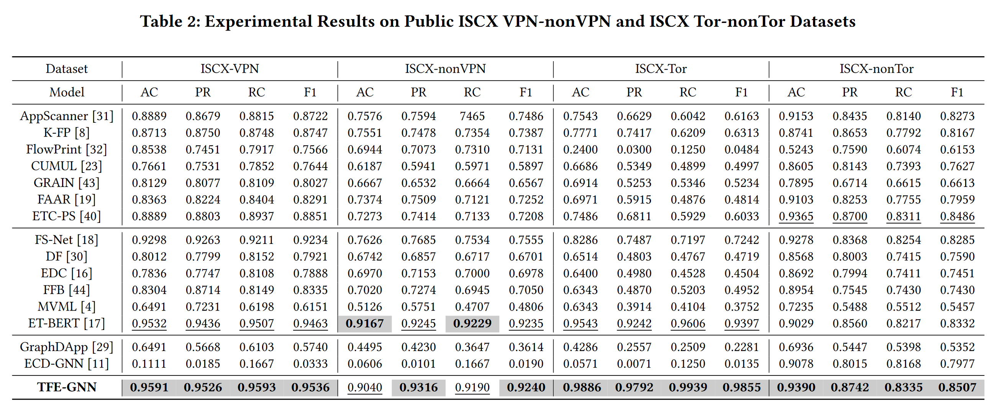

## 消融实验

在 ISCX-VPN 和 ISCX-Tor 数据集上对 TFE-GNN 进行了消融实验，分别将头、有效载荷、双嵌入模块、跳跃知识网络式串联、交叉门控特征融合和激活函数以及批量归一化分别表示为 'H'、'P'、'DUAL'、'JKN'、'CGFF' 和 'A&N'。不仅验证了TFE-GNN中每个组件的有效性，而且还测试了一些替代模块或操作的影响，用sum、max替换mean，用GRU、transformer替换LSTM

（只用H或P就不需要DUAL和CGFF）

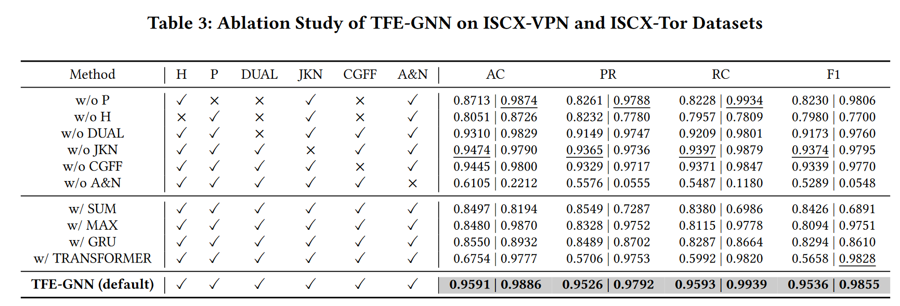

得出结论

1. 数据包标头在分类中起着比数据包有效载荷更重要的作用，不同的数据集具有不同级别的标头和有效载荷重要性
2. 使用双嵌入使 f1 分数分别提高了 3.63% 和 0.95%，这表明其总体有效性。JKN样串联和交叉门控特征融合在两个数据集上都以相似的幅度增强了TFE-GNN的性能。
3. 缺少激活函数和批量归一化在两个数据集上都可以看到显著的性能下降，证明了其必要性
4. 用sum替换mean在两个数据集上分别差了11.1%和29.64%，用max替换mean在VPN上差很多在tor上只差一点
5. 用GRU替换LSTM导致两个都差10%左右，transformer替换LSTM导致VPN差了40%左右，tor上只差一点

换GNN架构为GAT, GIN, GCN and SGC，还是GraphSAGE最好

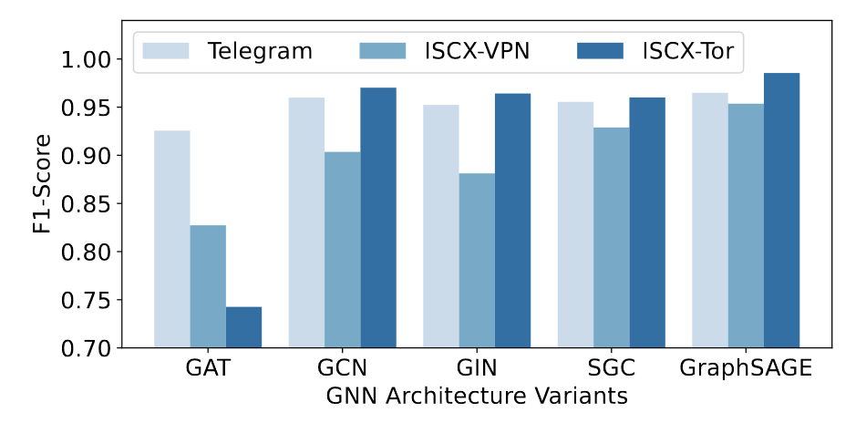

此外，通过TFE-GNN可以快捷的拓展一个segment级的全局特征

复杂度

TFE-GNN 在模型复杂度相对较小的情况下，在公共数据集上实现了最显着的改进。虽然ET-BERT在ISCX-nonVPN数据集上达到了可比的结果，但ET-BERT的FLOP大约是TFEGNN的五倍，模型参数的数量也增加了一倍，这通常表明模型推理时间更长，需要更多的计算资源。此外，ETBERT的预训练阶段非常耗时，由于预训练期间有大量的额外数据，并且模型复杂度高，因此成本很高。相比之下，TFE-GNN可以实现更高的精度，同时降低训练或推理成本。

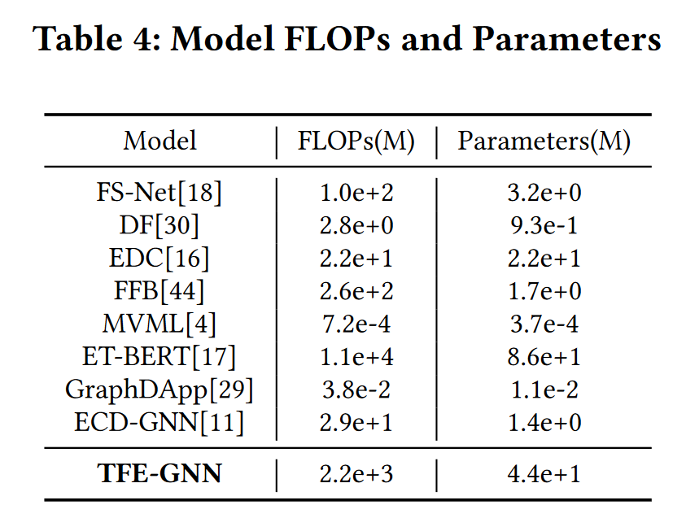

双重嵌入维度的影响。为了研究双嵌入层隐藏维度的影响，我们进行了灵敏度实验，结果如图a所示。正如我们所看到的，当嵌入维度低于 100 时，f1 分数会迅速增加。在此之后，随着维度的变化，模型性能趋于稳定。为了减少计算消耗，选取50作为默认维度

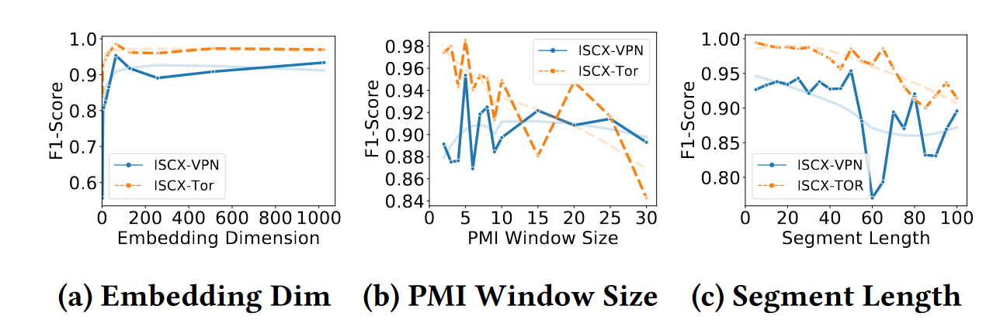

PMI窗口大小的影响。从图 b 中可以看出，较小的窗口大小通常会导致更好的 f1 分数。窗口越大图中添加的边就越多，由于图太密集，模型将更难分类。

段长的影响。从图 c 中，我们可以得出一个结论，即用于训练的短段长度通常会使性能更好。

# conclusion and future work

我们提出了一种构建字节级流量图的方法和一个名为 TFE-GNN 的模型，用于加密流量分类。字节级流量图构造方法可以挖掘原始字节之间的潜在相关性并生成判别性流量图。TFE-GNN 旨在从构建的流量图中提取高维特征。最后，TFE-GNN可以将每个数据包编码为一个整体表示向量，该向量可用于一些下游任务，如流量分类。选择了几个基线来评估 TFE-GNN 的有效性。实验结果表明，所提模型全面超越了WWT和ISCX数据集上的所有基线。精心设计的实验进一步证明了TFE-GNN具有很强的有效性。

将来，我们将尝试在以下限制方面改进 TFE-GNN。（1）有限的图构建方法。所提模型的图拓扑结构是在训练过程之前确定的，这可能会导致非最佳性能。此外，TFE-GNN无法应对每个数据包的原始字节中隐含的字节级噪声。（2） 字节序列中隐含的未使用的时间信息。字节级 trafc 图的构造没有引入字节序列的显式时间特征。
