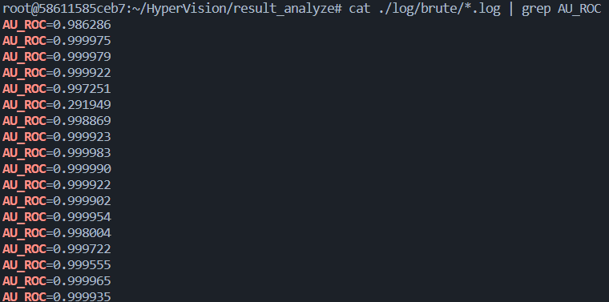

+++
title = '复现Detecting Unknown Encrypted Malicious Traffic in Real Time via Flow Interaction Graph Analysis'
date = 2023-10-25T10:25:43+08:00
draft = true
+++

# 导语

复现这篇2023NDSS论文，他大开源在https://github.com/fuchuanpu/HyperVision

# 环境配置

我是在home下做的，如果想在别的地方搞稍微换下路径就行

先拉git的代码 `git clone https://github.com/fuchuanpu/HyperVision.git`

依照作者在readme里说，在纯净的ubuntu22.04上运行他的脚本即可。用docker装一个纯净的ubuntu22.04

```bash
# 下载镜像
docker pull homebrew/ubuntu22.04:latest
# 启动，并且把~/HyperVision 和容器内的/root/HyperVision连起来
docker run -td --name hypervision -v "$HOME/HyperVision":/root/HyperVision homebrew/ubuntu22.04:latest
# 进入
docker exec hypervision -it bash
```

接下来的操作在docker里了

```bash
sudo su
cd /root/HyperVision
sudo ./env/install_all.sh # 这里最好先换个国内的源，会把需要装的都装了

wget https://hypervision-publish.s3.cn-north-1.amazonaws.com.cn/hypervision-dataset.tar.gz # 下载数据集，有6G，走的cdn，裸连速度就还不错
tar -xzf hypervision-dataset.tar.gz # 我也不知道为什么他写了个-xxf 如果想删掉原来的就删吧，不删也没关系

./script/rebuild.sh
./script/expand.sh
cd build && ../script/run_all_brute.sh && cd ..

cd ./result_analyze
./batch_analyzer.py -g brute
cat ./log/brute/*.log | grep AU_ROC
```

然后就复现完了



# 读代码

建议先看论文再看代码，可以看我的另一篇博客

首先理解一下这个项目是怎么编译的。看看执行的script都做了什么
